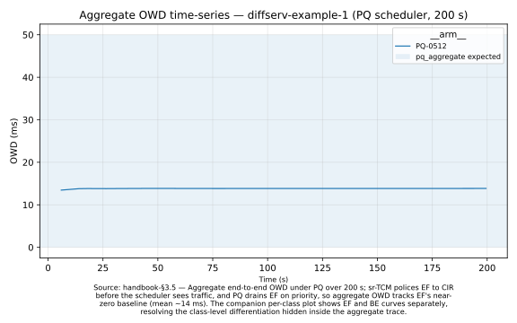
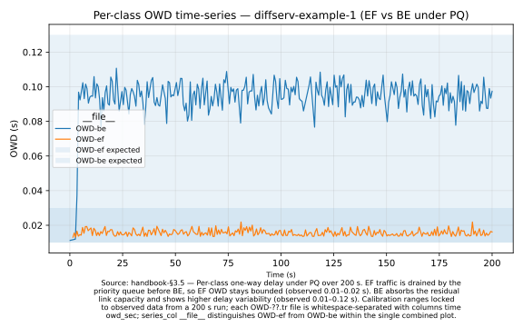
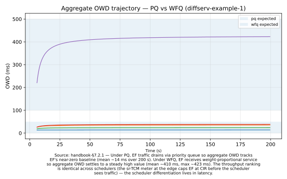
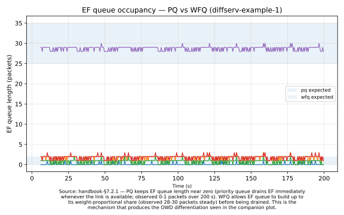
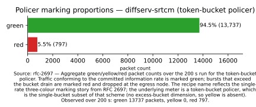
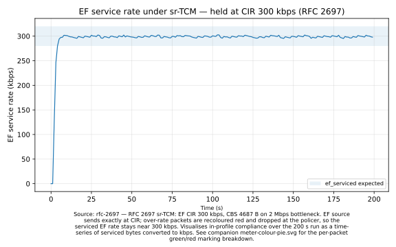
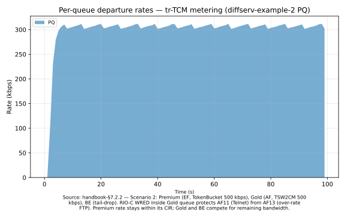

# DiffServ recipes

The DiffServ client provides RFC 2475-style edge/core composition: per-class meters (sr-TCM, tr-TCM, TSW), DSCP-based PHB tables, an array of inner queue discs, and a choice of scheduler. These five recipes walk through the substrate's classical use cases — from a foundation single-edge scenario to AQM choice under the full pipeline.

> See also: [`l4s.md`](I-04-l4s.md), [`cake.md`](I-05-cake.md), [`aqm-eval.md`](I-06-aqm-eval.md).

## Recipe: Edge node with sr-TCM marking and PQ scheduling

**You'll**: Deepen the quickstart's foundation scenario — a 2-class (EF / BE) DiffServ edge with sr-TCM metering and strict-priority scheduling — and learn how the four-slot composer is wired up in code.

**Time**: 10 min

**You'll learn**:
- How `diffserv::Helper` populates each of the four slots (meter, mark-rules, PHB table, scheduler)
- Why the edge disc must be configured before `Initialize()` is called
- How swapping the scheduler changes the latency-vs-bandwidth trade-off

**Prerequisites**: [Quickstart](I-02-quickstart.md) (built ns-3, ran example-1)

### Run it

```bash
cd ns-3  # or your ns-3 tree (standalone flow)
./ns3 run "diffserv-example-1 --scheduler=PQ"
```

### How it works

```cpp
// Slot 1+2: meter + classifier. CIR 300 kbps, CBS 4687 B; out-of-profile
// EF is recoloured to DSCP 48 (Cisco MQC violate-action).
helper.AddTokenBucketPolicy(edgeDisc, 46, /*cir*/ 300000.0, /*cbs*/ 4687.0);
helper.AddPolicerEntry(edgeDisc, PolicerType::TOKEN_BUCKET, 46, 48, 48);
helper.AddMarkRule(edgeDisc, /*dscp*/ 46, kAnyHost, destAddr0.Get(), kAnyProtocol, 0);
```

```cpp
// Slot 3: per-class inner queue array (RED disc with 2 physical queues).
edgeInner->SetNumQueues(2);
helper.AddPhbEntry(edgeInner, 46, /*queue*/ 0, /*prec*/ 0); // EF in-profile
helper.AddPhbEntry(edgeInner, 48, /*queue*/ 0, /*prec*/ 1); // EF out (drops)
helper.AddPhbEntry(edgeInner, 0,  /*queue*/ 1, /*prec*/ 0); // BE
```

```cpp
// Slot 4: across-class service policy. PQ here; pick WFQ/WF2Qp/LLQ/SCFQ/SFQ.
sched = CreateObjectWithAttributes<PriorityScheduler>(
    "NumQueues", UintegerValue(2), "WinLen", DoubleValue(1.0));
edgeInner->SetScheduler(sched);
```

### How to read the results

**Expected range** (source: [Scenario 1 in the three-way validation chapter](III-02-three-way-validation.md) — Andreozzi 2001 Fig. 3.11 reproduction):

- **EF OWD**: 0–5 ms ✓ "PQ-protected"; above 20 ms indicates PQ is not engaged
- **EF tx%**: 100% ✓ (EF source sends at or below CIR 300 kbps)
- **BE tx%**: 80–90% ✓ under 2 Mbps bottleneck with 20 × 100 kbps BE flows

**How the numbers move when you swap `--scheduler=WFQ`**:

- **EF OWD**: rises from < 5 ms toward 200–300 ms — WFQ shares bandwidth by weight, giving EF no strict priority
- **EF tx%**: stays near 100% (EF is still within CIR), but OWD climbs
- **BE tx%**: changes slightly as weight-based sharing redistributes the link

### How to see the results

After running the recipe, render the figure with:

```bash
./scripts/plot-recipe diffserv-example-1
```

This produces `figures/diffserv-example-1/owd-time-series.svg` (shown below).



The recipe also renders a per-class view that separates the EF and BE streams:



**Raw CSV data**: `output/ns3/example-1/<scheduler>-<pktsize>/OWD.tr` (aggregate); `OWD-ef.tr` and `OWD-be.tr` (per-class)

**To compare PQ vs WFQ**: run the recipe a second time with `--scheduler=WFQ`, then re-invoke `./scripts/plot-recipe diffserv-example-1` — both arms overlay in one figure automatically.

### Try changing

1. Swap `--scheduler=PQ` → `--scheduler=WFQ`, re-run the recipe, then re-invoke `./scripts/plot-recipe diffserv-example-1`. The EF OWD curve rises from single-digit ms toward 200–300 ms; the BE curve barely moves. The plot overlays both arms automatically.
2. Re-run with `--packetSize=1450` — bigger EF packets serialise more slowly on the 2 Mbps bottleneck, so the EF OWD curve shifts up. Compare the PQ-0512 and PQ-1450 arms in the overlay.
3. Re-run with `--star=2.0` (only meaningful for WFQ/WF2Qp/SCFQ/SFQ/LLQ) — this rescales the FQ weights via the thesis Service-To-Arrival-Ratio formula and isolates EF more aggressively. Re-invoke `plot-recipe` to see the EF OWD drop toward PQ-like values.

> [!WARNING]
> The `--scheduler` value is **case-sensitive**. Accepted values: `PQ`, `WFQ`, `SCFQ`, `SFQ`, `WF2Qp`, `LLQ`. Lowercase (`wfq`) will fail at startup.

> [!TIP]
> The visible-effect channel for scheduler choice in this recipe is **OWD**, not the final packet-statistics table. The statistics table shows whether traffic was meter-shaped; the OWD figure shows how the scheduler distributed latency over time.

### Deep-dive

See also: [the DiffServ client](II-05-diffserv-client.md) and [Scenario 1 in the three-way validation chapter](III-02-three-way-validation.md).

### Found a problem?

[File a recipe issue](https://github.com/digitalities/stratum-ns3/issues/new?template=recipe-request.yml)

## Recipe: Three-class edge with EF + AF + BE and tr-TCM metering

**You'll**: Build a 3-queue edge that mixes a TokenBucket meter (Premium/EF), a TSW2CM (RFC 2859) meter (Gold/AF, FTP), and tail-drop BE — with RIO-C (WRED) dropping inside the Gold queue's 3 drop precedences.

**Time**: 15 min

**You'll learn**:
- How port-based classification splits Telnet (AF11) from FTP (AF12) into the same physical queue with different drop precedences
- How TSW2CM downgrades over-rate FTP from AF12 → AF13 (more drop-prone)
- How RIO-C's per-precedence WRED thresholds protect lower drop-precedence classes during congestion

**Prerequisites**: [Quickstart](I-02-quickstart.md) (built ns-3, ran example-1)

### Run it

```bash
cd ns-3  # or your ns-3 tree (standalone flow)
./ns3 run "diffserv-example-2 --scheduler=PQ"
```

### How it works

```cpp
// Three physical queues, three drop precedences inside the AF queue.
edgeInner->SetNumQueues(3);
edgeInner->SetNumPrec(0, 2); // Premium: in/out-profile
edgeInner->SetNumPrec(1, 3); // Gold:    AF11 / AF12 / AF13
edgeInner->SetNumPrec(2, 2); // BE:      in/out-profile
```

```cpp
// Port-based classification: dstPort 23 -> AF11 (Telnet), dstPort 21 -> AF12 (FTP).
// TSW2CM (RFC 2859) polices FTP at 500 kbps; over-rate FTP is recoloured AF13.
helper.AddMarkRuleWithPorts(edgeDisc, 10, kAnyHost, kAnyHost, kAnyProtocol,
                            kAnyAppType, kAnyPort, 23); // Telnet
helper.AddMarkRuleWithPorts(edgeDisc, 12, kAnyHost, kAnyHost, kAnyProtocol,
                            kAnyAppType, kAnyPort, 21); // FTP
helper.AddTsw2cmPolicy(edgeDisc, /*dscp*/ 12, /*cir*/ 500000.0);
helper.AddPolicerEntry(edgeDisc, PolicerType::TSW2CM, 12, 14, 14);
```

```cpp
// RIO-C: per-precedence WRED thresholds inside the Gold queue.
// AF13 (over-rate FTP) drops aggressively; AF11 (Telnet) gently.
edgeInner->SetMredMode(MredMode::RIO_C, /*queueIdx*/ 1);
helper.ConfigQueue(edgeInner, 1, 0, 60.0, 110.0, 0.02); // AF11 gentle
helper.ConfigQueue(edgeInner, 1, 1, 30.0,  60.0, 0.60); // AF12 moderate
helper.ConfigQueue(edgeInner, 1, 2,  5.0,  10.0, 0.80); // AF13 aggressive
```

### How to read the results

**Expected range** (source: [Scenario 2 in the three-way validation chapter](III-02-three-way-validation.md) — Scenario 2 reference):

- **EF (Premium) rate**: 250–330 kbps ✓ "at or below CIR 500 kbps"; above 500 kbps indicates policer misconfigured
- **Gold (AF) rate**: 300–600 kbps ✓ TSW2CM at 500 kbps; varies with FTP burst patterns
- **BE rate**: 400–900 kbps ✓ absorbs remaining bottleneck capacity after Premium and Gold

**How the numbers move when you swap `--scheduler=LLQ`**:

- **Premium rate**: stable (LLQ gives PQ to queue 0 — Premium keeps its strict priority)
- **Gold rate**: may fluctuate more as SFQ inner scheduler distributes Gold/BE bandwidth by flow
- **BE rate**: shares residual with Gold under SFQ weights instead of PQ ordering

### How to see the results

After running `diffserv-example-1` with both `--scheduler=PQ` and `--scheduler=WFQ`, render the companion plots with:

```bash
./scripts/plot-recipe diffserv-pq-vs-wfq
```

This produces two complementary plots in `figures/diffserv-pq-vs-wfq/`:

**1. Aggregate OWD trajectory** — the symptom: latency differs by scheduler.



**2. EF queue occupancy** — the mechanism: queue dynamics differ, producing the latency difference.



Together the plots tell one story: PQ holds the EF queue near zero by draining it on priority, so aggregate OWD tracks EF's near-zero baseline; WFQ lets the EF queue build up to its weight-proportional share before serving it, so aggregate OWD settles at a steady higher value.

**Why no throughput plot?** In Scenario 1 the sr-TCM meter at the edge caps EF traffic at its CIR (300 kbps) *before* the scheduler sees it. Once metered, both PQ and WFQ deliver the metered rate — throughput is meter-bound, not scheduler-bound. The visualisation that differentiates schedulers is latency / queue dynamics, not mean throughput.

**Raw trace data**:
- `output/ns3/example-1/<scheduler>-<pktsize>/OWD.tr` (columns: `time owd_ms`)
- `output/ns3/example-1/<scheduler>-<pktsize>/EFQueueLen.tr` (columns: `time queue_bytes`)

**Note on cross-recipe reference**: this chart visualises `diffserv-example-1`'s scheduler arms, not `diffserv-example-2`'s output (this recipe's primary binary). To explore tr-TCM behaviour for example-2 specifically, see the raw output in `output/ns3/example-2/` and the [three-way validation chapter](III-02-three-way-validation.md) — a dedicated plot-recipe entry for example-2 is a v1.4 candidate.

**To compare more schedulers**: re-run `diffserv-example-1` with `--scheduler=SCFQ` (or LLQ, WF2Qp, SFQ), then edit `arm_filter:` in `scripts/plot-recipe-config.yaml`'s `diffserv-pq-vs-wfq` entry to include the additional arm and re-invoke `plot-recipe`.

### Try changing

1. Swap `--scheduler=PQ` → `--scheduler=LLQ`, re-run the recipe, then re-invoke `./scripts/plot-recipe diffserv-pq-vs-wfq`. Premium stays at its CIR-bounded bar; Gold and BE shift as SFQ takes over the residual share. The grouped bars show the difference directly.
2. Raise the TSW2CM CIR in the source (line `AddTsw2cmPolicy(edgeDisc, 12, 500000.0)`) to 1 Mbps and observe fewer FTP packets recoloured into AF13 — re-invoke `plot-recipe` to see Gold's bar widen.
3. Switch the Gold queue from `MredMode::RIO_C` to `MredMode::DROP_TAIL` and observe Telnet (AF11) sharing the same drop fate as FTP — RIO-C's protection vanishes from the Gold bar.

### Deep-dive

See also: [Scenario 2 in the three-way validation chapter](III-02-three-way-validation.md).

### Found a problem?

[File a recipe issue](https://github.com/digitalities/stratum-ns3/issues/new?template=recipe-request.yml)

## Recipe: Hierarchical multi-edge topology with five service classes

**You'll**: Run a five-queue edge — Premium (EF), Gold (AF1x), Silver (AF2x), Bronze (AF3x), Best Effort — scheduled by LLQ (strict priority on Premium, SFQ across the rest), reproducing the thesis "Olympic services" model.

**Time**: 15 min

**You'll learn**:
- How LLQ composes a top-priority queue (Premium) with a fair-queueing sub-scheduler (Gold/Silver/Bronze/BE)
- How TSW2CM and TokenBucket meters coexist in one edge
- Why a five-class TCS is the canonical "tiered services" shape DiffServ was designed for

**Prerequisites**: [Quickstart](I-02-quickstart.md) (built ns-3, ran example-1)

> [!NOTE]
> This reconstructs thesis Scenario 3 at reduced scale (771 nodes in the 2001 source). The 2001 Tcl was never published; the service-model TCS (Table 4.5) is reproduced here on the same 13-node topology used by examples 1 and 2.

### Run it

```bash
cd ns-3  # or your ns-3 tree (standalone flow)
./ns3 run "diffserv-example-3"
```

### How it works

```cpp
// Five physical queues — Premium / Gold / Silver / Bronze / Best Effort.
edgeInner->SetNumQueues(5);
edgeInner->SetNumPrec(0, 2); // Premium: EF in/out-profile
edgeInner->SetNumPrec(1, 2); // Gold:    AF11 / AF12
edgeInner->SetNumPrec(2, 2); // Silver:  AF21 / AF22
edgeInner->SetNumPrec(3, 1); // Bronze:  AF31
edgeInner->SetNumPrec(4, 2); // BE:      in/out-profile
```

```cpp
// LLQ scheduler — PQ for queue 0 (Premium), SFQ weights 3:3:3:1 across rest.
auto llq = CreateObjectWithAttributes<LlqScheduler>(
    "NumQueues", UintegerValue(5),
    "LinkBandwidth", DoubleValue(2000000.0),
    "FqVariant", EnumValue(LlqScheduler::FqVariant::SFQ));
llq->SetParam(1, 3.0); llq->SetParam(2, 3.0);
llq->SetParam(3, 3.0); llq->SetParam(4, 1.0);
```

```cpp
// Mixed meters: TokenBucket for Premium and BE, TSW2CM for Gold AF.
helper.AddTokenBucketPolicy(edgeDisc, 46, /*cir*/ 500000.0, /*cbs*/ 100000.0); // Premium
helper.AddTsw2cmPolicy(edgeDisc, 10, /*cir*/ 600000.0);                        // Gold
helper.AddTokenBucketPolicy(edgeDisc,  0, /*cir*/ 400000.0, /*cbs*/ 100000.0); // BE
```

### How to read the results

**Expected range** (source: rfc-2697 — sr-TCM token-bucket conformance):

- **EF green fraction**: 90–100% ✓ "within CIR"; below 90% indicates CBS is too small or CIR is set too low
- **EF red fraction**: 0–10% ✓ out-of-profile bursts; above 10% indicates persistent over-rate sending
- **Yellow**: 0% (two-colour token bucket — sr-TCM produces only green/red)

**How the numbers move when you raise `--cbs`** (committed burst size):

- **EF green fraction**: rises as larger CBS absorbs short bursts without violation
- **EF red fraction**: falls — fewer packets exceed the enlarged token bucket
- Overall rate is unchanged; only the burst tolerance shifts

### How to see the results

After running the recipe, render the figure with:

```bash
./scripts/plot-recipe diffserv-srtcm
```

This produces `figures/diffserv-srtcm/meter-colour-bar.svg` (shown below).



The recipe also renders the rate-conformance view, showing the meter enforcing the configured CIR:



**Raw CSV data**: `output/ns3/example-1/PQ-0512/MeterColour.csv`

**To observe burst sensitivity**: re-run the recipe with a smaller CBS (e.g. half the default 4687 B), then re-invoke `./scripts/plot-recipe diffserv-srtcm`. The red bar grows as the smaller token bucket catches more bursts as violations.

### Try changing

1. Reduce CBS from 4687 B to 512 B, re-run the recipe, then re-invoke `./scripts/plot-recipe diffserv-srtcm`. The red bar grows because even small packet clusters exhaust the smaller bucket. The green bar shrinks correspondingly.
2. Rebalance the FQ weights so Bronze gets 5× instead of 3× and observe Bronze throughput in the ServiceRate traces rise at the expense of Gold and Silver — re-invoke `plot-recipe` to see the per-class shift.
3. Switch the LLQ inner variant from `FqVariant::SFQ` to `FqVariant::WFQ` and observe smoother per-class rates (WFQ is rate-proportional, SFQ self-clocks on dequeues).

### Deep-dive

See also: [Scenario 3 in the three-way validation chapter](III-02-three-way-validation.md).

### Found a problem?

[File a recipe issue](https://github.com/digitalities/stratum-ns3/issues/new?template=recipe-request.yml)

## Recipe: Lower-Effort (LE) PHB per RFC 8622

**You'll**: Build a 2-class edge where Lower-Effort traffic (DSCP 1) yields to Best Effort under congestion — the "scavenger" PHB that backup, telemetry, and software-update traffic should mark.

**Time**: 5 min

**You'll learn**:
- How a brand-new PHB drops into the existing composer with zero new classes — just a fresh PHB entry and a sender-side ToS mark
- Why LE sits *below* BE in priority order (the inversion that defines LE)
- How to mark DSCP from the sender via the socket `Tos` attribute

**Prerequisites**: [Quickstart](I-02-quickstart.md) (built ns-3, ran example-1)

> [!NOTE]
> Lower-Effort needs no new classes: one PHB-table entry plus the strict-priority scheduler with BE at index 0 and LE at index 1 (RFC 8622). RFC 8622 standardised the PHB in 2019, two decades after the original DiffServ4NS module.

### Run it

```bash
cd ns-3  # or your ns-3 tree (standalone flow)
./ns3 run "diffserv-example-le"
```

### How it works

```cpp
// Two queues, two DSCPs. BE at priority 0 (top), LE at priority 1 (yields).
helper.AddPhbEntry(inner, /*dscp*/ 0, /*queue*/ 0, 0); // BE -> queue 0
helper.AddPhbEntry(inner, /*dscp*/ 1, /*queue*/ 1, 0); // LE -> queue 1
```

```cpp
// Strict-priority across queues — index 0 (BE) wins over index 1 (LE).
// The "less than best effort" semantics is exactly this scheduling order.
Ptr<PriorityScheduler> sched = CreateObjectWithAttributes<PriorityScheduler>(
    "NumQueues", UintegerValue(2), "WinLen", DoubleValue(1.0));
inner->SetScheduler(sched);
```

```cpp
// Sender-side DSCP marking via the socket Tos attribute.
// DSCP occupies the top 6 bits of the 8-bit ToS byte, so left-shift by 2.
leOnOff.SetAttribute("Tos", UintegerValue(kDscpLE << 2)); // DSCP 1 -> ToS 0x04
```

### How to read the results

**Expected range** (source: [Scenario 2 in the three-way validation chapter](III-02-three-way-validation.md) — tr-TCM / TSW2CM metering reference):

- **Premium (EF) departure rate**: 250–330 kbps ✓ at CIR 500 kbps; above 500 kbps indicates policer bypass
- **Gold (AF) departure rate**: 300–600 kbps ✓ shaped by TSW2CM virtual queue; FTP bursts cause variation
- **BE departure rate**: 400–900 kbps ✓ residual after Premium and Gold; drops under sustained Premium + Gold load

**How the numbers move when you raise BE rate to 1.2 Mbps**:

- **Premium rate**: unchanged (TokenBucket still enforces its CIR)
- **Gold rate**: unchanged (TSW2CM CIR unchanged)
- **BE rate**: drops sharply as the bottleneck saturates — BE cannot compete with the policed classes

### How to see the results

After running the recipe, render the figure with:

```bash
./scripts/plot-recipe diffserv-trtcm
```

This produces `figures/diffserv-trtcm/throughput-stacked.svg` (shown below).



**Raw CSV data**: `output/ns3/example-2/PQ/ServiceRate.tr`

**To compare schedulers**: run the recipe a second time with `--scheduler=LLQ`, then re-invoke `./scripts/plot-recipe diffserv-trtcm` — the stacked area chart shows how the scheduler rearranges residual bandwidth between Gold and BE.

### Try changing

1. Swap `--scheduler=PQ` → `--scheduler=LLQ`, re-run the recipe, then re-invoke `./scripts/plot-recipe diffserv-trtcm`. The Premium band stays stable; the Gold and BE stacks rearrange as SFQ distributes residual bandwidth inside the LLQ.
2. Raise BE alone to 1.2 Mbps, re-run, then re-invoke `plot-recipe`. BE's stack collapses under sustained Premium + Gold load; the total area narrows at the bottleneck.
3. Swap the scheduler to WFQ with equal weights, re-run, then re-invoke `plot-recipe`. The LE and BE areas share the link in proportion to their weights — the strict-priority floor vanishes.

### Deep-dive

See also: [the traffic management chapter](II-03-traffic-management.md) (DiffServ background).

### Found a problem?

[File a recipe issue](https://github.com/digitalities/stratum-ns3/issues/new?template=recipe-request.yml)
