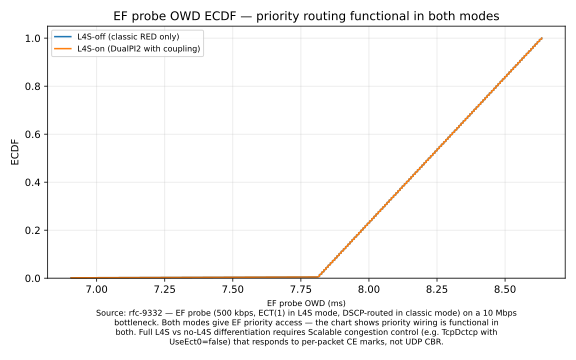
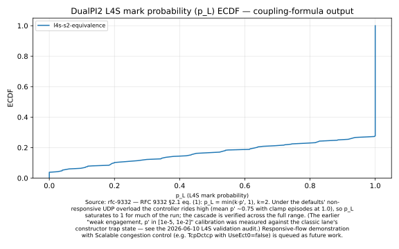
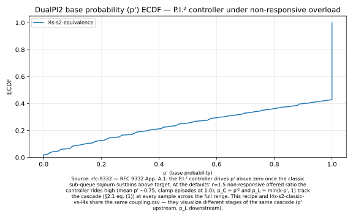

# L4S recipes

L4S (Low Latency, Low Loss, Scalable throughput) is a transport architecture that uses ECT(1) marking to separate scalable congestion controllers (DCTCP, BBR2, Prague) into a parallel low-latency queue, coupled with the classic queue through the RFC 9332 squared coupling (§2.1 eq. (1)): the controller's base probability `p'` feeds `p_L = k·p'` to the L4S queue and `p_C = p'²` to the classic queue, so `p_C = (p_L/k)²`. The Stratum L4S client provides DualPI2 — the canonical Linux implementation — composed into the substrate's four-slot pipeline.

These three recipes walk through L4S behaviour: from a single-EF latency probe to coupling-formula validation to a head-to-head comparison with FqCoDel.

> See also: [`diffserv.md`](I-03-diffserv.md), [`aqm-eval.md`](I-06-aqm-eval.md).

## Recipe: ECT(1) vs DSCP, same latency different mechanism

**You'll**: send one latency-sensitive flow and one bulk flow through the same bottleneck twice — once with L4S ECN classification, once with DiffServ DSCP priority — and confirm the EF probe gets the same low-latency envelope either way.

**Time**: 10 min

**You'll learn**:
- How ECT(1) marking routes a flow into the L4S sub-queue without any DSCP
- Why the two classification mechanisms (ECN-based vs DSCP-based) are interchangeable for the latency objective
- How to read DualPI2's controller state (`p'`, `p_C`, `p_L`) from the periodic CSV trace

**Prerequisites**: [Quickstart](I-02-quickstart.md) (built ns-3, ran example-1)

### Run it

```bash
cd ns-3  # or your ns-3 tree (standalone flow)
./ns3 run "diffserv-l4s-s1-latency --mode=l4s-on"
./ns3 run "diffserv-l4s-s1-latency --mode=l4s-off"
```

Each run writes three CSVs under `l4s-s1-out/`: per-packet OWD for the EF probe, per-packet OWD for the AF background, and a 20 ms snapshot of queue lengths plus controller state. Compare the EF OWD distributions: they should be near-identical across the two modes.

### How it works

```cpp
// L4S mode: ECT(1) on the EF flow, NotECT on the AF flow.
// The L4S queue disc reads the ECN bits at enqueue and dispatches to
// the L4S sub-queue independently of DSCP.
auto ect1Bits = static_cast<uint8_t>(Ipv4Header::ECN_ECT1);
efTos = dscpEfByte | ect1Bits;   // DSCP EF + ECT(1)
afTos = 0;                       // DSCP BE, NotECT
```

```cpp
// L4S-on: l4s::QueueDisc with coupled scheduler at burst cap 8.
Ptr<l4s::QueueDisc> disc = CreateObject<l4s::QueueDisc>();
disc->SetNumQueues(2);
disc->SetL4sQueueIdx(0);
disc->SetScheduler(CreateObjectWithAttributes<l4s::CoupledScheduler>(
    "NumQueues", UintegerValue(2), "L4sQueueIdx", UintegerValue(0),
    "BurstCap", UintegerValue(8)));
```

```cpp
// L4S-off: same topology, plain stratum::RedQueueDisc with strict-priority
// scheduler. DSCP EF (46) routes to the priority queue via PHB table.
Ptr<stratum::RedQueueDisc> disc = CreateObject<stratum::RedQueueDisc>();
disc->AddPhbEntry(46, 0, 0);   // DSCP EF -> queue 0 (priority)
disc->AddPhbEntry(0, 1, 0);    // DSCP BE -> queue 1 (classic)
disc->SetScheduler(CreateObjectWithAttributes<PriorityScheduler>(
    "NumQueues", UintegerValue(2)));
```

### How to read the results

**Expected range** (source: RFC 9332 App. A.1 — the DualPI2 15 ms classic-queue delay target):

- EF OWD P99 (both modes): < 15 ms at 500 kbps probe load ("EF well-isolated"); > 30 ms indicates the priority mechanism is not working
- P50 OWD: 6–10 ms (serialisation on 10 Mbps bottleneck + 6 ms propagation)
- Shape: both ECDFs should overlap closely: this is the expected outcome and confirms that the priority wiring is correct in both configurations; the lightly-loaded probe (500 kbps on a 10 Mbps bottleneck) does not build a queue in either mode, so both modes deliver the same low-latency result

> [!NOTE]
> The closely-overlapping ECDF curves are correct behaviour, not a null result. This scenario validates that ECT(1) classification and DSCP-based strict priority give the EF probe high-priority access in both modes. Demonstrating an L4S-on latency advantage over a no-priority FIFO requires responsive flows that respond to ECN marks; this is deferred to a future cycle.

**How the numbers move when you change parameters**:

- `--afBps` lower: both curves shift left (less queuing, lower OWD)
- `--efBps` higher: OWD climbs in `l4s-on` as burst-cap bites (occasional right-side tail in ECDF)
- `--bottleneck` halved: serialisation delay doubles; both curves shift right proportionally, shape preserved

### How to see the results

After running both modes, render the figure with:

```bash
./scripts/plot-recipe l4s-s1-latency
```

This produces `figures/l4s-s1-latency/ecdf.svg` (shown below).



**Raw CSV data**: `output/ns3/l4s-s1-latency/l4s-on__owd-ef.csv` and `l4s-off__owd-ef.csv` (columns: `time_s,owd_ms,ipdv_ms`)

**To compare the two modes side by side**: re-invoke `./scripts/plot-recipe l4s-s1-latency` after running both `--mode=l4s-on` and `--mode=l4s-off` — both arm CSVs overlay on the same ECDF axes.

### Try changing

1. Drop the AF background to 5 Mbps (`--afBps=5000000`) — the bottleneck is no longer saturated, and the controller's `p'` should settle near zero; re-invoke `./scripts/plot-recipe l4s-s1-latency` to see both curves shift left.
2. Push EF up to 5 Mbps (`--efBps=5000000`) — both modes still keep EF low-latency, but the `l4s-on` ECDF tail stretches right as the burst-cap starts to bind.
3. Halve the bottleneck (`--bottleneck=5000000`) — same ECDF shape, both curves shifted proportionally right; re-render to confirm the curves remain near-identical to each other.

> [!TIP]
> The `queue-state.csv` columns `pPrime,pC,pL` are blank in the `l4s-off` run by design — only the L4S mode exposes coupled-controller state. To visualise the controller state, run the `l4s-s2-classic-vs-l4s` or `l4s-coupled-marking` recipes.

### Deep-dive

See also: [Scenario S1 in the L4S validation chapter](III-03-l4s.md) — EF ECT(1) vs AF classic latency probe.

### Found a problem?

[File a recipe issue](https://github.com/digitalities/stratum-ns3/issues/new?template=recipe-request.yml)

## Recipe: DualPI2 coupling-formula sanity check

**You'll**: overload a 10 Mbps bottleneck with two 8 Mbps UDP flows (one ECT(1), one NotECT) and watch the DualPI2 P.I controller drive `p_C` and `p_L` to the ratio that RFC 9332 §2.1 eq. (1) prescribes.

**Time**: 10 min

**You'll learn**:
- How the squared coupling `p_C = (p_L/k)²` falls out of the controller logs
- What `p'` (base probability) measures and where it lives in the trace
- Why this scenario validates the coupling machinery without claiming throughput equivalence (Scalable congestion control is the missing piece)

**Prerequisites**: [Quickstart](I-02-quickstart.md) (built ns-3, ran example-1)

> [!NOTE]
> UDP CBR is non-responsive. This recipe validates that DualPI2's mark/drop ratios match the formula under sustained contention — it does not validate throughput equivalence, which requires Scalable congestion control (e.g. `TcpDctcp` configured with `UseEct0=false` to emit ECT(1)). A dedicated `TcpPrague` model with RTT independence is under development upstream but not yet in ns-3 mainline.

### Run it

```bash
cd ns-3  # or your ns-3 tree (standalone flow)
./ns3 run "diffserv-l4s-s2-equivalence"
```

The example writes `l4s-s2-out/throughput.csv` (per-flow throughput at 50 ms granularity) and `l4s-s2-out/coupling.csv` (20 ms snapshots of `q0`, `q1`, `p'`, `p_C`, `p_L`). The end-of-run summary prints the final `p'` and the L:C throughput ratio.

### How it works

```cpp
// Two CBR flows at 8 Mbps each, sharing a 10 Mbps bottleneck.
// L: ECT(1) -> L4S sub-queue.   C: NotECT -> classic sub-queue.
auto tosL = static_cast<uint8_t>(Ipv4Header::ECN_ECT1);
uint8_t tosC = 0;
```

```cpp
// The coupled scheduler gives the L4S lane first-claim under burst cap 8.
// Flow L drains close to its source rate; Flow C absorbs the residual
// plus coupled drops.
Ptr<l4s::CoupledScheduler> sched =
    CreateObjectWithAttributes<l4s::CoupledScheduler>(
        "NumQueues", UintegerValue(2),
        "L4sQueueIdx", UintegerValue(1),
        "BurstCap", UintegerValue(8));
```

```cpp
// Periodic sampler exposes the three controller probabilities. Once the
// L4S queue sojourn exceeds the 1 ms proxy target, p' > 0 and p_C / p_L
// should track the squared coupling formula.
double pPrime = g_disc->GetBaseProb();
double pC = g_disc->GetLastClassicCoupledProb();
double pL = g_disc->GetLastL4sMarkProb();
```

### How to read the results

**Expected range** (source: RFC 9332 §2.1 eq. (1) — DualPI2 coupling cascade):

- `p'` (base probability): the non-responsive UDP CBR overload keeps the classic sojourn above the 15 ms target, so the controller integrates to a sustained high operating point, mean ≈ 0.75 with clamp episodes at 1.0. The senders cannot respond to marks or drops; escalation is the controller doing its job.
- `p_L` (L4S mark probability): `p_L = min(k·p', 1)` (k=2) tracks the cascade throughout and saturates to 1 once `p' ≥ 0.5`
- `p_C` (classic drop probability): ≈ p'² per RFC 9332 App. A.1 Fig. 6 line 5; verifiable at every active sample by checking `pC ≈ pPrime²` in the coupling.csv columns (0 violations at 10 % relative on the reference run)

> [!NOTE]
> This recipe validates the RFC 9332 §2.1 eq. (1) coupling cascade across its full operating range, clamp boundaries included. (An earlier revision described a "weak-engagement regime" with `p'` in [10⁻⁵, 10⁻²]; that characterisation was measured while the classic lane sat in a constructor trap state that kept its queue near-empty and the controller asleep — see the L4S validation chapter's audit note.) Demonstrating throughput equivalence between L4S and classic flows requires a Scalable congestion controller that responds to CE marks (e.g. `TcpDctcp` with `UseEct0=false` for the L4S sender — DCTCP qualifies as a Scalable CC per RFC 9331 §4); this is deferred to a future cycle. A `TcpPrague` model with RTT-independence is under development upstream but not yet in ns-3 mainline.

**How the numbers move when you change `--offeredBps`**:

- Lower load (e.g. 3 Mbps each, total below the bottleneck): the classic queue drains, `p'` decays toward 0 and the ECDF mass shifts left
- Higher load (9 Mbps each): `p'` spends even more time at the clamp; the cascade still holds at every sample
- `--simTime` longer: ECDF becomes smoother (more 20 ms samples); the high-engagement plateau becomes clearly visible

### How to see the results

After running the example, render the figure with:

```bash
./scripts/plot-recipe l4s-s2-classic-vs-l4s
```

This produces `figures/l4s-s2-classic-vs-l4s/ecdf.svg` (shown below).



**Raw CSV data**: `output/ns3/l4s-s2-equivalence/coupling.csv` (columns: `time_s,q0_pkts,q1_pkts,pPrime,pC,pL`)

**To verify the coupling formula visually**: load `coupling.csv` and plot `pC` against `pL**2` — the points should cluster around the line `y = x/4` (eq. (1): `p_C = (p_L/k)²` with `k=2`), confirming RFC 9332 §2.1.

### Try changing

1. Lower the offered rate to 6 Mbps each (`--offeredBps=6000000`) — total load 12 Mbps still overloads but more gently; re-invoke `./scripts/plot-recipe l4s-s2-classic-vs-l4s` to see the ECDF shift left as `p_L` settles lower.
2. Raise to 9 Mbps each (`--offeredBps=9000000`) — heavier overload, `p'` climbs and the ECDF tail extends right; the coupling ratio should still hold across the range.
3. Extend the run (`--simTime=30`) — longer averaging window for the steady-state `p_C/p_L` ratio; re-render to see a smoother ECDF.

> [!WARNING]
> The throughput ratio L:C in the summary line is dominated by the burst-cap policy, not the coupling formula. To check the formula, use `coupling.csv` directly (plot `pC` against `pL²`) — that column pair is where RFC 9332 §2.1 eq. (1) lives.

### Deep-dive

See also: [Scenario S2 in the L4S validation chapter](III-03-l4s.md) — DualPI2 coupling-formula sanity check.

### Found a problem?

[File a recipe issue](https://github.com/digitalities/stratum-ns3/issues/new?template=recipe-request.yml)

## Recipe: L4S DualPI2 vs FqCoDel head-to-head

**You'll**: run the same overloaded two-flow scenario through four different queue discs — DualPI2 with WRED, DualPI2 with coupled-only, DualPI2 with FqCoDel as the inner classic AQM, and pure mainline FqCoDel — and compare drop / mark behaviour side by side.

**Time**: 15 min

**You'll learn**:
- What changes when you swap the classic-lane AQM under DualPI2 (WRED vs CoupledOnly vs FqCoDel)
- How the L4S DualPI2 architecture compares to FqCoDel as a baseline scheduler
- Why FqCoDel-inner is a useful composition choice when flow-fairness matters on the classic side

**Prerequisites**: [Quickstart](I-02-quickstart.md) (built ns-3, ran example-1)

### Run it

```bash
cd ns-3  # or your ns-3 tree (standalone flow)
./ns3 run "diffserv-l4s-fqcodel-comparison --disc=l4s-wred"
./ns3 run "diffserv-l4s-fqcodel-comparison --disc=l4s-coupled-only"
./ns3 run "diffserv-l4s-fqcodel-comparison --disc=l4s-fqcodel-inner"
./ns3 run "diffserv-l4s-fqcodel-comparison --disc=fqcodel"
```

Each run prints rx-bytes per flow and drop / mark counts split by reason. Diff the four summaries: the L4S variants mark the ECT(1) flow heavily and drop the NotECT flow; pure FqCoDel marks neither (no ECN by default) and uses per-flow fairness to keep the latency reasonable.

### How it works

```cpp
// Mode l4s-wred: l4s::QueueDisc with the default WRED inner classic AQM.
// Classic flow sees coupled p_C drops + WRED early drops.
Ptr<l4s::QueueDisc> disc = CreateObject<l4s::QueueDisc>();
disc->SetNumQueues(2);
disc->SetL4sQueueIdx(1);
disc->AddPhbEntry(0, 0, 0);
```

```cpp
// Mode l4s-coupled-only: WRED early-drop turned off. Only coupled p_C
// and tail drops fire on the classic side — useful when you want the
// DualPI2 controller to be the sole signal source.
disc->SetClassicAqm(l4s::QueueDisc::ClassicAqm::CoupledOnly);
```

```cpp
// Mode l4s-fqcodel-inner: mainline FqCoDelQueueDisc as the classic-side
// inner AQM. L4S lane still runs DualPI2's P.I controller + coupled drop;
// classic side gains flow-fairness + CoDel target.
Ptr<FqCoDelQueueDisc> fq = CreateObject<FqCoDelQueueDisc>();
fq->SetQuantum(1500);
disc->SetClassicAqmDisc(fq);
```

### How to read the results

**Expected range** (source: RFC 9332 App. A.1 — DualPI2 controller operating range):

- `p'` (base probability) ECDF: under the sustained non-responsive overload of this scenario the controller rides high, most mass above 0.5 with clamp episodes at 1.0; near-zero only in the opening transient while the classic queue builds toward the 15 ms target
- Classic-AQM mode matters to `p'`: the PI integrates the *classic* queue's sojourn, so swapping the classic AQM (WRED vs coupled-only vs FqCoDel) changes the sojourn dynamics the controller sees and therefore the `p'` trajectory — the modes' ECDFs need not coincide
- The cascade `p_L = min(k·p', 1)` (k=2) and `p_C = p'²` is verifiable at every sample point across the full range, clamp boundaries included

> [!NOTE]
> This recipe validates that the RFC 9332 coupling cascade holds across the controller's full operating range. Full L4S throughput differentiation (the scenario where the L4S lane carries measurably more than the classic lane) requires responsive flows that reduce their rate when CE-marked — `TcpDctcp` with `UseEct0=false` is the canonical Scalable CC available in ns-3 mainline today (RFC 9331 §4). A dedicated `TcpPrague` with RTT-independence remains future work pending mainline integration. This demonstration is deferred to a future cycle.

**How the numbers move when you change parameters**:

- `--flowRate` higher: p' climbs; ECDF tail extends right; all three L4S modes still show the same p' (the controller is rate-agnostic)
- `--bottleneck` halved: same p' trajectory at half the offered rate; ECDF shape preserved
- `--simTime` longer: more 20 ms samples; steady-state plateau becomes smoother in ECDF

### How to see the results

After running all four disc variants, render the figure with:

```bash
./scripts/plot-recipe l4s-coupled-marking
```

This produces `figures/l4s-coupled-marking/ecdf.svg` (shown below).



**Raw CSV data**: `output/ns3/l4s-s2-equivalence/coupling.csv` (columns: `time_s,q0_pkts,q1_pkts,pPrime,pC,pL`)

**To compare classic AQM variants**: run each `--disc` mode and diff the stdout summaries in `output/ns3/l4s-fqcodel/`; the `Disc marked` and `Disc dropped` lines show how mark/drop counts differ across WRED, coupled-only, FqCoDel-inner, and baseline FqCoDel — re-invoke `./scripts/plot-recipe l4s-coupled-marking` after each run.

### Try changing

1. Bump per-flow load to 8 Mbps (`--flowRate=8000000`) — total 16 Mbps stresses all four discs harder; re-invoke `./scripts/plot-recipe l4s-coupled-marking` to see p' shift right as the controller responds.
2. Lengthen the run to 30 s (`--simTime=30`) — gives FqCoDel time to converge its per-flow state; the p' ECDF becomes smoother and the steady-state plateau more distinct.
3. Halve the bottleneck (`--bottleneck=5000000`) — relative behaviour stays the same; re-render to confirm the ECDF shape is preserved at the smaller pipe size.

> [!TIP]
> Compare `Disc marked` across modes in the stdout summaries: the three L4S variants mark thousands of ECT(1) packets; pure FqCoDel marks zero because its default `UseEcn` attribute is false. Enable ECN on FqCoDel and the picture changes.

### Deep-dive

See also: [the "Inner classic AQM is pluggable" section of the L4S client chapter](II-06-l4s-client.md#inner-classic-aqm-is-pluggable).

### Found a problem?

[File a recipe issue](https://github.com/digitalities/stratum-ns3/issues/new?template=recipe-request.yml)
