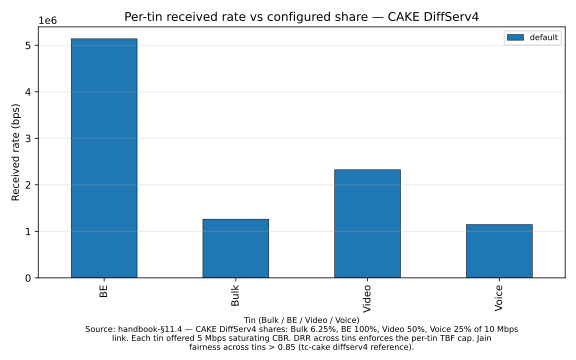
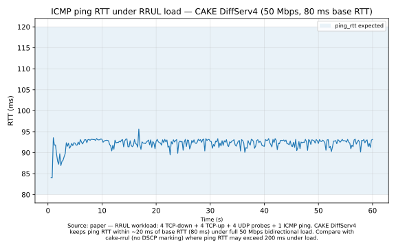
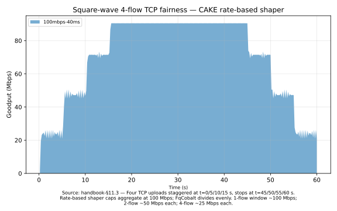

# CAKE recipes

CAKE (Common Applications Kept Enhanced) is the modern Linux qdisc developed by the Bufferbloat project and shipped in mainline since kernel 4.19. It composes per-tin token-bucket shaping, FQ-CoDel-derived per-flow fair queueing, ACK filtering, host-pair isolation, and DSCP-aware tin assignment — a single, integrated qdisc that does what classic stacks like HTB+SFQ+ECN-mark approximate in pieces.

The Stratum CAKE client recomposes these mechanisms into the substrate's four-slot pipeline using mainline `FqCobaltQueueDisc` as the per-tin slot inner queue, with an across-tin DRR dispatcher as the service policy. These four recipes walk through the headline use cases: substrate demo, RRUL benchmark, host-pair isolation, and TCP fairness under load.

> See also: [`diffserv.md`](I-03-diffserv.md), [`aqm-eval.md`](I-06-aqm-eval.md).

## Recipe: CAKE substrate demo — one UDP CBR per tin

**You'll**: drive one saturating UDP CBR into each of CAKE's four tins and watch the per-tin TBF caps plus across-tin DRR carve up a 10 Mbps bottleneck.

**Time**: 5 min

**You'll learn**:
- How `cake::Helper::SetAsCakeDiffserv4` wires the 4-tin layout (Bulk / BE / Video / Voice at 6.25% / 100% / 50% / 25% of link rate)
- How DSCP marking on the edge drives a packet into the matching tin
- How to read per-tin received bytes and a Jain fairness index from the substrate

**Prerequisites**: [Quickstart](I-02-quickstart.md) (built ns-3, ran example-1)

> [!NOTE]
> The tin layout is hardcoded to `SetAsCakeDiffserv4` — there is no `--tin-mode` CLI flag in this example. Other tin profiles (best-effort, precedence, diffserv3, diffserv8) live on `cake::Helper` and can be substituted by editing one line.

### Run it

```bash
cd ns-3  # or your ns-3 tree (standalone flow)
./ns3 run "diffserv-cake --outDir=/tmp/diffserv-cake --simTime=8"
```

### How it works

```cpp
// 1. Build a CAKE edge qdisc with the DiffServ4 tin layout at 10 Mbps.
Ptr<EdgeQueueDisc> edge = CreateObject<EdgeQueueDisc>();
cake::Helper::SetAsCakeDiffserv4(edge, DataRate(totalRateBps));
```

```cpp
// 2. Tag each sender's source IP with the tin's DSCP at the edge classifier,
//    then route it via a "dumb" (no-meter) policy into the right tin.
helper.AddMarkRule(edge, kTins[i].dscp,
                   static_cast<int32_t>(senderIfs[i].GetAddress(0).Get()),
                   kAnyHost, kAnyProtocol, 0);
helper.AddDumbPolicy(edge, kTins[i].dscp);
```

```cpp
// 3. Each sender's OnOffApplication marks its packets via the Tos attribute
//    (DSCP << 2) so they land in the matching tin pre-edge.
onOff.SetAttribute("DataRate", DataRateValue(DataRate(flowRateBps)));
onOff.SetAttribute("Tos", UintegerValue(static_cast<uint8_t>(kTins[i].dscp << 2)));
```

### How to read the results

**Expected range** (source: [the tin profiles section of the CAKE chapter](III-04-cake.md)):

- Bulk tin (DSCP CS1, 6.25% share): received ~625 kbps out of 10 Mbps
- BE tin (DSCP CS0, 100% share): received ~10 Mbps (full bottleneck — no competing tin exceeds its cap)
- Video tin (DSCP AF41, 50% share): received ~5 Mbps
- Voice tin (DSCP EF, 25% share): received ~2.5 Mbps
- Jain fairness across tins (weighted by share): > 0.85

**How the numbers move when you change `--totalRateBps`**:

- All four per-tin received rates scale linearly with the link rate (the TBF cap is a fraction of `totalRateBps`)
- Jain fairness index stays stable — the DRR enforces the share ratios regardless of absolute rate

**How the numbers move when you change `--flowRateBps`**:

- Lowering below the tin's cap unsaturates that tin; the received rate equals the offered rate and the DRR distributes the freed capacity to other tins
- Raising above the cap (default = 5 Mbps, all tins saturated) has no further effect — the TBF hard-caps each tin

### How to see the results

After running the recipe, render the figure with:

```bash
./scripts/plot-recipe cake-diffserv4
```

This produces `figures/cake-diffserv4/per-flow-bar.svg` (shown below).



**Raw CSV data**: `output/ns3/cake/default/per-tin-rates.csv`

**To compare tin profiles (diffserv4 vs diffserv3)**: edit `diffserv-cake.cc` to swap `SetAsCakeDiffserv4` for `SetAsCakeDiffserv3`, re-run, then re-invoke `./scripts/plot-recipe cake-diffserv4` — the bar chart collapses from four tins to three.

### Try changing

1. Run with `--totalRateBps=50000000` (50 Mbps): per-tin caps scale linearly — Bulk gets ~3.1 Mbps instead of ~625 kbps. Re-run `./scripts/plot-recipe cake-diffserv4` to see the updated bar heights.
2. Lower `--flowRateBps=1000000` so the Video tin (5 Mbps cap) is no longer saturated: its received rate now equals the offered 1 Mbps and the dispatcher distributes the slack to other tins.
3. Open `diffserv-cake.cc` and swap `SetAsCakeDiffserv4` for `SetAsCakeDiffserv3` — the Video tin merges into BE and you get three bars instead of four in the plot.

### Deep-dive

See also: [Tin profiles (DSCP-to-tin maps)](III-04-cake.md) and [Composition with the substrate](III-04-cake.md) in the CAKE implementation chapter.

### Found a problem?

[File a recipe issue](https://github.com/digitalities/diffserv4ns/issues/new?template=recipe-request.yml)

## Recipe: RRUL benchmark with DSCP marking

**You'll**: run the Flent RRUL (Real-time Response Under Load) workload through a CAKE-shaped 50 Mbps bottleneck with each of the 4 TCP-down + 4 TCP-up flows marked into a different DSCP class.

**Time**: 15 min

**You'll learn**:
- How RRUL stresses an AQM: 4 TCP downloads + 4 TCP uploads + 4 UDP probes + 1 ICMP ping, all at once
- How DSCP marking via the `Tos` attribute on `BulkSendApplication` routes flows into CAKE tins from the first segment onward
- How `FlentCsvSink` exports a Flent-compatible CSV bundle ready for `flent --plot`

**Prerequisites**: [Quickstart](I-02-quickstart.md) (built ns-3, ran example-1)

> [!NOTE]
> The non-DSCP baseline is `cake-rrul` (same workload, no `Tos` marking, all flows land in the default tin). Run both with the same `--bw` and `--rtt` for a fair side-by-side comparison.

### Run it

```bash
cd ns-3  # or your ns-3 tree (standalone flow)
./ns3 run "cake-rrul-diffserv --bw=50Mbps --rtt=80ms --length=60 --output=/tmp/cake-rrul-ds/"
```

### How it works

```cpp
// 1. Map each of the 4 flow indices to a DSCP class. CAKE's DiffServ4
//    tin layout: BE (CS0), BK (CS1), CS5, EF.
const uint8_t kTosByFlow[4] = {kTosBE, kTosBK, kTosCS5, kTosEF};
```

```cpp
// 2. Install the CAKE DiffServ4 edge with per-tin rate-based shaping.
cake::Helper::SetAsCakeDiffserv4(edgeDs,
                                 DataRate(bandwidth.GetBitRate()),
                                 false,  // enableAckFilter
                                 false,  // enableLlq
                                 true,   // enableTinShaping
                                 false,  // enableHostIsolation
                                 false); // useInnerTbfShaping
```

```cpp
// 3. Each BulkSendApplication marks via Tos before its first segment;
//    SourceApplication::DoStartApplication() calls Socket::SetIpTos so
//    every packet on this flow carries the right DSCP.
BulkSendHelper bulk("ns3::TcpSocketFactory",
                    InetSocketAddress(receiverIfs[i].GetAddress(1), port));
bulk.SetAttribute("MaxBytes", UintegerValue(0));
bulk.SetAttribute("Tos", UintegerValue(kTosByFlow[i]));
```

### How to read the results

**Expected range** (source: [the validation section of the CAKE chapter](III-04-cake.md)):

- ICMP ping RTT: 80–120 ms under full bidirectional load (base RTT = 80 ms, CAKE adds < 40 ms queueing)
- EF tin (25% of 50 Mbps = 12.5 Mbps cap): download flow 3 receives ~12.5 Mbps; its queueing contribution is minimal
- BE/BK/CS5 tins: each receives a share bounded by its tin's TBF cap; excess stays in the bottleneck queue
- Without DSCP marking (`cake-rrul`): ping RTT often exceeds 200 ms as all flows compete in one tin

**How the numbers move when you change `--bw`**:

- Lower bandwidth intensifies congestion; EF tin's absolute cap drops proportionally but its latency protection remains (25% reserved)
- Ping RTT at `--bw=10Mbps` stays in the 80–120 ms band because the EF TBF cap prevents head-of-line blocking from BE traffic

**How the numbers move when you change `--rtt`**:

- Base RTT shifts the entire RTT curve up or down; the queueing contribution (CAKE's sojourn control) remains bounded by the AQM target independent of propagation delay

### How to see the results

After running the recipe, render the figure with:

```bash
./scripts/plot-recipe cake-rrul
```

This produces `figures/cake-rrul/owd-time-series.svg` (shown below).



**Raw CSV data**: `output/ns3/cake-rrul/<arm>/ping_icmp.csv`

**To compare DSCP vs no-DSCP**: run both `cake-rrul-diffserv` and `cake-rrul` with the same `--bw` and `--rtt`, then place both output directories under `output/ns3/cake-rrul/` — both arms overlay on the same time-axis plot.

### Try changing

1. Run with `--bw=10Mbps` to see how the EF tin's 25% cap plays out under heavy congestion (EF flow gets ~2.5 Mbps regardless of the 4-way TCP free-for-all). Re-run `./scripts/plot-recipe cake-rrul` to see the RTT overlay.
2. Re-run with `cake-rrul` (drop the `-diffserv` suffix) and the same `--bw`/`--rtt` — place both output directories under `output/ns3/cake-rrul/` and re-invoke `./scripts/plot-recipe cake-rrul` to see the DSCP vs baseline RTT overlay.
3. Bump `--length=180` for a longer steady-state window: the ping RTT series shows a cleaner distribution after the TCP slow-start transient (first ~5 s) subsides.

> [!TIP]
> The output bundle is laid out for `flent --plot` (see [appendix III-03A — CAKE Flent figure pack](III-04A-cake-flent-figure-pack.md)). The metadata in `metadata.json` records the DSCP-to-flow map for downstream tooling.

### Deep-dive

See also: [appendix III-03A — CAKE Flent figure pack](III-04A-cake-flent-figure-pack.md) — Figure 5 ("DiffServ-marked RRUL") is the canonical reproduction this recipe drives.

### Found a problem?

[File a recipe issue](https://github.com/digitalities/diffserv4ns/issues/new?template=recipe-request.yml)

## Recipe: Asymmetric host-pair isolation

**What host isolation does**: CAKE triple-isolate mode keeps per-host bulk-flow counts and divides each flow's DRR quantum by `max(srcCount, dstCount)` — the larger of that flow's source-host and destination-host active-flow counts. It is flat per-flow DRR with a per-host divisor, not a separate outer queue per host. A host running many flows has each of its flows served with a proportionally smaller quantum, so opening more flows does not win it more aggregate bandwidth against a host running few.

**Configuration pattern**: enable host-pair isolation by passing `enableHostIsolation=true` to any `cake::Helper::SetAsCake*` call:

```cpp
// BestEffort is the single-tin profile — isolates host-pair fairness
// from tin-level effects.
cake::Helper::SetAsCakeBestEffort(edgeDs,
                                  DataRate(bandwidth.GetBitRate()),
                                  false,               // enableAckFilter
                                  false,               // enableLlq
                                  true,                // enableTinShaping
                                  true,                // enableHostIsolation
                                  false);              // useInnerTbfShaping
```

This sets `EnableHostIsolation=true` and `HostIsolationMode=Triple` on the patched-mainline `FqCobaltQueueDisc` (the `EnableHostIsolation` / `HostIsolationMode` attributes and the mode enum come from `patches/ns3/0006`; `patches/ns3/0016` adds the per-host hashing the modes consume). The same `enableHostIsolation` parameter is available on `SetAsCakeDiffserv4`, `SetAsCakeDiffserv3`, `SetAsCakeDiffserv8`, `SetAsCakePrecedence`, and `SetAsCakeAlphaTinShaped`.

> [!NOTE]
> Triple-isolate equalises by source host **or** destination host — whichever side has more active flows (`max(srcCount, dstCount)`). For the asymmetry to show, host A and host B must use **different destination hosts**: then host A's source-host count drives the divisor and its flows are scaled down against host B's single flow. If instead **all flows share one destination sink**, the destination-host count saturates uniformly across every flow, the divisor cancels, and the result reduces to plain per-flow fairness — the many-flow host keeps its per-flow share. (This is the reverse of the retired per-`{src,dst}`-pair wrapper, where a shared sink was what collapsed a host's flows into one bucket.)

**Measured results**: for the measured host-fairness results — the ≤4.3 pp ns-3/Linux agreement at the shared-sink anchor, and the fidelity boundary (substantially a measurement-configuration effect, not a scheduler divergence) that appears in the asymmetric split-destination regime where isolation actually discriminates — see the [CAKE implementation chapter](III-04-cake.md#host-fairness-empirical-anchor).

> [!NOTE]
> A dedicated runnable host-isolation example scenario is planned as future work.

### Deep-dive

See also: [host-pair isolation in the CAKE implementation chapter](III-04-cake.md) — the composition pattern and the host-fairness empirical anchor.

### Found a problem?

[File a recipe issue](https://github.com/digitalities/diffserv4ns/issues/new?template=recipe-request.yml)

## Recipe: Square-wave 4-flow TCP fairness

**You'll**: stagger four TCP uploads with offset start/stop times through a CAKE rate-based shaper and watch each flow ramp up to its fair share as the others arrive.

**Time**: 15 min

**You'll learn**:
- How CAKE's rate-based dispatcher (`cake::Helper` in `RateBased` shaper mode) divides a fixed bottleneck across an N-flow workload
- How the per-flow throughput trajectory tracks the active-flow count over time (1 flow → 100%, 2 → 50% each, 4 → 25% each)
- How to wire `FlentCsvSink` to emit a Flent-compatible bundle directly from a C++ scenario

**Prerequisites**: [Quickstart](I-02-quickstart.md) (built ns-3, ran example-1)

### Run it

```bash
cd ns-3  # or your ns-3 tree (standalone flow)
./ns3 run "cake-tcp-4up-squarewave --bw=100Mbps --rtt=40ms --length=60"
```

### How it works

```cpp
// 1. Configure cake::Helper in RateBased mode so the dispatcher caps the
//    aggregate egress at the bottleneck rate. Per-tin caps equal the
//    aggregate (one-tin-per-flow, all the same shape).
cake::Helper helper;
helper.SetShaperMode(cake::Helper::ShaperMode::RateBased);
helper.SetGlobalRateBps(bandwidth.GetBitRate());
helper.SetTinRateBpsAll(bandwidth.GetBitRate());
helper.SetTinCount(nFlows);
helper.BuildAndInstall(bottleneckDev.Get(0));
```

```cpp
// 2. Stagger the four flows: starts at t=0/5/10/15, stops at t=45/50/55/60.
//    Each flow's throughput trace is a "square wave" that ramps up as it
//    arrives and back down as later flows depart.
const double starts[4] = {0.0, 5.0, 10.0, 15.0};
const double stops[4]  = {45.0, 50.0, 55.0, 60.0};
```

```cpp
// 3. Emit a Flent-compatible CSV bundle so the trace can be replayed with
//    `flent --plot tcp_4up_squarewave` against any of the Flent figures.
FlentCsvSink sink;
sink.SetTestName("tcp_4up_squarewave");
sink.SetStepSize(MilliSeconds(200));
sink.SetLength(Seconds(length));
sink.SetOutputDir(outDir);
```

### How to read the results

**Expected range** (source: [the validation section of the CAKE chapter](III-04-cake.md)):

- t = 0–5 s (1 active flow): ~100 Mbps (sole flow gets the full bottleneck)
- t = 5–10 s (2 active flows): ~50 Mbps each
- t = 10–45 s (4 active flows): ~25 Mbps each
- t = 45–50 s (3 active flows): ~33 Mbps each
- t = 50–55 s (2 active flows): ~50 Mbps each
- t = 55–60 s (1 active flow): ~100 Mbps (flow 3 finishes last)
- TCP slow-start is visible as a brief ramp at each flow's entry; fairness holds in steady state

**How the numbers move when you change `--bw`**:

- All per-flow rates scale proportionally; the square-wave shape and fairness property are preserved
- At lower bandwidths (e.g. `--bw=10Mbps`), TCP slow-start transients become more pronounced relative to steady-state rate

**How the numbers move when you change `--rtt`**:

- Higher RTT lengthens the slow-start ramp at each new flow's entry
- The 4-flow steady-state rates (~25 Mbps each) are unaffected — RTT does not change the shaper's capacity allocation

### How to see the results

After running the recipe, render the figure with:

```bash
./scripts/plot-recipe cake-ack-filter
```

This produces `figures/cake-ack-filter/throughput-stacked.svg` (shown below).



**Raw CSV data**: `output/ns3/cake-squarewave/<arm>/tcp_up_flow{0..3}.csv` (columns: `t,bytes_delta,goodput_mbps`)

**To compare spacing variants**: edit `cake-tcp-4up-squarewave.cc` to change `starts` and `stops`, re-run, then re-invoke `./scripts/plot-recipe cake-ack-filter` to overlay the modified trace.

### Try changing

1. Tighten the spacing — set `starts[4] = {0, 1, 2, 3}` and `stops[4] = {57, 58, 59, 60}`: all four flows overlap for nearly the full duration and the per-flow rates converge to 25 Mbps fast. Re-run `./scripts/plot-recipe cake-ack-filter` to see the stacked area collapse to four equal bands.
2. Run with `--bw=10Mbps --rtt=200ms`: the longer RTT shows TCP's slow-start cost on each flow's ramp-up — fairness still holds in steady state but the transients dominate the stacked chart.
3. Raise `--length=180` for a 12-minute trace: the stacked chart shows a cleaner statistical reading of the rate-based shaper's fairness in the long 4-flow window.

> [!TIP]
> The output directory is laid out for `flent --plot tcp_4up_squarewave <outDir>`. The square-wave plot is one of the canonical Flent regression figures for any bufferbloat-aware AQM.

### Deep-dive

See also: [Implementation overview](III-04-cake.md) in the CAKE implementation chapter — the rate-based shaper is one of the three coexisting hard-rate-cap paths.

### Found a problem?

[File a recipe issue](https://github.com/digitalities/diffserv4ns/issues/new?template=recipe-request.yml)
