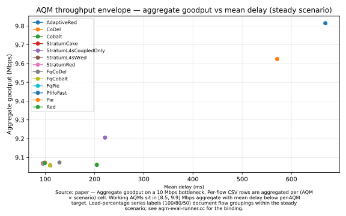
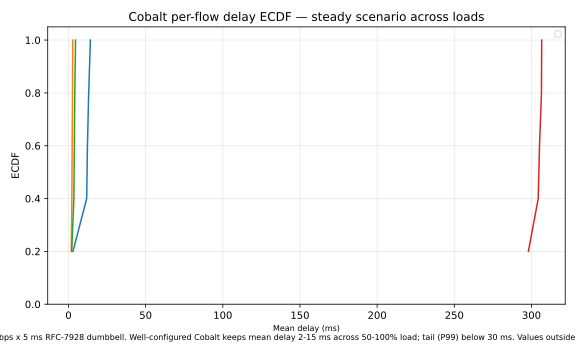

# AQM evaluation recipes

The Stratum substrate ships with an AQM characterisation harness that sweeps the in-tree AQM cells (current registry size: n=13 in the `Registry<AqmEntry>` template) under a single uniform workload, producing a 2D throughput-vs-latency "ellipse diagram" you can read at a glance. These two recipes walk through the harness and one external benchmark reproduction.

> See also: [`diffserv.md`](I-03-diffserv.md), [`cake.md`](I-05-cake.md), [`l4s.md`](I-04-l4s.md) — the AQM choice is one of the four-slot pipeline's most consequential knobs.

## Recipe: Run one cell of the AQM catalogue (ellipse diagram)

**You'll**: run one cell of `aqm-eval-runner` — pick any AQM in the catalogue, run a single RFC 7928 scenario against it, and read the per-flow CSV and the aggregate summary that feed the ellipse plot.

**Time**: ~1 minute

**You'll learn**:
- How the substrate's AQM evaluation runner is organised — one binary plus a registry of queue discs
- What a single "cell" of the ellipse diagram measures (per-flow goodput vs mean delay under a fixed scenario)
- How to enumerate the available AQMs and scenarios from the CLI itself

**Prerequisites**: [Quickstart](I-02-quickstart.md) (built ns-3, ran example-1)

> [!NOTE]
> The runner writes outputs under `/tmp/aqm-eval-runner/` by default. Override with `--outDir=<path>` if you want to keep results between runs.

### Run it

```bash
cd ns-3  # or your ns-3 tree (standalone flow)
./ns3 run "aqm-eval-runner --aqm=ns3::FqCoDelQueueDisc --scenario=steady --simTime=4"
```

> [!NOTE]
> The runner's `--aqm=` value is the dispatch name from the registry — full `ns3::*QueueDisc` TypeIds for mainline AQMs (e.g. `ns3::CobaltQueueDisc`), and short names for the Stratum-specific composites (`StratumRed`, `StratumL4sWred`, `StratumL4sCoupledOnly`, `StratumCake`). Run `./ns3 run "aqm-eval-runner --aqm=list"` for the full catalogue.

This runs the **steady** scenario (RFC 7928 Test 1: 4 saturating UDP bulk flows + 1 sparse EF probe) through the mainline `FqCoDelQueueDisc` and writes two files:

- `/tmp/aqm-eval-runner/steady-FqCoDel-perflow.csv` — one row per flow with goodput, retransmitted bytes, mean delay
- `/tmp/aqm-eval-runner/steady-FqCoDel-summary.txt` — aggregate Mbps, Jain fairness, EF flow delay

### How it works

The runner enumerates AQMs from a central registry, so adding a queue disc to the registry makes it instantly visible to the runner — no binary edit required:

```cpp
// Validate --aqm against the registry; reject unknown names.
if (!aqm_eval::AqmRegistry::Get().FindByName(aqm))
{
    std::cerr << "[aqm-eval-runner] unknown --aqm='" << aqm << "'\n"
              << "  valid choices: " << JoinAqmNames() << "\n";
    return 1;
}
```

The bottleneck queue disc is constructed via a per-entry factory closure that receives the link rate (so e.g. `StratumCake` can size its rate-based shaper correctly):

```cpp
// One call site for every AQM — the registry knows how to build it.
Ptr<QueueDisc> qdisc = aqm_eval::AqmRegistry::Get().Make(aqm, DataRate(totalRateBps));
```

Per-flow goodput is computed RFC 7928 §3.2 style — original bytes only, retransmissions subtracted:

```cpp
// FlowMonitor counts every IP-layer byte; the TcpRetransmitTag lets us
// subtract retransmitted bytes to recover goodput.
const uint64_t origBytes = r.fmRxBytes - r.fmRetxBytes;
r.rxRateBps = (origBytes * 8.0) / measureSpan;
```

### How to read the results

**Expected range** (source: the accompanying paper §5 / Fig 2):

- Aggregate goodput per flow cluster: **8.5–9.9 Mbps** (link is 10 Mbps; TCP + per-flow overhead account for the gap)
- Mean delay: **2–15 ms** depending on AQM algorithm and scenario; FQ-class AQMs (e.g. `ns3::FqCoDelQueueDisc`, `ns3::FqCobaltQueueDisc`) cluster at the low end (2–5 ms); single-queue drop-tail and RED-family AQMs drift higher (8–15 ms)
- Jain fairness: **≥ 0.90** for FQ-class; **≥ 0.80** for single-queue AQMs; values below 0.70 indicate flow starvation (see the [Reading the figure section of the AQM-eval chapter](III-06-aqm-eval.md))

**How the numbers move when you change `--aqm=<other-TypeId>`** (use the full `ns3::*QueueDisc` TypeId for mainline AQMs; short names only for Stratum composites):

- `ns3::PfifoFastQueueDisc` → delays 10–20 ms; Jain 0.85–0.90 (no active queue management)
- `ns3::FqCoDelQueueDisc` → delays 2–5 ms; Jain ≥ 0.95 (per-flow isolation)
- `ns3::CobaltQueueDisc` → delays 3–8 ms; Jain ≥ 0.90 (CoDel variant with BLUE fallback)
- `ns3::RedQueueDisc` → delays 5–15 ms; Jain 0.80–0.90 (depends on min/max threshold calibration)
- `StratumRed` (Stratum composite) → sits *inside* the mainline envelope on paper Fig 2 — composability claim

### How to see the results

After running the recipe, render the figure with:

```bash
./scripts/plot-recipe aqm-eval-runner --arm=ns3::CobaltQueueDisc/80
```

This produces `figures/aqm-eval-runner/aqm-envelope.svg` (shown below).



**Raw CSV data**: `output/ns3/aqm-eval/<ns3::TypeId>/<load>/steady-*-perflow.csv`

**To compare AQMs**: re-run with `--aqm=ns3::FqCoDelQueueDisc --load=80%`, then re-invoke `plot-recipe --arm=ns3::FqCoDelQueueDisc/80` — the figure is regenerated for that arm. To overlay multiple AQMs in one figure, run both arms and omit `--arm` (the `filter-required` mode then merges all matched arm directories).

### Try changing

1. List every registered AQM and pick a different one: `./ns3 run "aqm-eval-runner --aqm=list"`, then re-run with e.g. `--aqm=ns3::CobaltQueueDisc` (full mainline TypeId) or `--aqm=StratumL4sWred` (Stratum short name). After each run, re-render with `./scripts/plot-recipe aqm-eval-runner --arm=<TypeId>/80` to overlay both arms.
2. Swap the scenario for one with TCP flows: `--scenario=tcp-friendly` (two long-lived TCP NewReno flows) or `--scenario=tcp-unresponsive` (1 TCP + 1 unresponsive UDP CBR at 90% of link capacity). Compare the resulting ECDF shape — AQMs that lose Jain fairness appear as a split cluster in the plot.
3. Toggle ECN on a vanilla AQM: `--ecn=on` then `--ecn=off`. Most mainline AQMs (`ns3::RedQueueDisc`, `ns3::AdaptiveRedQueueDisc`, `ns3::CoDelQueueDisc`, `ns3::PieQueueDisc`, `ns3::CobaltQueueDisc`, `ns3::FqCoDelQueueDisc`, `ns3::FqPieQueueDisc`, `ns3::FqCobaltQueueDisc`) honour the override; composites (`StratumL4sWred`, `StratumCake`) keep their built-in ECN policy and print a note.

> [!TIP]
> To regenerate the full ellipse plot across every (scenario, AQM) pair, use `scripts/aqm-eval/ellipse-plot.py` on the full matrix directory. One CSV per cell, ~117 cells; budget 3–5 minutes for a full sweep on a laptop.

### Deep-dive

See also: [AQM-eval chapter](III-06-aqm-eval.md).

### Found a problem?

[File a recipe issue](https://github.com/digitalities/stratum-ns3/issues/new?template=recipe-request.yml)

## Recipe: Reproduce Chang et al. 2015 (DiffServ scheduler validation)

**You'll**: run the substrate's reproduction of the Chang/Rahimi/Pournaghshband SIMULTECH 2015 scenario — two TCP flows competing through a weighted-fair scheduler — and verify that the perceived bandwidth ratio converges to the configured weight ratio.

**Time**: 10 minutes (single run); 30+ minutes for the full validation matrix.

**You'll learn**:
- How an external benchmark is reproduced cell-by-cell against the substrate's scheduler implementations
- Why TCP feedback dynamics affect convergence at low data rates (and how to bypass them with `--udp`)
- How weight ratios map to perceived throughput ratios under WFQ, WRR, WF2Q+, SCFQ, and SFQ

**Prerequisites**: [Quickstart](I-02-quickstart.md) (built ns-3, ran example-1)

### Run it

```bash
cd ns-3  # or your ns-3 tree (standalone flow)
./ns3 run "chang-comparison --scheduler=WRR --dataRate=10 --weightRatio=2"
```

This runs the Chang et al. dumbbell — two senders, one receiver, bottleneck at half the sender access rate — for 300 seconds with WRR weights of (~13.3, ~6.7) on the two flows. Output lands under `output/chang-comparison/WRR-T10000-R2/`:

- `ratio.tr` — time series `<seconds> <perceived_ratio>`
- `summary.txt` — final weights, per-flow throughput, perceived vs expected ratio, error percentage

### How it works

The bottleneck is a `EdgeQueueDisc` that classifies flows by source IP and dispatches them into per-DSCP queues managed by the chosen scheduler:

```cpp
// Two-flow scenario: flow 0 -> DSCP 10 (queue 0), flow 1 -> DSCP 20 (queue 1).
MarkRule rule0;
rule0.dscp = 10;
rule0.srcAddr = static_cast<int32_t>(Ipv4Address("10.0.1.1").Get());
disc->AddMarkRule(rule0);
```

Scheduler weights are derived from the `--weightRatio` CLI so the two weights always sum to 20 — this keeps the absolute service rate stable while only the ratio varies:

```cpp
// w1 / w2 = weightRatio, w1 + w2 = 20.
double w2 = 20.0 / (weightRatio + 1.0);
double w1 = 20.0 - w2;
```

The scheduler itself is built via the scheduler registry — the same dispatch pattern as the AQM registry in the previous recipe:

```cpp
// Case-fold the CLI name, map "WF2Q+" -> "wf2qp", look up by canonical tag.
SchedulerArgs schedArgs;
schedArgs.numQueues = 2;
schedArgs.linkBps = bottleneckMbps * 1e6;
schedArgs.weights = {w1, w2};
auto sched = SchedulerRegistry::Get().Construct(canonicalScheduler, schedArgs);
```

The perceived ratio is sampled periodically and averaged over the second half of the run (the first half is treated as TCP warm-up).

### How to read the results

**Expected range** (source: [the Running the matrix section of the AQM-eval chapter](III-06-aqm-eval.md) / the accompanying paper §5):

- Perceived weight ratio (from `summary.txt`): within **± 5% of the configured `--weightRatio`** for WRR and WF2Q+ at `--dataRate=10`; up to ± 15% at `--dataRate=50` due to TCP AIMD floor
- Convergence time (from `ratio.tr`): **< 60 s** for WRR/SCFQ at `--dataRate=10`; WFQ and WF2Q+ converge in **30–90 s** depending on packet-size uniformity
- Jain fairness across the two flows: **≥ 0.90** at ratios ≤ 5; degrades below **0.80** above ratio 7 when TCP throughput asymmetry prevents the smaller flow from filling its weight slot

**How the numbers move when you change `--scheduler=<other>`**:

- `--scheduler=WRR` → fastest convergence (< 30 s), smallest ratio error (< 3%) for equal packet sizes; no virtual-time bookkeeping
- `--scheduler=WFQ` → virtual-time scheduling; converges more slowly (~60–90 s) but handles mixed packet sizes more fairly
- `--scheduler=WF2Q+` → tighter delay bounds than WFQ; error < 5% across all tested ratios
- `--scheduler=SCFQ` → self-clocking variant; converges well but slightly noisier ratio trace
- `--udp` flag → removes TCP feedback; ratio error drops to < 1% for all schedulers (isolates scheduler weight-tracking from TCP dynamics)

### How to see the results

After running the recipe, render the per-flow delay ECDF for the Cobalt AQM (the AQM underneath the bottleneck in both this and the previous recipe) with:

```bash
./scripts/plot-recipe aqm-eval-cobalt
```

This produces `figures/aqm-eval-cobalt/ecdf.svg` (shown below), which shows the per-flow mean-delay distribution of `ns3::CobaltQueueDisc` across 50%, 80%, and 100% load arms — the AQM baseline that scheduler comparison sits on top of.



**Raw CSV data**: `output/ns3/aqm-eval/ns3::CobaltQueueDisc/<load>/steady-*-perflow.csv`

**Chang et al. ratio convergence data**: `output/chang-comparison/<scheduler>-T<dataRate>-R<weightRatio>/ratio.tr` and `summary.txt`

**To compare schedulers visually**: re-run `chang-comparison` with `--scheduler=WFQ`, then with `--scheduler=WRR`, and plot the `ratio.tr` files side by side with a simple `awk` + `gnuplot` pipeline or import into the notebook of your choice — the convergence slope is the diagnostic.

### Try changing

1. Sweep the weight ratio: re-run with `--weightRatio=1`, `--weightRatio=7`, `--weightRatio=10`. At very high ratios TCP's AIMD floor prevents perfect convergence — watch the error percentage grow in `summary.txt` and cross-check against the Cobalt ECDF to confirm the AQM itself is not the limiting factor.
2. Compare schedulers: `--scheduler=WFQ`, `--scheduler=WRR`, `--scheduler=WF2Q+`, `--scheduler=SCFQ`, `--scheduler=SFQ`. WRR converges cleanest for uniform packet sizes (no virtual-time bookkeeping). Re-run `aqm-eval-cobalt` between scheduler runs to confirm Cobalt's delay profile is unchanged — scheduler swap should not shift the AQM operating point.
3. Bypass TCP feedback to isolate the scheduler's weight-tracking behaviour: `--udp` makes both senders emit saturating UDP CBR at the access rate, so the bottleneck is 2× oversubscribed and the scheduler decides allocation purely by weight.

> [!WARNING]
> At `--dataRate=50` the run extends automatically to 1200 seconds (TCP cwnd takes longer to settle at high rates). If you're scripting the full matrix expect a multi-hour wall-clock budget.

### Deep-dive

See also: [three-way validation chapter](III-02-three-way-validation.md).

### Found a problem?

[File a recipe issue](https://github.com/digitalities/stratum-ns3/issues/new?template=recipe-request.yml)
