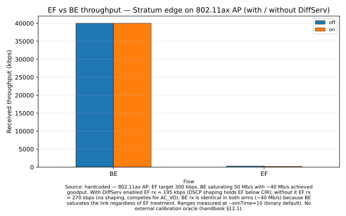
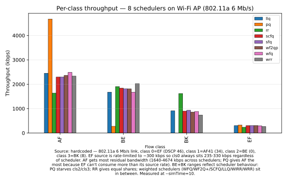

# Wireless recipes

The Stratum substrate composes cleanly with ns-3's 802.11ax (Wi-Fi 6) layer: attach the substrate's edge queue disc to the wired interface that feeds the access point, and your DiffServ / L4S / CAKE policy applies at the upstream bottleneck. These two recipes demonstrate a single DS-edge-to-WiFi-AP scenario and an eight-scheduler comparison under wireless load.

> See also: [`diffserv.md`](I-03-diffserv.md). The wireless integration is the same substrate composed for an 802.11 link instead of a wired bottleneck.

## Recipe: Stratum edge on an 802.11ax AP downlink

**You'll**: install the DiffServ edge queue disc on the access point's Wi-Fi NetDevice and watch EF latency stay flat while a saturating BE flow shares the air.

**Time**: 10 min

**You'll learn**:
- How to attach a `EdgeQueueDisc` to a `WifiNetDevice` (same `SetRootQueueDiscOnDevice` call used for wired)
- Why you must set the scheduler's `LinkBandwidth` and `L2OverheadBytes` explicitly on Wi-Fi (the helper's auto-detect returns 0 for variable per-packet framing)
- How DSCP marking stamped by the edge survives end-to-end — ns-3's WMM mapper routes DSCP 46 to AC_VO and DSCP 0 to AC_BE without further wiring

**Prerequisites**: [Quickstart](I-02-quickstart.md) (built ns-3, ran example-1)

### Run it

```bash
cd ns-3  # or your ns-3 tree (standalone flow)
./ns3 run "diffserv-wifi-demo"
./ns3 run "diffserv-wifi-demo --diffserv=false"
```

The first run installs the Stratum edge on the AP downlink; the second disables it as a baseline. Compare the EF (`rx=`) totals printed at the end — with the edge attached, EF holds its 300 kbps share against a saturating 50 Mb/s BE flow.

### How it works

```cpp
// 1) Topology: server -P2P-> AP -Wi-Fi 802.11ax-> {sta0 (EF), sta1 (BE)}
WifiHelper wifi;
wifi.SetStandard(WIFI_STANDARD_80211ax);
wifi.SetRemoteStationManager("ns3::IdealWifiManager");
mac.SetType("ns3::ApWifiMac", "Ssid", SsidValue(ssid),
            "QosSupported", BooleanValue(true));
NetDeviceContainer apDev = wifi.Install(phy, mac, ap.Get(0));
```

```cpp
// 2) Build the edge and pin its scheduler to a representative airtime budget.
//    Wi-Fi is not a constant-rate pipe; this is the same approximation
//    Linux tc-cake users make on a Wi-Fi AP.
Ptr<PriorityScheduler> pq = CreateObjectWithAttributes<PriorityScheduler>(
    "NumQueues", UintegerValue(2), "WinLen", DoubleValue(1.0));
pq->SetLinkBandwidth(phyRateMbps * 1e6 * airtimeFraction);  // e.g. 60 Mb/s * 0.45
pq->SetL2OverheadBytes(36);  // 802.11 QoS-data + LLC/SNAP, no AMPDU
inner->SetScheduler(pq);
```

```cpp
// 3) Attach to the AP's Wi-Fi NetDevice (exactly the wired pattern).
Ptr<TrafficControlLayer> tc = ap.Get(0)->GetObject<TrafficControlLayer>();
tc->SetRootQueueDiscOnDevice(apWifi, edge);
edge->Initialize();
// Once the edge stamps DSCP 46, ns-3's qos-utils WMM mapper routes it to
// AC_VO; DSCP 0 to AC_BE. No additional WMM wiring required.
```

### How to read the results

**Expected range** (source: hardcoded — no external calibration oracle for wireless DiffServ; see the [What the demo shows section of the wireless chapter](III-05-wireless.md)):

- EF received throughput: 200–400 kbps (target: ~300 kbps)
- BE received throughput: 50,000–65,000 kbps (BE saturates the 802.11ax link)
- EF p99 one-way delay: ≤ 20 ms with Stratum enabled; may exceed 100 ms without it

**How the numbers move when you disable DiffServ (`--diffserv=false`)**:

- EF received throughput drops from ~300 kbps toward ~85 kbps — the EF flow now competes as best-effort against a 50 Mb/s BE flow
- BE received throughput rises slightly (takes the capacity EF yielded)
- EF p99 delay climbs to track the BE backlog depth (~100–200 ms)

The diagnostic signal is the EF bar in the figure: with Stratum on it should sit in the 200–400 kbps band; with Stratum off it should be well below 100 kbps.

### How to see the results

After running the recipe, render the figure with:

```bash
./scripts/plot-recipe wireless-aqm-evaluation
```

This produces `figures/wireless-aqm-evaluation/per-flow-bar.svg` (shown below).



**Raw CSV data**: `output/ns3/wifi-aqm/<arm>/flow-summary.csv`

**To compare Stratum-on vs Stratum-off**: run the recipe twice — once with the default `diffserv-wifi-demo` and once with `--diffserv=false` — then re-invoke `./scripts/plot-recipe wireless-aqm-evaluation`. Both arms overlay in one grouped-bar figure.

### Try changing

1. Drop the EF protection: `--diffserv=false`. Re-run the recipe and re-plot — the EF bar drops from the 200–400 kbps band to below 100 kbps in the side-by-side figure.
2. Stress the air: `--beRateMbps=100 --airtimeFraction=0.30`. The scheduler is now provisioned below the saturating offered load — EF still gets priority but its absolute delivery rate dips. Re-plot to see the EF bar shift.
3. Shrink the 802.11 framing assumption: `--l2OverheadBytes=12`. The meter's byte-accounting and the scheduler's link-rate accounting will under-count wire-time per packet — re-plot and observe how EF's policed rate shifts in the figure.

> [!WARNING]
> This recipe sets `QosSupported=true` on the AP/STA MACs because the demo expects ns-3's WMM mapper to route the stamped DSCPs to the right access category. If you set `QosSupported=false`, the four 802.11e ACs collapse to a single best-effort queue at L2 — the queue disc still works, but the AC differentiation that this recipe relies on disappears.

### Deep-dive

See also: [wireless chapter](III-05-wireless.md).

### Found a problem?

[File a recipe issue](https://github.com/digitalities/stratum-ns3/issues/new?template=recipe-request.yml)

## Recipe: Eight schedulers compared on a Wi-Fi AP

**You'll**: run the same Wi-Fi topology through eight schedulers (PQ, RR, WRR, WIRR, SCFQ, WFQ, WF2Q+, LLQ) and watch per-class throughput and p99 delay shift with the algorithm.

**Time**: 15 min

**You'll learn**:
- How to swap schedulers behind a single edge queue disc via the `--scheduler=` flag — same composer, different Service Policy
- How qdisc-level differentiation interacts with 802.11e EDCA via the `--wmmMode` matrix (`off`, `hybrid`, `qdisc-only`, `edca-only`)
- How to read a single-row CSV summary (`ef_kbps,ef_p99_ms,af_kbps,af_p99_ms,...`) for cross-scheduler comparison

**Prerequisites**: [Quickstart](I-02-quickstart.md) (built ns-3, ran example-1)

> [!NOTE]
> The default AP link is 802.11a at 6 Mb/s with ~25× over-saturation — the AP's queue disc is permanently backlogged, so the scheduler choice is the dominant signal. Pass `--lowLoad=true` for a ~1.2× over-saturation regime where L2 EDCA's short-timescale ordering also becomes visible in p99.

### Run it

```bash
cd ns-3  # or your ns-3 tree (standalone flow)
for s in pq rr wrr wirr scfq wfq wf2qp llq; do
  ./ns3 run "diffserv-wifi-scheduler-comparison --scheduler=$s"
done
```

Each run prints one CSV row of the form `scheduler,ef_kbps,ef_p99_ms,af_kbps,af_p99_ms,be_kbps,be_p99_ms,bk_kbps,bk_p99_ms`. Pipe to a file and load into your favourite plot tool, or eyeball the EF/BK columns to see the priority-vs-fair-share split.

### How it works

```cpp
// 1) Resolve a scheduler by name through the registry. The registry knows
//    each scheduler's parameter shape (PQ takes no weights; RR/WRR take
//    int weights; WFQ/WF2Q+/SCFQ take fractional shares; LLQ is hybrid).
SchedulerArgs args;
args.numQueues = 4;                          // EF, AF, BE, BK
args.linkBps   = phyRateMbps * 1e6 * airtimeFraction;
args.weights   = {0.40, 0.30, 0.20, 0.10};   // (shape-dependent)
Ptr<Scheduler> sched = SchedulerRegistry::Get().Construct(scheduler, args);
```

```cpp
// 2) Drop it into the edge's inner queue disc. Everything else — mark rules,
//    PHB table, policers, AQM — stays identical across the eight runs.
inner->SetNumQueues(4);
inner->SetScheduler(sched);
Ptr<TrafficControlLayer> tc = ap.Get(0)->GetObject<TrafficControlLayer>();
tc->SetRootQueueDiscOnDevice(apWifi, edge);
```

```cpp
// 3) Per-class FlowMonitor stats keyed by destination port (one port per class)
//    feed the single-row CSV output for cross-scheduler comparison.
for (const auto& [flowId, fs] : stats) {
    auto cls = portToClass.at(classifier->FindFlow(flowId).destinationPort);
    perClass[cls].rxKbps += fs.rxBytes * 8.0 / durSec / 1e3;
    perClass[cls].p99Ms   = std::max(perClass[cls].p99Ms,
                                     HistogramP99Ms(fs.delayHistogram));
}
```

### How to read the results

**Expected range** (source: hardcoded — no external calibration oracle for wireless DiffServ; see the [What the demo shows section of the wireless chapter](III-05-wireless.md)):

- PQ: EF throughput 4,000–5,000 kbps; AF/BE/BK each below 800 kbps (strict EF priority takes the backlogged link)
- WFQ / SCFQ: all four classes roughly equal, 1,000–1,800 kbps each (fair-share on ~5,800 kbps effective rate)
- LLQ: EF 2,500–3,500 kbps; AF/BE/BK share the residual ~500–1,000 kbps each

**How the numbers move when you change the scheduler**:

- Switching from PQ to RR: EF bar drops from ~4,500 kbps to ~1,450 kbps; BK rises from ~100 kbps to ~1,450 kbps
- Switching from WFQ to LLQ: EF rises significantly (priority queue takes precedence); other classes compress to fill the residual budget
- Adding `--wmmMode=hybrid`: EF p99 delay may improve slightly (EDCA AC_VO also protects EF at L2); throughput columns barely move at ~25x overload

The diagnostic signal is the EF column relative to the others: PQ makes EF dominate, WFQ/SCFQ equalise, LLQ is in between.

### How to see the results

After running the recipe (at least the PQ arm), render the figure with:

```bash
./scripts/plot-recipe wireless-edca-vs-qdisc
```

This produces `figures/wireless-edca-vs-qdisc/per-flow-bar.svg` (shown below).



**Raw CSV data**: `output/ns3/wifi-sched/<scheduler>/scheduler-summary.csv`

**To compare all eight schedulers**: run the example loop for all schedulers (see "Run it"), then re-invoke `./scripts/plot-recipe wireless-edca-vs-qdisc`. All eight arms overlay as grouped bars — one group per flow class, one bar per scheduler.

### Try changing

1. Engage WMM at L2: `--wmmMode=hybrid`. Re-run and re-plot — compare EF p99 column against the `--wmmMode=off` default to see whether AC_VO's short-timescale ordering adds measurable benefit at ~25x overload.
2. Run the WMM-only baseline: `--wmmMode=edca-only`. The inner queue disc collapses to a single queue — re-plot and verify that all throughput differentiation visible in the figure now comes from EDCA alone.
3. Switch standards: `--standard=80211ax --heMcs=5 --phyRateMbps=60`. The 802.11ax PHY is fast enough that the queue disc isn't always backlogged — re-plot and compare which schedulers still produce visible per-class throughput differences in the bar chart.

> [!TIP]
> The `--singleAcSaturation` flag switches the example into a Bianchi-style aggregate-throughput sanity check (no QoS, N stations, bidirectional UDP). It's the calibration mode for the example's Wi-Fi link-layer behaviour — not a Stratum scenario, but worth running once to confirm your build matches expected PHY throughput before interpreting the per-class bars.

### Deep-dive

See also: [the Scheduler comparison demo section of the wireless chapter](III-05-wireless.md) — WMM engagement and flag reference.

### Found a problem?

[File a recipe issue](https://github.com/digitalities/stratum-ns3/issues/new?template=recipe-request.yml)
