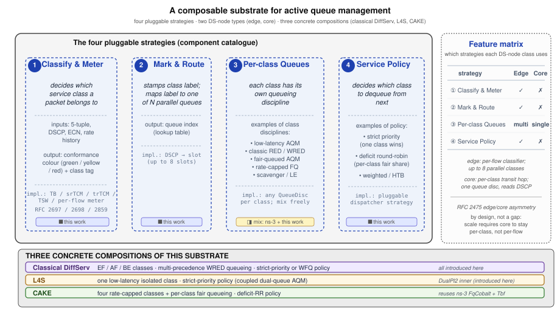

# Stratum architecture and design

> **Hands-on**: Part I gives runnable recipes for everything described
> here — start with the [quickstart](I-02-quickstart.md). Part III holds
> the validation evidence.

## One substrate, three clients

DiffServ, L4S, and CAKE are usually three separate things. On Linux they
are three queue disciplines (`sch_dsmark`, `sch_dualpi2`, `sch_cake`); in
ns-3 they are three unrelated models. Each carries its own classifier, its
own queueing, its own scheduler, and the three rarely meet on one node.
Stratum is the one composer that hosts all three.

Stratum treats each of the three as a client of a single edge/core queue
disc. A client is a binding: it chooses what to put in each of four
configuration slots, and the composer runs the resulting pipeline.
DiffServ binds RFC 2697/2698 meters and a strict-priority
scheduler; L4S binds an ECN-classified DualPI2 inner; CAKE binds a
DSCP-to-tin map with `FqCobalt` inners under deficit round robin. The
same code path serves all three.

The gain from the shared path is composition. Because the three clients
share one classifier, one queueing slot array, and one scheduler hook, a
node can mix them: a DualPI2 low-latency queue can run alongside an
assured-bandwidth DiffServ class on the same router, a composition that
no prior ns-3 contribution can express. That mix falls out of the design
rather than needing a bespoke module: put the DualPI2 inner in one slot,
the assured-bandwidth inner in another, and let a strict-priority
dispatcher serve them. Here they are three bindings of one composer.

"First-class client" means none is privileged. The DiffServ
client is canonical. It absorbs the 2001 DiffServ4NS module as its
historical core, and its four primitives are the ones the others reuse,
but the composer does not special-case it. L4S and CAKE attach through
the same slot API the DiffServ client uses: the same `SetInnerDiscAt`
call that places a RED disc in a DiffServ slot places a DualPI2 inner for
L4S or an `FqCobalt` tin for CAKE, and the same DSCP-to-slot mapping
routes to all three. Because the attachment is uniform, a single node can
run more than one client's traffic at once: an edge can route L4S packets
to a DualPI2 inner and assured-forwarding packets to a RED inner under one
classifier, one meter stack, and one PHB table. The three clients are peers: the composer sees four filled slots and runs
the pipeline.

This is the substrate's identity. Stratum is a new whole, not a third
version of DiffServ4NS. The 2001 module lives on as one client's
inherited core; Stratum is the composer that absorbs it and adds two more
peers beside it.

## The four strategy slots

The composer is four slots filled independently, one set per DS-node:

1. **Classify-and-Meter** — decide what aggregate a packet belongs to and
   whether it conforms.
2. **Mark-and-Route** — tag the packet and route it to an inner queue.
3. **Per-class slot array** — up to eight inner queue discs, one per
   class.
4. **Across-slot service policy** — the dequeue order across those
   inners.

*The four strategy slots and the three clients' bindings — the same
figure the accompanying paper uses to introduce the architecture.*

Each slot is set per node, and the four sets need not match between nodes.
RFC 2475 §2.4 allows edge and interior nodes to apply different traffic
conditioning, and the composer takes that literally: an edge node fills
all four slots, while a core node fills only the slot array and the
service policy. The edge runs the full pipeline (classify, meter, mark,
route, queue, schedule) and stamps a final DSCP onto every packet. The
core trusts that DSCP and does no classification or metering of its own;
it reads the mark the edge set and queues on it. The same per-class
inners and the same scheduler serve both, so the queueing and scheduling
machinery is written once and reused at every hop.

This split is two queue-disc classes. `EdgeQueueDisc` extends the
base ns-3 queue disc with the classifier and the per-aggregate meter
state; on enqueue it classifies the packet to an initial DSCP, meters it
and maps the resulting colour to a final DSCP, attaches the DSCP tag, and
consults the PHB table to pick an inner slot. `CoreQueueDisc` is a
thin subclass that performs none of that. It skips straight to the slot
lookup using the DSCP the edge already set. Everything from the slot array
inward is identical between them, which is why the asymmetry costs nothing
in duplicated code.

What follows describes each slot: the decision it makes, the contract a
strategy must satisfy to fill it, the families available, and which
client plugs in what.

### Classify-and-Meter

This slot decides which traffic aggregate a packet belongs to and whether
it conforms to that aggregate's profile. It runs at the ingress edge and
nowhere else. A strategy here is a classifier plus a meter: the
classifier maps packet fields (destination address, source and
destination port, application type) to an initial aggregate; the meter
maintains per-aggregate token state and returns a conformance colour. The
meter contract is narrow — given a packet length and the current time,
return a colour — and every meter takes the time as an explicit argument
rather than reading the simulation clock, which keeps the meters testable
without a running simulation.

The meter families are sr-TCM (RFC 2697), tr-TCM (RFC 2698), TSW2CM and
TSW3CM (RFC 2859), a plain token bucket, a per-flow byte-accounting meter,
and a pass-through that meters nothing. They share one interface and are
selected by a single helper call, so swapping a single-rate three-colour
meter for a two-rate one is a one-line change with no effect on the slots
downstream. The DiffServ client draws from this family. The
other two clients classify differently: L4S reads the ECT(1) code point at
the inner disc rather than metering at the edge, and CAKE classifies by
mapping DSCP to a tin, so for those two this slot is effectively
pass-through and the work moves inward.

### Mark-and-Route

This slot turns the meter's verdict into a forwarding decision. It writes
a DSCP onto the packet and uses a per-hop-behaviour table to map that DSCP
to one of the inner queue slots. A strategy here provides two things: the
rule that sets the final DSCP from the initial classification and the
conformance colour, and the PHB table that maps a DSCP to a slot index.
The mark rides as a `DscpTag` on the IPv4 header, applied on
dequeue. Once a packet carries its final DSCP, any downstream node routes
it by table lookup alone.

The DiffServ client uses a DSCP tag plus a PHB table populated with the
EF, AF, and CS classes. The L4S client adds the L4S identifier to this
slot: ECT(1) marks the packet for the low-latency queue without consuming
a DSCP code point, so the DSCP stays free for PHB selection and one edge
can carry both L4S and classic traffic. The CAKE client uses this slot
for tin assignment, mapping each DSCP to one of its tins.

The routing is a lookup, not a branch. Because the PHB table maps DSCP to
a slot index and the slot array holds arbitrary inner discs, the marking
decision and the queueing decision are decoupled: the edge picks the slot,
and what sits in that slot (a RED disc, a DualPI2 inner, an `FqCobalt`
tin) is chosen separately at configuration time. Changing the inner does
not change the route, and changing the route does not change the inner.

### Per-class slot array

This slot is the queueing itself: up to eight inner queue discs
(`kMaxInnerSlots` = 8), one per class, indexed by the PHB table. The
contract on an inner is exactly the ns-3 `QueueDisc` contract — enqueue,
dequeue, drop — so any `QueueDisc` subclass drops into a slot with no
edge-side change. The edge looks up the target slot from the final DSCP
and delegates the enqueue to that slot's inner disc.

The inner-agnostic contract is what makes the three clients differ here
without touching the composer. The DiffServ client fills slots with
multi-precedence RED, a classful disc whose per-precedence sub-queues
implement RIO-C, RIO-D, WRED, or drop-tail with up to three
drop-precedence levels per class, so an over-rate AF flow downgraded by the
edge meter lands in a more drop-prone precedence within the same slot. The
L4S client fills one slot with a DualPI2 inner holding a classic queue and
an L4 queue side by side. The CAKE client fills each slot with a per-tin
`FqCobalt` disc, inheriting COBALT per-flow AQM and set-associative flow
hashing unchanged from ns-3 mainline. None of these substitutions touches
the edge: the slot array reads only the `QueueDisc` interface, so the disc
inside a slot is free to be as simple as a drop-tail queue or as elaborate
as a fair-queueing AQM with per-host isolation.

### Across-slot service policy

This slot decides the dequeue order across the filled inner slots. A
strategy here is a dispatcher: on each dequeue it picks which slot to
serve next. The default walks the slots in strict-priority order, slot 0
first; a client overrides it by installing a different dispatcher.

The DiffServ client has the full scheduler family inherited from the
2001 module: PQ (strict priority), WFQ, WF2Q+, LLQ, hybrid-LLQ, WRR,
SCFQ, and SFQ. They are not interchangeable. WF2Q+ bounds worst-case
delay; SCFQ does not. LLQ gives one class strict precedence and shares the
remainder fairly; hybrid-LLQ layers that priority queue over a weighted
discipline. The choice is the operator's, and it is a one-call install on
the helper. The L4S client does not schedule across slots the way the
DiffServ client does; its service policy is the coupled marking probability that ties the
L4 queue's marking to the classic queue's drop probability inside the
DualPI2 inner, so the "policy" is a congestion-signal coupling rather than
a dequeue order. The CAKE client serves its tins under deficit round robin
with per-tin byte quanta, and can layer a low-latency queue on top so
latency-sensitive traffic preempts the round-robin walk.

## Clients as slot choices

Each client is one row of slot bindings:

| Client | Classify-and-Meter | Mark-and-Route | Slot array | Service policy |
|---|---|---|---|---|
| DiffServ | sr-TCM, tr-TCM, TSW2CM/3CM, byte-accounting | DSCP tag + PHB table | RED / RIO / drop-tail | PQ, WFQ, WF2Q+, LLQ, hybrid-LLQ, WRR, SCFQ, SFQ |
| L4S | DualPI2 ECT(1) classifier | DSCP + L4S identifier | classic + L4 inners | coupled marking probability |
| CAKE | DSCP-to-tin (besteffort / precedence / diffserv3 / diffserv4 / diffserv8) | tin assignment | per-tin `FqCobalt` | across-tin DRR + optional LLQ |

The DiffServ client is the reference binding. It classifies on
packet fields at the edge, meters with one of the RFC-specified meters,
marks a DSCP, routes by PHB table, queues in multi-precedence RED, and
schedules with one of the eight service policies. Its four primitives are
ported from the 2001 ns-2 module, whose design is set down in the 2001
thesis (§3.3.3 and Figure 3.11), and are the primitives the other
two clients reuse. The port made three structural adaptations to fit ns-3:
multi-precedence RED became a classful queue disc with per-precedence
sub-queues, the scheduler became a pluggable subclass installed by a single
call, and DSCP changes ride a tag applied on dequeue because the ns-3
queue-disc API grants only read access to enqueued items. Its depth lives
in [the DiffServ client](II-05-diffserv-client.md).

The L4S client fills the slots minimally. It does not meter at the edge;
it classifies on ECT(1) at the inner disc, where ECT(1) packets route to
the low-latency queue and everything else to the classic queue. The DSCP
is left untouched at that layer, so PHB selection upstream still works and
the same edge carries L4S and classic traffic together. The DualPI2
inner runs the RFC 9332 coupled AQM, tying the two queues' congestion
signals. Its depth lives in [the L4S client](II-06-l4s-client.md).

The CAKE client maps DSCP to a tin and assigns each tin a slot; the
supported tin profiles are: besteffort, precedence, diffserv3, diffserv4,
and diffserv8. Each slot holds a `FqCobalt` disc, and the dispatcher serves the
tins in deficit-round-robin order, optionally with a low-latency queue for
latency-sensitive tins. Its depth lives in
[the CAKE client](II-07-cake-client.md).

## Registry-based extensibility

A new AQM or scheduler joins the substrate by registering a cell, not by
editing the consumers that use it. Both kinds of strategy register through
one `Registry<EntryT>` template: an AQM cell carries a dispatch name, a
filename tag, an ECN-support flag, and a factory closure; a scheduler cell
carries a dispatch name, a tag, a display name, and a factory. Registering
a cell is the whole integration.

Downstream consumers read the registry rather than carrying their own
copy of the strategy list. The CLI catalogues, the plot palettes, the
catalogue tables in this handbook, and the smoke tests that check coverage
all derive their contents from the registered set. Adding a cell shows up
in `--aqm=list`, tags the output CSVs, lands in the plots beside the
others, and is counted by the coverage tests, with no manual fan-out.

The point of routing every consumer through one registry is that the
substrate's coverage claim stays machine-checkable. Nothing in the
catalogues, the plots, or the tests states the strategy list by hand, so
the list cannot drift out of step with the code. A contributor who adds an
AQM writes one registration and gains a CLI entry, a filename tag, a plot
colour, and a coverage-test slot; a contributor who removes one loses all
four in the same move. The in-tree registries currently carry the AQM and
scheduler cells listed in the handbook's catalogue tables. That count is
the registry's, and the tables read it from the registry rather than
restating it, so the number in the table is always the number in the
code.

## Scope boundaries

The substrate targets intra-domain DiffServ forwarding over IPv4 unicast,
the data plane of RFC 2475 §2.3. Several things are deliberately outside
that boundary:

- IPv6 and MPLS.
- Inter-domain traffic-conditioning agreements.
- Control-plane mechanisms: RSVP, NSIS, and admission control.

Validation is bounded by named reference sources, and a claim outside them
is not made. The DiffServ meters and the L4S coupling are checked against
RFC conformance vectors. The DiffServ client is checked for
cross-simulator equivalence against the 2001 module ported to ns-2.35. The
legacy schedulers are checked against the Chang et al. reproduction. The
CAKE client is checked against the CAKE paper reproduction. Inherited
TF-TANT measurements anchor the original module's behaviour. Where a
result falls outside those sources, it is named as such rather than
asserted. Part III carries each of these in full.

## Where to go deeper

Client architecture: [the DiffServ client](II-05-diffserv-client.md),
[the L4S client](II-06-l4s-client.md), and
[the CAKE client](II-07-cake-client.md). How the substrate is built and
tested in ns-3: [the 2026 ns-3 port](II-08-ns3-module.md). Runnable
recipes are in Part I; the validation evidence is in Part III.
