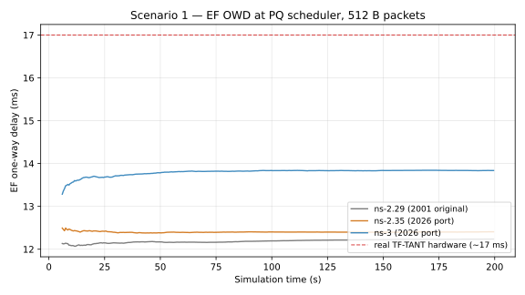
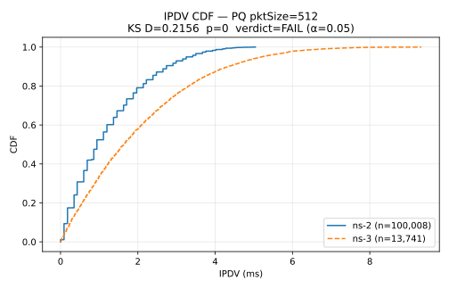
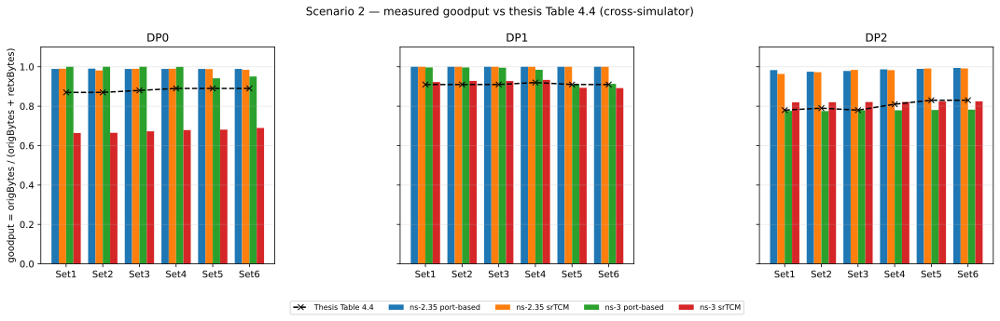
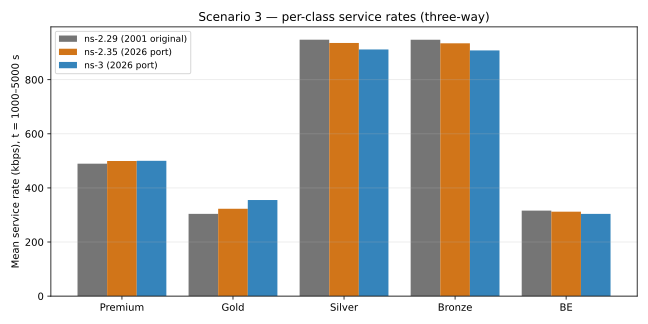

# Three-way comparative results

## Reconstruction as verification

This chapter presents the evidence that the ns-3 substrate reproduces the 2001 DiffServ4NS module's behaviour — three scenarios from the original thesis, run on all three simulator generations, compared against the thesis data.

The 2001 DiffServ4NS module was first ported to ns-2.35 and then
reconstructed from scratch on ns-3. The three implementations share no
code — the ns-2.29 original (frozen since 2001), the ns-2.35 port, and
the ns-3 substrate are independent renderings of the same design — so
running all three on the same scenarios turns agreement across them
into a verification instrument: when three independent simulators
converge on the same per-class outcome, that is evidence the
reconstruction reproduces the original behaviour rather than a
coincidence of one toolchain.

At sufficient resolution a faithful port verifies its surrounding
context too. The reconstruction surfaced two latent defects neither
originating in the port — a finite-FTP classification slip in the 2001
source and a null-pointer dereference in modern ns-3 mainline's TCP
persist timer (fixed by an eight-line guard and submitted upstream) —
and two abstraction-layer asymmetries that only appear at scenario
scale: the 2001 ns-2 UDP agent omitted the 28-byte IP/UDP header from
its packet size, and ns-3's explicit NetDevice layer requires
wire-byte accounting where ns-2's flat-packet abstraction did not. Both
are visible in the per-scenario data.

At component scale the workflow is spec-first against RFC vectors. At
scenario scale, where the reference is 25-year-old empirical data
rather than an RFC, the discipline is tolerance-lock-after-calibration:
a per-class envelope is calibrated once and pinned by a deterministic
regression test. The scenario-specific tolerances that follow are those calibrated envelopes.

## Scenarios and agreement

Three scenarios from the 2001 thesis, each exercising a different slice
of the architecture, with tolerances calibrated per scenario:

- **Scenario 1 — Priority Queueing (thesis §4.1).** EF against a
  best-effort background over a single bottleneck, 200 s, 512 B EF;
  observes OWD, IPDV, and queue length on a TF-TANT-calibrated workload.
  Deterministic metrics within ~3 %.
- **Scenario 2 — WRED differentiation under web traffic (thesis §4.2).**
  469-node topology, one AF class with three drop precedences, a WRED
  sweep across six threshold sets, 5000 s; observes per-drop-precedence
  packet-loss probability. Cross-simulator agreement within a few
  percentage points (pp) of the thesis target.
- **Scenario 3 — Complete service model (thesis §4.3).** 771-node
  topology, five service classes (Premium / Gold / Silver / Bronze / BE)
  under an LLQ (PQ + SFQ 3:3:3:1) composite scheduler, 5000 s; observes
  per-class throughput conservation under a heterogeneous application mix
  — the most integrative gate. Deterministic CBR (Premium) ±1 %, TCP bulk
  classes (Silver, Bronze, BE) ±3 %.

"Agreement" means the steady-state per-series mean falls inside the
scenario's tolerance band. Divergences are classified pair-wise: 26
ns-2.29-vs-ns-2.35 pairs and 21 ns-2.35-vs-ns-3 pairs, with 0 FAIL.

### Scenario 1 — EF one-way delay against the hardware anchor

The figure below compares EF one-way delay across the three simulators and the hardware anchor.

Premium-only EF traffic through the PQ scheduler. The 2001 thesis
measured PQ EF OWD on real TF-TANT testbed hardware (Cisco 7200/7500,
IBM 2212/2216, Cabletron, SmartBits — `provenance/Andreozzi-2001-thesis.pdf`
Fig. A.5/A.6); that ~17 ms measurement at 512 B is the ground-truth
anchor (dashed line in the figure).

| Series  | mean (ms) | std   | p50    | p95    |
|---------|----------:|------:|-------:|-------:|
| ns-2.29 |    12.252 | 0.013 | 12.254 | 12.265 |
| ns-2.35 |    12.379 | 0.041 | 12.393 | 12.408 |
| ns-3    |    13.819 | 0.062 | 13.838 | 13.850 |

ns-3 closes about a third of the simulation-to-hardware gap; the remainder is
ns-2's network-layer abstraction (its packet size carries payload only).
The ns-2.35 UDP-header fix shifts ns-2.35 +0.13 ms over ns-2.29, a
visible step toward ns-3's wire-byte semantics. Service rate tracks CIR
within 0.4 % on all three simulators once a scheduler L2-overhead
attribute aligns ns-3's wire-byte basis with ns-2.35's.

Beyond the per-series means, the KS-CDF harness (Q-1.4 in `specs/03-quality.md`) overlays the empirical
CDFs at PQ pktSize=512: ns-3's IPDV distribution is the ns-2
distribution shifted ~0.7 ms right (the same NetDevice drop-tail bias),
with close shape (KS D=0.22 for IPDV, 0.39 for OWD).

> **Note:** at N ≈ 10⁴–10⁵ samples the KS p-value goes to zero for any pair of distinct implementations and is uninformative; the D-statistic is reported for shape comparison only, not as a pass/fail gate.

Cross-simulator validation reports the D-statistic and means/medians without a hard gate. A D-threshold gate (D < 0.10) is reserved for within-simulator regression checks.

### Scenario 2 — cross-simulator parity and the traffic-model dimension

The Scenario 2 comparison is deliberately asymmetric. ns-2.35 is the
only simulator where both traffic models run (bulk-TCP and
PagePool/WebTraf), so it appears twice — isolating the traffic-model
dimension from the simulator dimension. The three bulk-TCP series should
cluster (cross-simulator parity at matched traffic); the WebTraf series
drops out, and because its simulator is identical to ns-2.35 bulk-TCP,
that gap is attributable entirely to the traffic model.

At DP2 (the tightest WRED profile), set-1 caPL (%):

| Series           | caPL % | Thesis target | Δ (pp) |
|------------------|-------:|--------------:|-------:|
| ns-2.29          |  28.52 |         25.12 |  +3.40 |
| ns-2.35-bulktcp  |  28.40 |         25.12 |  +3.28 |
| ns-2.35-webtraf  |   2.26 |         25.12 | −22.86 |
| ns-3             |  26.84 |         25.12 |  +1.72 |

The three bulk-TCP series cluster within a few pp of the thesis target;
the WebTraf line runs an order of magnitude lower — the documented
traffic-model finding that PagePool/WebTraf under-loads the AF11
aggregate by ~8× versus bulk-TCP, because HTTP session-level think-time
gates the offered load.

The strongest numerical reproduction is the thesis Table 4.4 goodput
metric — per-DP measured goodput `origBytes / (origBytes + retxBytes)`
across all six WRED sets:

| Simulator / mode    | DP2 set range | vs thesis DP2                       |
|---------------------|---------------|-------------------------------------|
| ns-3 port-based     | 0.775 – 0.783 | mean abs dev 0.024 — within ±5 pp on 6/6 sets |
| ns-3 srTCM          | 0.820 – 0.824 | +3–4 pp (per-flow meter shifts load off DP2)  |
| ns-2.35 port-based  | 0.975 – 0.994 | +18–21 pp                           |
| ns-2.35 srTCM       | 0.964 – 0.992 | +16–20 pp                           |

ns-3 port-based with bulk-TCP HTTP matches the thesis within 5 pp across
all six WRED sets — direct numerical validation that the goodput
pipeline reproduces the thesis metric. The systematic ns-2.35 offset is
the same traffic-model disparity: thesis-faithful PagePool/WebTraf
think-time gaps drain the queues, reducing WRED drops and hence TCP
retransmissions, which the metric pipeline surfaces rather than
introducing a new divergence.

### Scenario 3 — per-class throughput conservation (three-way)

Service rates for the five classes at steady state (t = 1000–5000 s), all three simulators:

| Class   | ns-2.29 | ns-2.35 | ns-3   |
|---------|--------:|--------:|-------:|
| Premium |   489.3 |   499.4 |  500.1 |
| Gold    |   304.6 |   323.1 |  356.0 |
| Silver  |   948.1 |   935.5 |  911.2 |
| Bronze  |   946.8 |   934.6 |  908.0 |
| BE      |   316.2 |   312.0 |  303.8 |
| **Sum** |  3005.0 |  3004.6 | 2979.1 |

All three simulators honour the 3 Mbps shaper; aggregate throughput
matches within 0.8 % (ns-2.35 3004.6 vs ns-3 2979.1 kbps) and Premium
within 0.1 %. Silver, Bronze, and BE slip −2.5 to −2.9 %, inside their
±3 % tolerance. One-way delay means agree within 1 % across all three
(24.24–24.48 ms) and IPDV means within 25 %, both inside the Q-3.x band (see `specs/03-quality.md`).

#### Gold residual — a generator approximation, not a policer divergence

The one class outside the ±3 % band is Gold (ns-3 356.0 vs ns-2.35
323.1 kbps, +10.2 %), carried by a RealAudio-like on/off source that
ns-3 — shipping no RealAudio generator — approximates with an OnOff
source. The residual is a **traffic-generator approximation**, not a
divergence between the two policers, and this is established by direct
measurement rather than inference.

The decisive evidence is a byte-identical trace replay. The instrumented
ns-2.35 binary captured the real Scenario 3 Gold ingress (1,059,052
packets over the 5000 s run; ns-2.35's own marking gave AF12 fraction
0.1736). Replaying that exact stream packet-for-packet through the ns-3
TSW2CM/RIO-C policer reproduces the out-of-profile fraction within
sampling noise — 0.1731/0.1733/0.1731 across three seeds versus 0.1736,
a difference of ≈ 1.3× the binomial sampling σ. Given identical input
the two policers mark identically, so the entire +9.9 % lives in the
traffic the generators present, not in how they police it.

The aggregate driver is the idle (OFF) distribution: ns-3 substitutes an
exponential off-time (mean 1.8 s) for the model's discrete empirical
off-time distribution (mean 2.50 s), which sets each source's duty cycle
and hence the concurrency the load-gated TSW2CM meter sees. The ±10 %
Gold bracket therefore brackets a paced OnOff approximation against a
faithful micro-burst generator correctly policed by the burst-sensitive
TSW2CM/RIO-C — not a defect in either simulator. Porting the discrete
off-time distribution is a documented post-publication fidelity item,
exposed as a diagnostic flag but not the default because it overshoots
without a matching restructure of the generator's on-period semantics.

## See also

- [Examples catalog](I-08-examples-catalog.md) — per-scenario topology
  and reproduction commands.
- [Conclusions](III-07-conclusions.md) — documented divergences and the
  reconstruction-as-debugging finding.

Full per-scenario machinery — the ns-2 build and run procedure, the
complete per-run tables, the per-scheduler KS overlays, and the WebTraf
classifier variants — together with the 2001 ns-2 lineage lives in the
DiffServ4NS heritage repository and the companion technical report. This
chapter keeps the evidence a reader needs to trust the ns-3 substrate.
