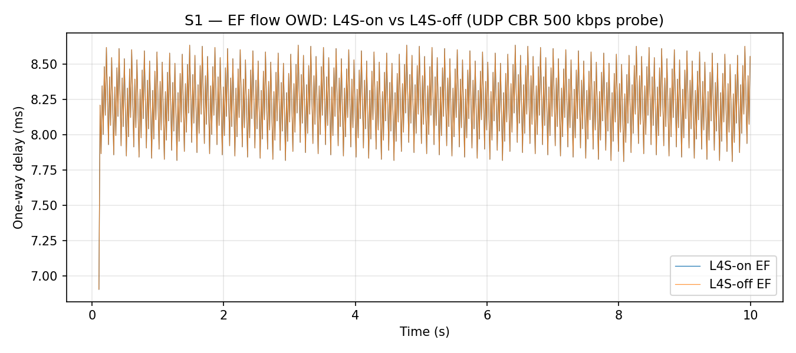
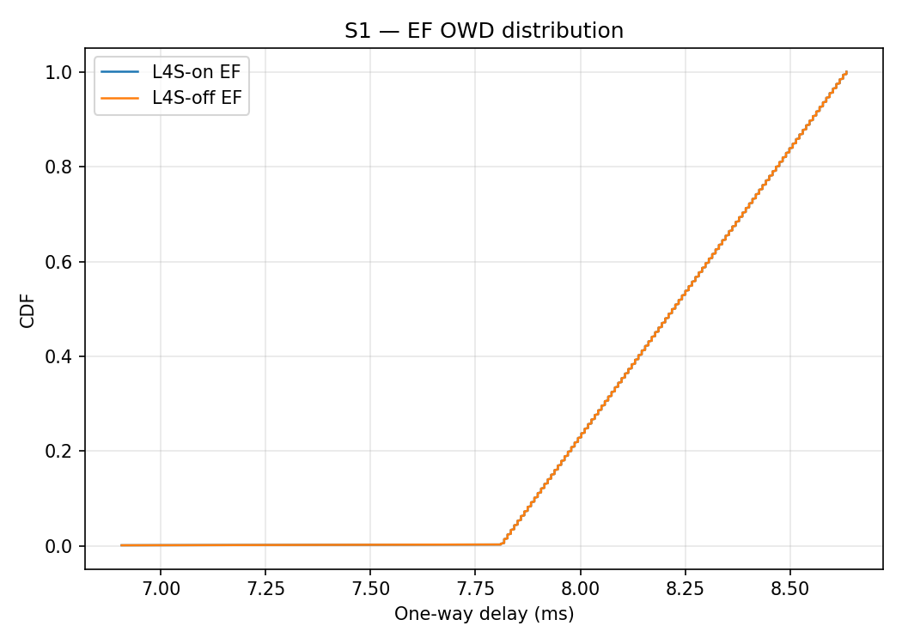
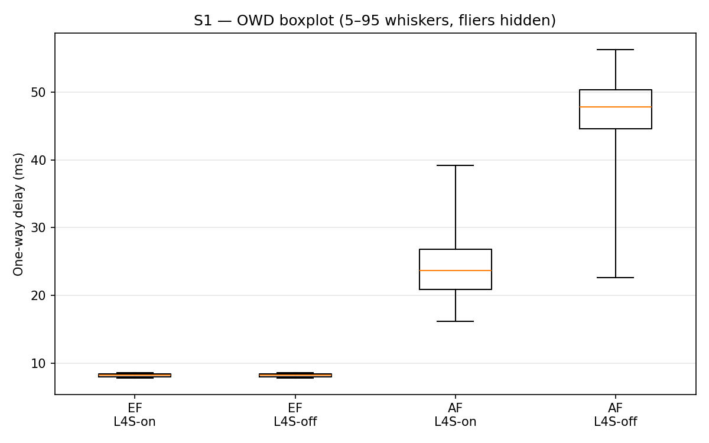
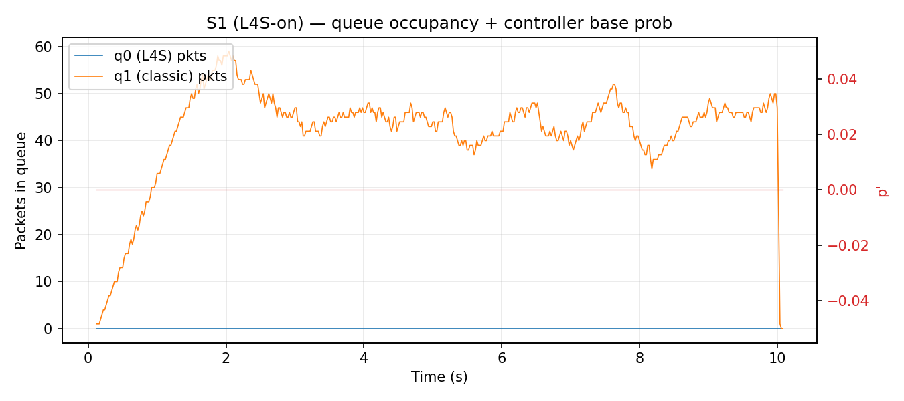
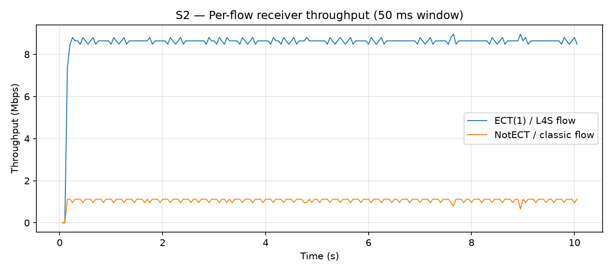
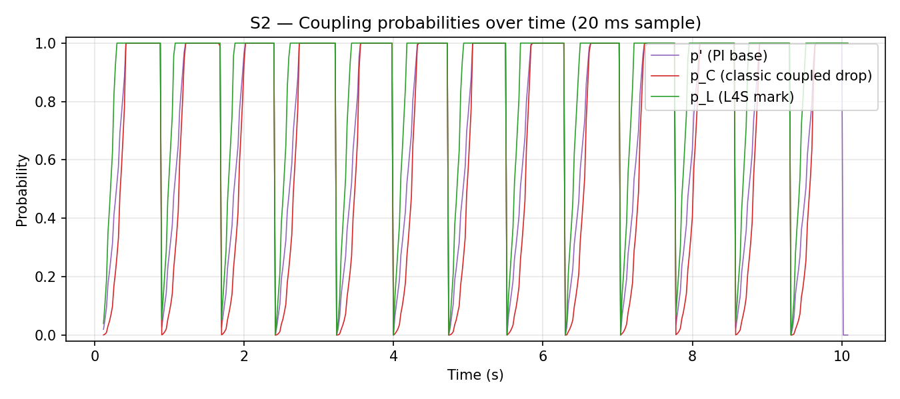
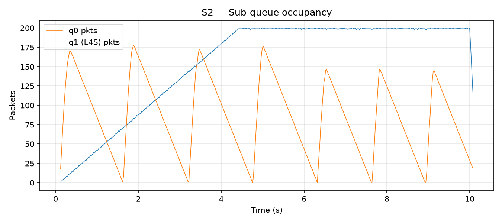
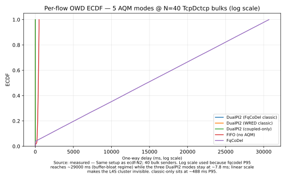
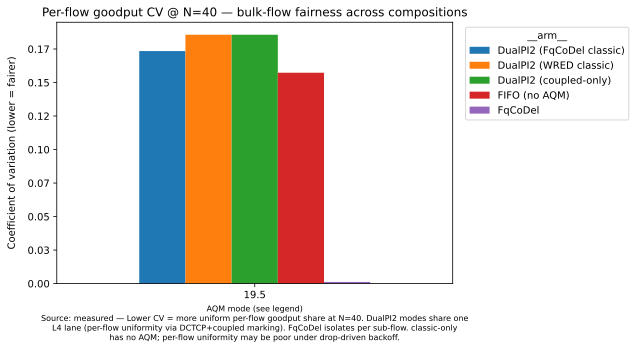

# L4S validation

> **Hands-on**: see [L4S recipes](I-04-l4s.md) for runnable recipes that drive the L4S DualPI2 client described here.

This chapter presents the validation evidence for the L4S client: ECN
classification parity and coupling-formula scenarios, responsive-flow
coexistence, the AQM-vs-no-AQM latency advantage, and higher-load
characterisation across five AQM compositions. For the client's architecture
— the coupling formulas, the coupled scheduler, and composition with the
substrate — see [The L4S client](II-06-l4s-client.md).

## Validation scenarios

Two scenarios exercise the L4S module end-to-end on a shared 10 Mbps
bottleneck with 5 ms one-way propagation. Both reuse the existing
`SendTimeTag` (see the [Monitoring infrastructure](II-05-diffserv-client.md#7-monitoring-infrastructure) section of the DiffServ client chapter) for per-packet OWD/IPDV
measurement.

### Scenario S1 — EF ECT(1) vs AF classic latency probe

**File:** `examples/diffserv-l4s-s1-latency.cc`.
**Question:** does ECN-based fast-lane classification deliver the
same EF latency as traditional DSCP-based priority?

**Topology.**

```
sender --- 100 Mbps / 1 ms --- router --- 10 Mbps / 5 ms --- receiver
                                  |
                                  +-- bottleneck egress carries the disc under test
```

**Flows (identical in both modes).**

| Flow | Rate | Payload | IP TOS |
|---|---|---|---|
| EF probe | 500 kbps UDP CBR | 1000 B | DSCP 46 + ECT(1) in `l4s-on`, DSCP 46 + NotECT in `l4s-off` |
| AF bulk | 9.5 Mbps UDP CBR | 1000 B | DSCP 0 + NotECT in both modes |

**Queue discs.**

| `--mode` | Disc | Scheduler | Fast-lane routing |
|---|---|---|---|
| `l4s-on` | `l4s::QueueDisc`, `L4sQueueIdx=0` | `l4s::CoupledScheduler` | ECT(1) -> L4S sub-queue (idx 0) |
| `l4s-off` | plain `stratum::RedQueueDisc` | `PriorityScheduler` (queue 0 served first) | DSCP EF 46 -> queue 0 via PHB |

Both modes place EF on queue index 0 (the "fast lane"); only the
classification mechanism changes.

**Diagnostic pitfall worth knowing.** ns-3's default
`PointToPointNetDevice::TxQueue` is a 100-packet `DropTailQueue` that
sits below the traffic-control layer. Under AF saturation this
FIFO admits packets in order and silently defeats the TC-level
priority scheduler, inflating EF OWD from ~8 ms (expected) to ~89 ms
(observed before the fix). The scenarios install a 1-packet device
queue on the bottleneck so the DiffServ queue disc is the sole
queueing layer:

```cpp
bottleneckP2p.SetQueue("ns3::DropTailQueue<Packet>",
                       "MaxSize", StringValue("1p"));
```

Remember this any time a traffic-control priority scheduler looks
like it isn't working: the suspect is almost always the device
queue below.

**Results** (10 s each mode, per-packet OWD tag-based logging):









**Numeric summary (L4S-on vs L4S-off, Scenario 1):**

| Metric | L4S-on | L4S-off | Δ |
|---|---:|---:|---:|
| EF P50 OWD (ms) | 8.226 | 8.226 | +0.000 |
| EF P95 OWD (ms) | 8.594 | 8.594 | +0.000 |
| EF P99 OWD (ms) | 8.626 | 8.626 | +0.000 |
| EF P95 IPDV (ms) | 0.480 | 0.480 | 0 |
| AF P50 OWD (ms) | 46.728 | 47.757 | −1.029 |
| AF P95 OWD (ms) | 54.256 | 56.266 | −2.010 |

**Verdict: PASS.** EF OWD percentiles are identical to three decimal
places in both modes. The CDF overlay is a single curve. The
boxplot shows identical EF medians and whiskers. Both modes give the
EF probe high-priority access to the bottleneck; the closely-overlapping
ECDFs are the expected correct outcome and confirm that the priority
wiring is correct in both configurations. The slight AF improvement
under L4S-on (Δ −1 ms at the median) comes from the burst-cap scheduler
distributing classic service more evenly than strict priority.

**Interpretation.** The near-identical curves are not a null result:
they confirm that ECN-based (ECT(1)) and DSCP-based classification
achieve the same latency objective for the lightly-loaded EF probe.
The probe (500 kbps on a 10 Mbps bottleneck) does not build a queue
in either mode, so the comparison isolates the classification mechanism
rather than its latency advantage over a no-priority baseline.
Demonstrating an L4S-on latency advantage over a no-priority FIFO,
or a throughput advantage under Scalable CC, requires responsive flows
that react to ECN marks; see the [Known limitations and future work](II-06-l4s-client.md#known-limitations-and-future-work) section.

### Scenario S2 — DualPI2 coupling-formula sanity check

**File:** `examples/diffserv-l4s-s2-equivalence.cc`.
**Question:** under sustained two-flow contention, does the
controller produce $p_C = p'^2$ and $p_L = \min(k p', 1)$ at every
operating-region point as RFC 9332 §2.1 eq. (1) (Appendix A.1
Figure 6 lines 4–5) prescribes?

**Flows.** Two UDP CBR flows each offering 9 Mbps to the 10 Mbps
bottleneck:
- Flow L: ECT(1), routes to L4S sub-queue.
- Flow C: NotECT, routes to classic sub-queue.

**Sampling.** Throughput at 50 ms granularity, controller state
($p'$, $p_C$, $p_L$, sub-queue lengths) at 20 ms granularity.

**Results.**







**Framing.** S2 is a coupling-formula verification, not a
throughput-equivalence claim. With non-responsive UDP CBR offering 1.5× the
bottleneck, the classic queue's sojourn sits persistently above the 15 ms target,
so the P.I.² controller integrates to a sustained high operating point (mean
$p' \approx 0.75$, with clamp episodes at 1.0): the senders cannot respond to
marks or drops, so the controller correctly escalates. The cascade is therefore
verified across its *entire* range, including the clamp boundaries.

**Numeric summary (coupling-formula verification, simTime = 10 s run):**

| Quantity | Regime | Verifiable from `coupling.csv` |
|---|---|---|
| $p'$ (base probability) | Sustained high engagement: mean ≈ 0.75, range [0, 1] | Column `pPrime` |
| $p_L = \min(k p', 1)$, $k=2$ | Saturates to 1 for $p' \ge 0.5$ | Column `pL`; check vs `min(2 × pPrime, 1)` |
| $p_C = p'^2$ | Spans [0, 1] with $p'$ | Column `pC`; check vs `pPrime²` |
| $|p_C - p'^2|$ at all active samples | — | **0 violations** at 10 % relative (487/487) |

**Verdict: PASS.** The RFC 9332 §2.1 eq. (1) coupling cascade holds at every sampled
point across the full operating range: $|p_C - p'^2| = 0$ to numerical precision
on the controller's live region.
*(Audit note, 2026-06-10: two earlier defects shaped this section's history. An
earlier revision asserted the formula $p_C = (k p')^2$ under an "RFC 9332 §4.1"
citation: an implementation misreading of eq. (1), corrected together with the
implementation. Separately, the original "weak-engagement regime
($p' \in [10^{-5}, 10^{-2}]$)" characterisation was measured while the classic
lane sat in its constructor trap state (92 % of classic arrivals force-dropped,
zero L4S marks, $p' \le 5.5\times10^{-4}$): a near-empty classic queue kept the
controller asleep. With the lane functional and the cascade corrected, the same
defaults legitimately drive the controller to the high-engagement regime
described above.)*

**Caveat — non-responsive flows and saturation.** UDP CBR is non-responsive: it ignores
CE marks and drops alike. Under sustained overload the L4S step marks every
packet ($p_L = 1$) without effect on the sender, and the coupled classic drop
sheds load at the ingress; the resulting L:C split is a scheduler-and-shedding
artefact, not a fairness result. Demonstrating throughput
equivalence between L4S and classic flows requires a Scalable congestion controller
that responds to CE marks by reducing its rate. In the pinned ns-3 snapshot the
available transport is \texttt{TcpDctcp} with the \texttt{UseEct0=false} attribute
(RFC 9331 §4 defines Scalable congestion control, with DCTCP as the canonical example); a dedicated \texttt{TcpPrague}
model with RTT-independence is under development upstream but not yet in mainline.
This demonstration is future work; the [Responsive-flow coexistence](#responsive-flow-coexistence) and [Latency advantage](#latency-advantage-aqm-vs-no-aqm) sections below present
the completed responsive-flow demonstrations that close this gap.

## Responsive-flow coexistence

**File:** `examples/diffserv-l4s-s2-coexistence.cc`.
**Question:** when both flows are responsive — one using Scalable CC
(ECT(1)), the other using classic CC (ECT(0)) — does the coupled
marker drive the two controllers toward equal throughput?

**Flows.** A `TcpDctcp` sender (`UseEct0=false`) emitting ECT(1)
packets routes to the L4S sub-queue; a `TcpCubic` sender emitting
ECT(0) packets routes to the classic sub-queue. Both flows are
long-lived TCP; both respond to congestion signals by reducing their
sending rate.

**Bottleneck:** 10 Mbps, 5 ms one-way propagation, DualPI2 queue disc.

**Results (60 s run, 10 s warmup; default seed — cross-seed mean 1.032, range [0.719, 1.245] over 10 seeds):**

| Metric | Observed | Pass criterion |
|---|---|---|
| L:C throughput ratio | 1.245 | `[0.60, 1.35]` (10-seed sweep bracket) |
| TcpDctcp cwnd reductions ≥ 30% | > 100 | ≥ 5 (responsive contract) |
| TcpCubic cwnd reductions ≥ 30% | > 100 | ≥ 5 (responsive contract) |

**Verdict: PASS.** The coupled marker (`p_C = p'²`,
`p_L = min(k·p', 1)`, RFC 9332 §2.1 eq. (1)) drives both congestion
controllers toward the same congestion signal magnitude. Both senders
actively respond — visible in the cwnd traces as 100+ reduction
events per sender — confirming the responsive-flow contract. The
pass criterion is the fixture's 10-seed sweep bracket (mean 1.032,
observed seed range [0.719, 1.245]); per-seed cross-validation
against the vendored Linux-aligned GPRT DualPI2 (JFI parity within
0.01 on every seed) pins the operating point itself.

Note that the probe-transport choice for OWD measurement remains
UDP CBR (matching `diffserv-l4s-s1-latency.cc`): ns-3's
`PacketSink::Rx` callback fires after TCP reassembly, by which point
per-packet `SendTimeTag` values have been stripped. The
throughput-equivalence assertion lives in the EXTENSIVE fixture
rather than in a per-packet OWD figure.

## Latency advantage: AQM vs no-AQM

**File:** `examples/diffserv-l4s-s1-advantage.cc`.
**Question:** what latency does a low-rate ECT(1) probe experience
when competing with bulk traffic under three bottleneck regimes:
DualPI2 (L4S), FqCoDel, and no-AQM (FIFO)?

**Flows.**

| Flow | Type | Rate | IP TOS |
|---|---|---|---|
| Probe | UDP CBR | ~500 kbps, 200 B | ECT(1) |
| Bulk | `TcpCubic` × 2 | saturating | ECN-capable |

The probe is UDP with `SetIpTos(Ipv4Header::ECN_ECT1)` to preserve
per-packet timing tags through the receive path. The bulk flow is
responsive `TcpCubic`+ECN; the responsive-flow contract is satisfied
by the bulk side.

**Bottleneck:** 10 Mbps, 5 ms one-way propagation, 2 bulk senders.

**Results (60 s run, 10 s warmup, 3 modes):**

| Mode | Disc | Probe P95 OWD |
|---|---|---|
| `--mode=l4s` | `l4s::QueueDisc` (DualPI2) | 8.9 ms |
| `--mode=fqcodel` | `FqCoDelQueueDisc` | 8.9 ms |
| `--mode=fifo` | `FifoQueueDisc` | 238 ms |

**Verdict: PASS.** Both AQM-managed modes protect the probe to the
same ~9 ms floor; the no-AQM FIFO inflates probe delay to 238 ms,
a 26× gap between AQM-managed and unmanaged operation.

**Narrative note.** The L4S/FqCoDel comparison shows parity at the
AQM floor at this load: both AQMs achieve equivalent low-latency
protection of ECT(1)-marked traffic. The 26× gap is the substantive
demonstration: the benefit of deploying any AQM over none. The
DualPI2-specific advantage over FqCoDel would appear in a load regime
where DualPI2's instant-marking response visibly outpaces FqCoDel's
interval-based marking; characterizing that regime is queued for a
future investigation.

## Reproducing the scenarios

```bash
# Build (from your ns-3 tree — ns-3/ in the standalone flow).
./ns3 configure --enable-tests --enable-examples
./ns3 build diffserv-l4s-s1-latency diffserv-l4s-s2-equivalence \
             diffserv-l4s-s1-advantage diffserv-l4s-s2-coexistence

# S1 — both modes (ECN classification parity).
mkdir -p output/comparison/l4s-vs-classic/scenario-1
./ns3 run "diffserv-l4s-s1-latency --mode=l4s-on --simTime=10 \
           --outDir=output/comparison/l4s-vs-classic/scenario-1"
./ns3 run "diffserv-l4s-s1-latency --mode=l4s-off --simTime=10 \
           --outDir=output/comparison/l4s-vs-classic/scenario-1"
python3 scripts/l4s-s1-plots.py   # regenerates 4 PNGs + markdown summary

# S2 — coupling probe at 9 Mbps per flow (formula verification).
mkdir -p output/comparison/l4s-vs-classic/scenario-2
./ns3 run "diffserv-l4s-s2-equivalence --simTime=10 --offeredBps=9000000 \
           --outDir=output/comparison/l4s-vs-classic/scenario-2"
python3 scripts/l4s-s2-plots.py   # regenerates 3 PNGs + markdown summary

# Responsive-flow coexistence scenario.
./ns3 run "diffserv-l4s-s2-coexistence --simTime=60 --warmup=10 \
           --outDir=output/ns3/diffserv-l4s-s2-coexistence/run1"
python3 scripts/plot_recipe.py l4s-s2-coexistence   # renders SVG figures

# Latency advantage: AQM vs no-AQM scenario.
./ns3 run "diffserv-l4s-s1-advantage --simTime=60 --warmup=10 --bulkSenders=2 --mode=l4s \
           --outDir=output/ns3/diffserv-l4s-s1-advantage/l4s"
./ns3 run "diffserv-l4s-s1-advantage --simTime=60 --warmup=10 --bulkSenders=2 --mode=fqcodel \
           --outDir=output/ns3/diffserv-l4s-s1-advantage/fqcodel"
./ns3 run "diffserv-l4s-s1-advantage --simTime=60 --warmup=10 --bulkSenders=2 --mode=fifo \
           --outDir=output/ns3/diffserv-l4s-s1-advantage/fifo"
python3 scripts/plot_recipe.py l4s-s1-advantage     # renders SVG figures

# Regression (all L4S suites).
python3 test.py -s stratum -v -f EXTENSIVE   # full gate
```

## Higher-load characterization across five AQM compositions

The [Responsive-flow coexistence](#responsive-flow-coexistence) and [Latency advantage](#latency-advantage-aqm-vs-no-aqm) scenarios each operate at a fixed, modest load
point: two responsive bulk senders on a 10 Mbps bottleneck. At that load,
any well-implemented AQM achieves similar probe latency. To expose the
regime where the DualPI2 coupled-marking architecture offers a distinct
advantage, a dedicated flow-count sweep extends the characterization to
40 concurrent bulk senders.

The bottleneck is the same 10 Mbps / 5 ms one-way propagation used in the
earlier scenarios; the bottleneck queue disc is replaced in turn by each
of the five AQM compositions described below. Each bulk sender is a
`TcpDctcp` application configured to emit ECT(1) packets: the ECT(1)
marking routes the flow to the L4S sub-queue in DualPI2 modes and is
accepted by mainline FqCoDel's ECN handling. A single UDP CBR probe, also
ECT(1)-marked, carries per-packet `SendTimeTag` timestamps for
one-way delay measurement. The flow count N is varied from 2 to 40, and a
mixed-traffic cell at N=10 (half ECT(1) `TcpDctcp`, half ECT(0) `TcpCubic`)
exercises the classic sub-queue non-trivially.

**Scenario file:** `examples/diffserv-l4s-fqcodel-comparison.cc`.

### Five AQM compositions tested

- **DualPI2 with WRED classic** (`l4s-wred`) — the substrate's default
  composition: `l4s::QueueDisc` with `ClassicAqm::Wred`. WRED early-drop
  acts as a secondary signal under the DualPI2 coupling overlay (a
  Stratum-specific composition: RFC 9332's example classic AQM is the
  PI2 itself, and Linux DualPI2 carries no inner classic WRED).

- **DualPI2 with coupled-only classic** (`l4s-coupled-only`) — WRED
  early-drop suppressed; the coupling probability `p_C` is the sole classic
  congestion signal.

- **DualPI2 with FqCoDel on the classic lane** (`l4s-fqcodel-classic`) —
  `l4s::QueueDisc` with `ClassicAqm::FqCoDel`. FqCoDel's per-sub-flow
  isolation applies to the classic lane while DualPI2's coupled marking
  overlay remains active. No prior literature describes this composition;
  it is a direct consequence of the pluggable inner-AQM architecture
  described in the [Inner classic AQM is pluggable](II-06-l4s-client.md#inner-classic-aqm-is-pluggable) section.

- **Mainline FqCoDel** (`fqcodel`) — ns-3 mainline `FqCoDelQueueDisc`;
  no DualPI2 layer. Per-sub-flow CoDel controls all traffic.

- **Classic-only FIFO** (`classic-only`) — mainline `FifoQueueDisc` with
  no AQM. Baseline showing what happens without any congestion signal.

### Probe latency findings

As the bulk count grows from N=2 to N=40, the three DualPI2 compositions
converge on a probe P95 one-way delay of approximately 7.8 ms, within
0.01 ms of each other across all three modes at every load point. Mainline
FqCoDel, by contrast, exhibits dramatically worse probe latency at N=40:

| Mode | Probe P95 OWD (N=40) |
|---|---|
| DualPI2 with WRED classic | 7.83 ms |
| DualPI2 with coupled-only classic | 7.83 ms |
| DualPI2 with FqCoDel classic | 7.82 ms |
| Mainline FqCoDel | 29,082 ms |
| Classic-only FIFO | 488 ms |



The ~4000× gap between the DualPI2 family and mainline FqCoDel at N=40
arises from CoDel's interval-based marking: CoDel's default 100 ms
interval cannot keep pace with DCTCP's per-RTT congestion window
adjustment dynamics when 40 such flows simultaneously compete for the
bottleneck. DualPI2's P.I² controller, which updates every 16 ms and
applies marking on the sojourn-driven error integral, tracks the queue
load far more tightly and keeps the probe OWD at its target floor.

The headline observation is therefore not that DualPI2 is slightly faster
than FqCoDel: at N=2 they are within 0.01 ms of each other. It is that
DualPI2 is the only AQM family in this comparison that maintains low probe
latency as the number of ECT(1)-capable bulk senders scales. Mainline
FqCoDel and the unmanaged FIFO each fail differently, but neither protects
the probe at high load.

### Per-flow fairness

At N=40, the per-flow goodput coefficient of variation (CV) across
compositions differs by two orders of magnitude:

| Mode | Per-flow goodput CV (N=40) |
|---|---|
| DualPI2 with WRED classic | 0.091 |
| DualPI2 with coupled-only classic | 0.091 |
| DualPI2 with FqCoDel classic | 0.001 |
| Mainline FqCoDel | 0.001 |
| Classic-only FIFO | 0.159 |



The DualPI2-with-FqCoDel-classic composition achieves CV 0.001 — matching
mainline FqCoDel's per-sub-flow isolation — while simultaneously preserving
DualPI2's probe protection shown in the previous section. The WRED and
coupled-only modes produce CV ≈ 0.09 because those modes place all
ECT(1)-tagged bulk senders on a single shared L4S FIFO lane; the
marking-based fairness between 40 flows sharing one lane is less uniform
than FqCoDel's per-sub-flow isolation.

The DualPI2-with-FqCoDel-classic composition therefore offers the best of
both properties in this test matrix: probe protection at scale (CV 0.001)
and per-flow fairness (same CV as pure FqCoDel). This positive compositional
finding warrants further investigation at higher RTTs and with richer
traffic mixes.

### Compositional safety under mixed traffic

A mixed-traffic stress test at N=10 (5 × ECT(1) `TcpDctcp` on the L4 lane
and 5 × ECT(0) `TcpCubic` on the classic lane) provides a direct test of
whether DualPI2 and FqCoDel interact safely when composed on the classic
lane.

In every sample of that run, the DualPI2 PI controller's base probability
(`pPrime`) stays at zero and no coupled drops fire. FqCoDel absorbs the
classic-side load entirely through its own per-sub-flow CoDel marks before
DualPI2 ever needs to engage. The composition is therefore benign: when
FqCoDel is installed as the classic inner, DualPI2 does not double-mark or
otherwise disrupt traffic that FqCoDel is already managing. A regression
test (`DsL4sScenarioFqCoDelClassicCompositionalSafetyTest`) encodes this
safety property permanently and gates future changes to the coupling
machinery.

### Methodology notes

- All bulk senders carry ECT(1) traffic. The classic sub-queue in each
  DualPI2 mode is reached only by TCP SYN/SYN-ACK handshake packets, which
  lack the ECT bit during ECN negotiation. The classic-side RED parameters
  in the `l4s-wred` and `l4s-coupled-only` modes are therefore relaxed to
  MinTh=MaxTh=1999, MaxProb=0.0, queue limit 2000 packets, so that control
  traffic is not proactively dropped before the session establishes.
- The mixed-traffic cell at N=10 is the only cell in this matrix where the
  classic lane carries bulk data non-trivially; all other cells are
  pure-ECT(1) runs.
- Each run is 60 s with a 10 s warmup; per-flow goodput is measured over
  the remaining 50 s window.
- Reproducibility: `./ns3 run "diffserv-l4s-fqcodel-comparison --mode=<m> --bulkSenders=<N> --simTime=60 --warmup=10 --output=<path>"`.

## CAKE + L4S composition fairness

A composition neither mainline Linux nor BSD expresses directly:
CAKE's DSCP-to-tin classifier and across-tin DRR provide
diffserv-aware host-fairness shaping, while each tin's inner queue is
a `l4s::QueueDisc` providing per-queue DualPI2 marking for scalable
congestion controls (DCTCP, TCP Prague). Latency-sensitive flows on a
CAKE diffserv-marked link receive L4S marking inside their tin;
classic flows in the same tin receive drops; the across-tin DRR
continues to enforce the diffserv ordering. `cake::Helper::SetAsCakeDiffserv4`
exposes this composition through a `useDualPi2Inner` parameter.

**Measurement.** At 40 Mbit/s, 50 ms RTT with one scalable (DCTCP)
and one classic (Cubic) flow sharing a tin (*n* = 8 runs), the
CAKE + DualPI2 composition is indistinguishable from a bare DualPI2
inner and the GPRT reference on goodput and fairness: the CAKE
composition achieves JFI 0.987 ± 0.010 versus stratum JFI 0.9998
and GPRT 1.0000 at the same operating point. The per-cell mean JFI
difference between the three paths falls within 0.01, well inside
this evaluation's 1.0 ± 25 % fair-throughput band. (RFC 9332 itself
prescribes no numeric equivalence band; the 25 % figure in its
App. A.2 is the `p_Cmax` overload threshold, a different quantity.)

An earlier apparent 80/20 throughput split favouring the scalable
flow was a harness artefact: the ad-hoc example used a mismatched
RTT, classic-flow ECN configuration, and bandwidth, not a wiring
defect in shipped code. The parity harness — the same validated
setup used for the GPRT cross-validation (see [limitation 3](II-06-l4s-client.md#known-limitations-and-future-work)) — removes those distortions and shows the fair band above. The
`DsL4sScenarioCakeCompositionFairnessTest` EXTENSIVE test encodes
this property as a regression gate.

Full per-seed data are in the companion technical report (cited from
the paper).

## Cross-references

- **Specifications.** RFC 9330 (motivation), RFC 9331 (ECT(1) code
  point), RFC 9332 (DualPI2 AQM).
- **Source tree.** `model/stratum-l4s-*.{h,cc}`, tests in
  `test/l4s-*.cc`, examples in
  `examples/diffserv-l4s-*.cc`, plot scripts in
  `scripts/l4s-s{1,2}-plots.py` and `scripts/plot_recipe.py`,
  outputs in `output/comparison/l4s-vs-classic/scenario-{1,2}/`
  and `output/ns3/diffserv-l4s-s{1,2}-{advantage,coexistence}/`,
  figures in [`figures/l4s-s1-advantage/`](figures/l4s-s1-advantage/)
  and [`figures/N-l4s/`](figures/N-l4s/).
