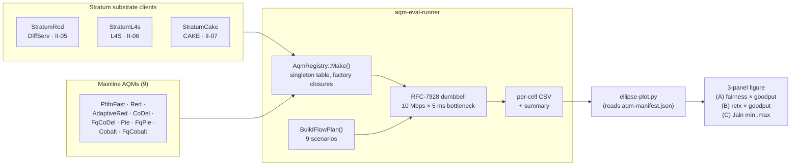
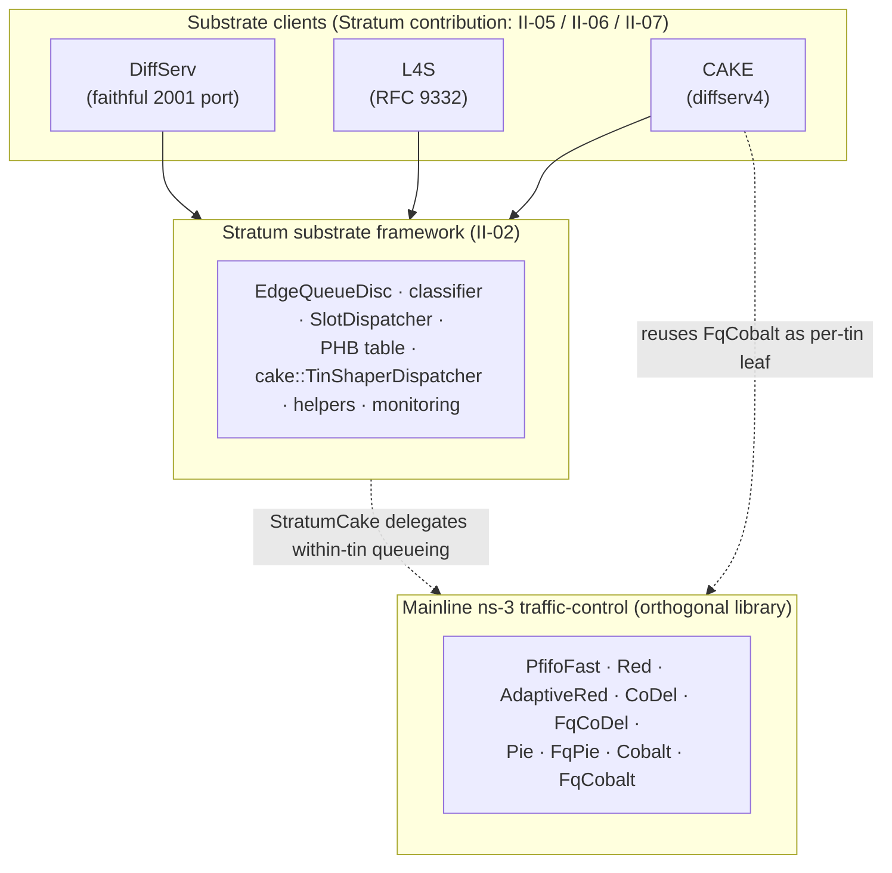
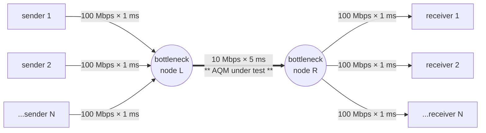
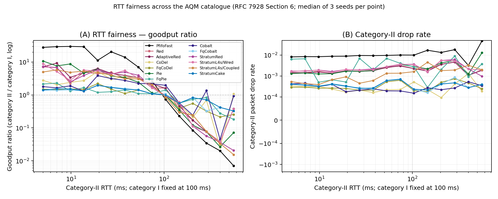

# AQM-eval characterisation suite

> **Hands-on**: see [AQM-eval recipes](I-06-aqm-eval.md) for runnable recipes that walk through the AQM-eval harness described here.

This chapter documents the **AQM-eval characterisation harness** added
to the ns-3 port in late April 2026. The harness sweeps thirteen
queue-disciplines through nine RFC 7928 scenarios, produces a
three-panel ellipse + Jain-range figure, and surfaces algorithmic
regimes that aggregate-only metrics smooth out. It is the
substrate-evaluation contribution that grounds paper §5.4.

> **Reading order.** This chapter stands alone; nothing in preceding
> chapters depends on it. It complements [L4S](II-06-l4s-client.md) and [CAKE](III-04-cake.md)
> by validating that the substrate's queue-disc family interoperates
> with mainline AQMs across a published characterisation methodology
> rather than only on the 2001 thesis scenarios.

## What the suite is

A single binary `aqm-eval-runner` plus a Python plotting script
`scripts/aqm-eval/ellipse-plot.py`. The runner instantiates a
standard RFC-7928 dumbbell (100 Mbps access links, 10 Mbps × 5 ms
bottleneck), classifies traffic on flow 5-tuples, and emits per-flow
CSV plus per-cell summary text for each (scenario, AQM) pair.

> **A note on the term *matrix*.** Throughout this chapter we
> call the cross product `{scenarios} × {AQMs}` the **matrix**:
> each `(scenario, AQM)` pair is one **cell**, and a full sweep
> visits every cell. The term is borrowed from test-engineering
> usage ("test matrix" for a 2-D combinatorial sweep) and is
> not vocabulary from RFC 7928 or the NITK
> `aqm-evaluation-suite`, which use "scenarios" or "test set".

| Dimension | Catalogue |
|---|---|
| **Mainline AQMs** (9, in canonical matrix) | `PfifoFastQueueDisc`, `RedQueueDisc`, `AdaptiveRedQueueDisc`, `CoDelQueueDisc`, `FqCoDelQueueDisc`, `PieQueueDisc`, `FqPieQueueDisc`, `CobaltQueueDisc`, `FqCobaltQueueDisc` |
| **Stratum substrate clients** (4 rows, 3 clients) | `StratumRed` — faithful **DiffServ** with PHB table (see [The ns-3 module](II-08-ns3-module.md)); `StratumL4s` — **L4S** DualPI2 (RFC 9331/9332, see [L4S](II-06-l4s-client.md)), characterised in two configurations: `StratumL4sWred` (WRED early-drop on classic queue) and `StratumL4sCoupledOnly` (canonical DualPI2 with coupled p_C as sole AQM, FIFO classic queue); `StratumCake` — **CAKE** 4-tin `diffserv4` composition (see [CAKE](III-04-cake.md)). All sit inside the mainline ellipse on Panel A — empirical evidence for the substrate's composability claim. |
| **Mainline RED variants** (3, dispatchable but outside the canonical matrix) | `FengAdaptiveRedQueueDisc`, `NonLinearRedQueueDisc` — both routed through `RedQueueDisc` with a flag attribute per NITK 2017 convention; `AdaptiveRedQueueDisc` is the one included in the canonical matrix. |
| **UDP-CBR scenarios** (6) | Inherited from the harness's earlier UDP-CBR cohort: `steady`, `mixed`, `rt-bulk`. RFC 7928 §8.2: `mild-congestion`, `medium-congestion`, `heavy-congestion`. |
| **TCP scenarios** (3) | RFC 7928 §5.1.1 `tcp-friendly`, §5.2 `tcp-aggressive`, §5.3.1 `tcp-unresponsive`. |

Total: 13 × 9 = **117 cells** in the canonical matrix, in roughly
35 s of wall-clock per full sweep on a contemporary laptop. The
canonical 13 = 9 mainline + 4 substrate-client (StratumL4s contributes
two rows for its two configurations; see [Findings](#findings) for the rationale).

**The harness exercises all three substrate clients of Stratum** —
faithful DiffServ (`StratumRed`), the L4S extension (`StratumL4s`, see [L4S](II-06-l4s-client.md)),
and the CAKE implementation (`StratumCake`, see [CAKE](III-04-cake.md)). Their interoperability
with the same scenarios that drive mainline AQMs is the operational
form of paper §5.4's claim that Stratum is a substrate, not a fork.



The pipeline is one binary plus one plotting script. The substrate
clients on the left and the mainline AQMs above feed the same
dispatcher (`AqmRegistry`); the scenario library on the right composes
flows; the dumbbell topology is constant across all 117 cells. The
plot script reads the matrix and emits the three-panel PDF that
paper §5.4 cites.

### Mainline AQMs vs Stratum substrate clients

Both feed `AqmRegistry::Make()` because both implement ns-3's `Ptr<QueueDisc>`
interface — that interface fungibility is exactly what lets the
harness compare them on the same axes. But the two are *not peers*
in Stratum's architecture; they sit at different layers.

- **Mainline AQMs are leaf queue-disc primitives.** `PfifoFast`,
  `Red`, `CoDel`, `Pie`, `FqCobalt`, etc. None of them knows about
  DSCP, PHBs, or DiffServ classification. They live in
  the ns-3 tree's `src/traffic-control/` and are written without
  reference to RFC 2474/2475.
- **Stratum substrate clients are DiffServ-aware compositions.** Each
  wraps a queue-disc *internal structure* in the classifier +
  dispatcher framework of [the DiffServ client](II-05-diffserv-client.md). The internal structure may or
  may not reuse mainline AQMs:

  | Substrate client | Internal queue-disc structure | Reuses mainline AQM? |
  |---|---|---|
  | `StratumRed` (faithful DiffServ, see [The ns-3 module](II-08-ns3-module.md)) | Stratum-internal `stratum::RedQueueDisc` + `RedSubQueue` with RIO_C / RIO_D / WRED and PHB-table lookup. Predates any mainline RED-with-PHB. | **No** — leaf-level reimplementation tracking the 2001 thesis design. |
  | `StratumL4s` (L4S, see [L4S](II-06-l4s-client.md)) | Stratum-internal `l4s::QueueDisc` implementing RFC 9332 DualPI2 with an in-tree PI controller. | **No** — mainline has no production DualPI2 implementation. |
  | `StratumCake` (CAKE, see [CAKE](III-04-cake.md)) | Stratum-internal `EdgeQueueDisc` + `cake::TinShaperDispatcher` over **4 × mainline `FqCobaltQueueDisc`** as per-tin leaf AQMs (CAKE-as-composition over mainline primitives). | **Yes** — `FqCobaltQueueDisc` per tin. |

The substrate's contribution is the classifier + dispatcher + helper
layer above whichever queue disc sits at each leaf, not the leaf
queue disc itself. `StratumCake` makes this concrete: the per-tin AQM is
the same `FqCobaltQueueDisc` used directly elsewhere in the matrix;
what makes it CAKE is the `cake::TinShaperDispatcher` + tin-map +
share-proportional quanta wrapping it (paper §6, see [CAKE](III-04-cake.md)).

That layered relation is what justifies treating mainline AQMs and
substrate clients as peers from the harness's perspective: from
inside the bottleneck queue disc, the harness sees a single
`Ptr<QueueDisc>`. From inside the substrate, that pointer can either
be a leaf primitive or a multi-tin composition. Panel A's empirical
result — every substrate client lands inside the mainline ellipse —
demonstrates that the wrapping doesn't pay a measurable cost in the
fairness × goodput plane.

### Layering: substrate is below substrate clients, not below mainline

A common misreading of "Stratum is a substrate" places Stratum below mainline
AQMs visually, as if mainline were a client of Stratum. That isn't the
relation. Mainline AQMs run fine without Stratum — they have no
dependency on it. The substrate metaphor names a different relation:
**Stratum sits below DiffServ / L4S / CAKE** (the three substrate clients),
which use Stratum's classifier + dispatcher + PHB framework to organise
queueing. Mainline AQMs are an *orthogonal* library of queue-disc
primitives that one substrate client (`StratumCake`) consumes as a leaf.



The dotted lines mark the *only* Stratum-to-mainline dependency edge:
`StratumCake`'s leaf AQM. `StratumRed` and `StratumL4s` sit entirely inside Stratum with
no leaf-level mainline dependency.

### Roles at a scheduling-decision moment

A "scheduling decision" in a queue disc factors into four steps:
classify the packet, schedule across classes, schedule within a
class, drop or mark. **Mainline AQMs and Stratum substrate clients
supply different layers, never the same one.**

| Decision step | Mainline AQM (used as leaf) | Stratum substrate client (wrapper) |
|---|---|---|
| **Classify packet** | None, or 5-tuple flow hash (`Fq*` variants only). No DSCP awareness. | DSCP / ECT-bits / PHB lookup → resolve to a *class index* (PHB sub-queue for `StratumRed`, L4S-vs-classic for `StratumL4s`, tin index for `StratumCake`). |
| **Schedule across classes** | None — there are no classes. | Strict priority (`StratumRed` PHB priorities), bounded-priority coupled scheduler (`StratumL4s`, RFC 9332 §2.5.1), DRR with share-proportional quanta (`StratumCake`'s `cake::TinShaperDispatcher`). |
| **Schedule within a class** | Per-flow DRR (`Fq*`) or FIFO (single-queue). This is where mainline does its core work. | Delegates — the leaf inside each class does this, whether Stratum-internal or mainline. |
| **Drop / mark logic** | At the leaf, using the AQM's own algorithm (PIE / CoDel / Cobalt / RED). | At the leaf — Stratum-internal (`StratumRed` RIO_C/D, `StratumL4s` coupled PI mark) or mainline (`StratumCake`'s per-tin Cobalt sojourn drop). |

In one sentence: **Stratum supplies the multi-class layer; mainline AQMs
supply the AQM/FQ leaf layer; in compositions like `StratumCake` both
layers are active simultaneously and run sequentially per packet.**

### One packet, four install cases

The role split becomes concrete by tracing one packet through each
install option the harness supports:

- **Path 1 — mainline alone (e.g. `--aqm=ns3::FqPieQueueDisc`).**
  Bottleneck has no notion of class.
  - *Enqueue:* hash 5-tuple → flow bucket → per-flow PIE
    `DropEarly` check → enqueue or drop.
  - *Dequeue:* DRR across flow buckets.
  - *Actors:* mainline only.

- **Path 2 — `StratumRed` (faithful DiffServ).**
  - *Enqueue:* Stratum reads DSCP → `LookupPhb` → (sub-queue index, drop-precedence colour) → submit to `RedSubQueue` → Stratum-internal RIO_C / RIO_D / WRED check → enqueue or drop.
  - *Dequeue:* Stratum schedules across PHB sub-queues by configured priority/weight.
  - *Actors:* Stratum only (no mainline involved).

- **Path 3 — `StratumL4s` (L4S DualPI2).**
  - *Enqueue:* Stratum reads ECT bits → route to L4S queue (ECT(1)) or classic queue (non-ECT or ECT(0)) → coupled PI controller updates the shared probability $p'$ → optional CE mark on L4S queue, probabilistic drop on classic queue → enqueue.
  - *Dequeue:* Stratum serves the two queues with the bounded-priority coupled scheduler (RFC 9332 §2.5.1).
  - *Actors:* Stratum only.

- **Path 4 — `StratumCake` (CAKE `diffserv4`).** *The only path with two-actor scheduling.*
  - *Enqueue:* Stratum reads DSCP → tin index per CAKE `diffserv4` map (`BE` / `BK` / `VI` / `VO`) → submit to that tin's `FqCobaltQueueDisc` → mainline hashes 5-tuple → flow bucket → mainline Cobalt sojourn / BLUE check → enqueue.
  - *Dequeue:* **Stratum picks the tin** (DRR with share-proportional quanta from `cake::TinShaperDispatcher`); **mainline picks the flow within that tin** (DRR across flow buckets inside the chosen `FqCobaltQueueDisc`).
  - *Actors:* Stratum (across-tin) and mainline (within-tin), sequenced.

`StratumCake` is the architecturally interesting case for this chapter
because it's the only substrate client whose scheduling decision is
genuinely shared: `cake::TinShaperDispatcher` does what mainline cannot
(class-aware shaping), and `FqCobaltQueueDisc` does what Stratum chooses
not to reimplement (per-flow Cobalt). `StratumRed` and `StratumL4s` choose to
keep both layers in Stratum-internal code because their AQM logic
(RIO multi-precedence; DualPI2 coupled PI controller) has no mainline
counterpart to delegate to.

### Dependency posture: mainline AQMs are imported, not modified

Stratum treats mainline traffic-control (the `src/traffic-control/`
module — distinct from `src/core/`) as a stable third-party library.
**No mainline queue-disc class is patched, monkey-patched, friend-classed,
or header-poked.** All reuse goes through the public `Ptr<QueueDisc>`
+ attribute APIs.

The two patches Stratum carries under `patches/ns3/` live in
`src/internet/`, not in traffic-control:

- `0001-tcp-persist-empty-buffer.patch` — null-deref guard in
  `tcp-socket-base.cc::PersistTimeout()`. Filed upstream as issue
  #1326 / MR !2829, merged into the pinned tip `1c158e897`.
- `0002-tcp-retransmit-tag.patch` — adds the `TcpRetransmitTag` `Tag`
  subclass + its stamp/strip sites in `tcp-socket-base.cc`. Filed as
  MR !2830, merged into the same tip; the harness above is the
  first end-user of the tag outside `MonitorHelper`.

Neither touches a queue disc.

What Stratum *does* do at the traffic-control boundary:

| Action | Outcome |
|---|---|
| **Discovers quirks** in mainline AQMs while running the matrix (e.g. `FqPie` RNG-bistable lock, the `Fq*` outer-class attribute override pattern, `Ipv4QueueDiscItem::Mark` non-idempotency). | Documented as characterisation findings (see [Findings](#findings)) and worked around in Stratum code where it matters. **Mainline is left untouched.** |
| **Identifies additive feature wishes** for the upstream-MR dual-track (paper §10): `EnableAckFilter` attribute on mainline `FqCobaltQueueDisc`, virtual `NetDevice::GetL2OverheadBytes()`. | Recorded as v1.1 work. Both are *additions* Stratum's CAKE composition would benefit from, not bug fixes; deferred. |
| **Reuses mainline AQMs structurally** (`StratumCake` instantiates four `FqCobaltQueueDisc` per tin; `stratum::RedQueueDisc` is the in-tree Stratum reimplementation of a 2001-thesis design, unrelated to mainline). | Public-API only. No private symbols, no header modifications. |

That posture is why the paper §5.4 substrate-composability claim is
cheap to argue: there is no private modification surface to disclose.
Cloning vanilla `ns-3-dev` at the pinned commit + applying the two
`internet/` patches *is* the entire integration surface — it lives
under `patches/ns3/` and is auto-applied by `scripts/fetch-ns3.sh`.

The harness is the first end-user of the `TcpRetransmitTag`
introduced by upstream MR `nsnam/ns-3-dev!2830` outside of
`MonitorHelper` itself. Goodput is measured per RFC 7928 §3.2
with tag-aware retransmission subtraction at the receiver IP layer; a
`PacketSink::Rx` side-channel cross-validates within the IP+TCP-header
overhead (~3 % for typical 1448 B segments).

The lineage points to NITK's WNS3 2017 `aqm-evaluation-suite`
(`@deepak2017aqmeval`) for the scenario library and to the TCP
Ex Machina ellipse-plot lineage (`@winstein2013remy`) for the
visualisation pattern; no source code is copied from either.

## Running the matrix

The narrative below is linear: first the topology you'll be running
against, then the single-command reproduction, then the same flow
broken into individual steps with the wrapper, then the full
subcommand reference, and finally the manual escape hatch for
power users who want to bypass the wrapper.

### What you'll be running against

Each (scenario, AQM) cell uses the same hardcoded RFC-7928 dumbbell:



Per-flow start times, RTT (5 ms), and per-side fan-out follow
RFC 7928 §4. The AQM under test is installed on the
*bottleneck-node-L → bottleneck-node-R* egress queue disc — the
single `Ptr<QueueDisc>` that the harness configures and measures.
Measurement points: FlowMonitor at IP layer, plus `PacketSink::Rx`
at each receiver application.

### One command (the gold path)

For paper-artefact reviewers and Zenodo-deposit consumers — clean
checkout to paper figure 5 in one step:

```bash
./scripts/aqm-eval/aqm-eval reproduce
```

That subcommand chains *setup* (fetch ns-3-dev pinned + apply the
two `internet/` patches + build the runner) → *matrix* (117 cells)
→ *plot* (three-panel figure). Wall-clock budget: 3–5 minutes
total, dominated by the first build (subsequent runs of `matrix`
take ~30 s).

The result lands at `output/aqm-eval/qdel-goodput.{png,pdf}` and
should match the committed reference at
`paper/figures/aqm-envelope.pdf`.

### Step-by-step with the wrapper

If you'd rather drive each step yourself (faster iteration, easier
debugging), `aqm-eval reproduce` is just a shorthand for these four
calls in sequence:

```bash
# 1. Install — fetch ns-3-dev, apply patches, build the runner.
#    Idempotent; safe to re-run.
./scripts/aqm-eval/aqm-eval setup

# 2. First run — one cell to confirm the install works.  Lands in
#    output/aqm-eval/exploratory/ by default.
./scripts/aqm-eval/aqm-eval run \
    --scenario tcp-friendly \
    --aqm ns3::FqPieQueueDisc \
    --simTime 10

# 3. Full sweep — canonical 13 × 9 = 117 cells.  ~30 s wall-clock.
./scripts/aqm-eval/aqm-eval matrix \
    --outDir output/aqm-eval/day2-matrix

# 4. Render the figure — three panels from the matrix directory.
./scripts/aqm-eval/aqm-eval plot \
    --inDir output/aqm-eval/day2-matrix
```

For the FqPie bistable verification protocol (see [Bistable-verification protocol](#bistable-verification-protocol-fqpie-class)) there is one
more subcommand:

```bash
./scripts/aqm-eval/aqm-eval bistable --runs 5
```

It runs FqPie tcp-friendly five times with `--RngRun=1..5` and
prints a verdict against the bistable-signature criteria.

### Subcommand reference

`./scripts/aqm-eval/aqm-eval --help` prints the catalogue;
`./scripts/aqm-eval/aqm-eval <subcommand> --help` prints
per-subcommand options and behaviour.

| Subcommand | Purpose |
|---|---|
| `setup` | `scripts/fetch-ns3.sh` (idempotent) + configure ns-3 + build `aqm-eval-runner`. |
| `run` | Single (scenario, AQM) cell. Required: `--scenario`, `--aqm`. |
| `matrix` | Canonical 13-AQM × 9-scenario sweep (117 cells). |
| `plot` | Three-panel figure from a matrix directory (calls `ellipse-plot.py`). |
| `rtt-sweep` | RFC 7928 §6 RTT-fairness sweep: category I at 100 ms vs category II across 15 log-spaced points in [5 ms, 560 ms], multi-seed (see [RTT fairness](#rtt-fairness-across-the-catalogue)). |
| `bistable` | 5-RngRun FqPie sweep + verdict against the RNG-bistable signature criteria. |
| `reproduce` | Gold path — `setup` + `matrix` + `plot`, end-to-end. |
| `list` | Canonical scenarios / AQMs catalogue (`list scenarios`, `list aqms`, `list all`). |
| `clean` | Remove a matrix output directory (refuses paths outside `output/aqm-eval/`). |

The wrapper is a Bash script with no extra dependencies. It calls
the exact same `aqm-eval-runner` binary documented in the [What the suite is](#what-the-suite-is) section; nothing
is hidden behind it that isn't reproducible by hand.

### Under the hood: invoking `aqm-eval-runner` directly

For parameter sweeps driven from Python, debugging a single cell
with `--command-template "gdb --args %s"`, or anything the wrapper
doesn't expose, drop down to the runner directly:

```bash
# Same install as `aqm-eval setup` does:
./scripts/fetch-ns3.sh
cd ns-3  # or your ns-3 tree (standalone flow)
./ns3 configure --enable-tests --enable-examples
./ns3 build aqm-eval-runner

# Same single cell as `aqm-eval run` issues:
./ns3 run "aqm-eval-runner \
    --scenario=tcp-friendly \
    --aqm=ns3::FqPieQueueDisc \
    --simTime=10 \
    --outDir=output/aqm-eval/exploratory"
```

Per-cell outputs land at `<outDir>/<scenario>-<aqm>-perflow.csv`
and `<outDir>/<scenario>-<aqm>-summary.txt`. The summary records
scenario / AQM / aggregate Mbps / Jain index / FlowMonitor + sink
byte totals / cross-plane delta. Per-flow CSVs preserve `flow,
fm_rx_bytes, fm_retx_bytes, sink_rx_bytes, rx_rate_bps, mean_delay_ms`
for downstream analysis.

The runner's CLI exposes nine `AddValue` flags plus the implicit
ns-3 framework `--RngRun`:

| Flag | Default | Notes |
|---|---|---|
| `--scenario` | `steady` | One of the nine catalogued names. Pass `--scenario=list` to print the catalogue and exit. Unknown values produce a one-line error with the valid choices. |
| `--aqm` | `ns3::FqCoDelQueueDisc` | Any name registered in `AqmRegistry`: a TypeId (e.g. `ns3::FqPieQueueDisc`) or one of the substrate-client shorthands (`StratumRed`, `StratumL4sWred`, `StratumL4sCoupledOnly`, `StratumCake`). RED-variant flag dispatches (ARED, etc.) ride the registry as separate entries. Pass `--aqm=list` to print the full registry catalogue (name, family, ECN-support flag, display name) and exit. Unknown values produce a one-line error with the valid choices. |
| `--ecn` | `default` | Optional override of the constructed queue disc's `UseEcn` attribute: `on`, `off`, or `default` (no override). Applied via `SetAttributeFailSafe` after construction; AQMs whose registry entry says `supportsEcn=false` (PfifoFast, StratumRed) emit a stderr note and fall back to default. Stratum-aware composites (StratumL4s, StratumCake) keep their built-in ECN policy and emit a composite-specific note. The summary records both `ecn_requested=` and `ecn_applied=` for traceability. |
| `--manifest` | unset | Path to write the registry as JSON (AQM cells + scenario list) and exit immediately, without simulating. The committed copy at `scripts/aqm-eval/aqm-manifest.json` is regenerated this way; the Python plotters consume it for family / display-name / ECN-support metadata. |
| `--simTime` | `4.0` | Seconds; the three TCP scenarios need at least 10. |
| `--totalRateBps` | `10000000` | Bottleneck capacity (sweepable for ellipse-base sample collection on otherwise-deterministic scenarios). |
| `--rttCat1Ms` / `--rttCat2Ms` | `0` (mode off) | RTT-fairness mode (RFC 7928 §6): per-category flow RTTs in ms. Both flags required (≥ 4.2 ms); needs `--scenario=tcp-friendly`. The mode reshapes path delays (bottleneck delay drops to 1 ms; per-flow access delay = RTT/2 − 2 ms) and appends per-category goodput, the category-II/category-I ratio, and per-category drop rates to the summary. Off by default, so canonical matrix outputs are unchanged. |
| `--outDir` | `/tmp/aqm-eval-runner` | Per-cell CSV + summary destination. |
| `--RngRun=N` | `1` | ns-3 framework flag (not in the runner's own `AddValue` set). Matters for stochastic AQMs (PIE-class); UDP-CBR cells are byte-identical across RngRuns. |

Default-value caveats: `--ecn=default` is a no-op (the constructed
queue disc's intrinsic default stands), so existing matrices reproduce
byte-for-byte. `--manifest` is exit-only and never runs the
simulation; combining it with other flags is harmless because the
runner returns immediately after writing the file.

Topology constants (RTT 5 ms, access links 100 Mbps), per-flow
start times, simulation seed structure, and output schema are
hardcoded in `aqm-eval-runner.cc`. To extend any of them, follow
the [Extending the harness](#extending-the-harness) section.

### Why the harness runs every cell to completion

The harness deliberately does not halt on the first failing cell.
Two reasons.

First, a single bottleneck cell can mask several others downstream:
the same fix-and-re-run loop has, on more than one occasion,
revealed a chain of latent failures whose existence was invisible
while the earliest one was halting the run. Each fix in such a
chain only unmasks the next, and the count of "failures the audit
surfaced today" routinely underestimates the count present in the
suite. Running every cell to completion exposes the *distribution*
of failures, which is what an audit is for; running only until the
first failure exposes the *front* of the distribution, which is
all a bisect would have given you anyway.

Second, abort-on-failure semantics interact badly with output
buffering. ns-3's per-test verbose lines flush at unpredictable
boundaries; an `NS_FATAL` mid-suite typically loses every
just-completed PASS line. To preserve per-cell evidence regardless
of where the abort lands, the harness writes per-cell CSV +
summary directly to `--outDir` (line-buffered, one row per cell),
and the wrapper aggregates across cells only at the end. Read the
per-cell files if a run aborts; they survive the abort.

If you do want abort-on-first-failure for a focused debug loop,
that is the manual-escape-hatch use of `aqm-eval-runner`
directly — drive it from a shell loop with the scenarios you
want to inspect, not from the wrapper.

## Reading the figure


`scripts/aqm-eval/ellipse-plot.py` reads the matrix and produces
`output/aqm-eval/qdel-goodput.{png,pdf}` with three panels:

- **Panel A — fairness × goodput, 1σ ellipse per AQM.** Per-cell
  measurements scatter inside a 1σ confidence ellipse fit per AQM
  across the nine scenarios. Confirms substrate composability:
  Stratum-aware queue discs (`StratumRed`, `StratumL4s`, `StratumCake`) sit *inside* the
  mainline envelope.

- **Panel B — retx × goodput, 1σ ellipse per AQM.** Surfaces the L4S
  DualPI2 mark signature (~1 % of bytes carry CE) without
  contaminating goodput, and isolates AQMs with high retx as cells
  where goodput–overhead trade-offs become visible.

- **Panel C — per-AQM Jain min..max range over the three TCP
  scenarios.** Refuses to average; surfaces per-cell anomalies that
  the cluster-summary ellipses smooth out. This is the panel that
  exposes the four named findings below.

Inline labels in Panels A and B denote currently-open anomalies
worth the reader's attention. Resolved or by-design behaviours live
in the legend like every other AQM. The convention is codified in
the script comments.

### Full-matrix companion view

The three-panel figure above summarises across scenarios. For
readers who want every cell visible at once, the companion
heatmap below shows the full 13 × 9 matrix for both fairness
and goodput.

**Row order** groups AQMs by family — single-queue mainline
(top 6), FQ-class mainline (middle 3), Stratum-aware substrate
clients (bottom 3) — and within each family sorts by ascending
worst-case TCP Jain so anomalies surface at the top of their
block. **Column order** runs UDP scenarios (left 6) then TCP
scenarios (right 3), with each block sorted left-to-right by
AQM stress so the eye can trace fairness degradation along
each row. This layout puts the strongest single-cell anomalies
near the heavy-congestion / tcp-friendly column boundary — the
red-clustered heavy-congestion cells (`Pie` 0.50, `PfifoFast`
0.57, `CoDel` 0.68) sit one column away from `FqPie`
tcp-friendly 0.74, making the [Findings](#findings) attribution
narrative concrete (same surface signature, different root
causes).


What it adds beyond the cluster summaries:

- **The FqPie RNG-bistable and StratumCake hash-FQ findings** appear
  as isolated low-Jain cells in Panel A, separable from the broader
  patterns the ellipse panels smooth into the AQM cluster mean.
- **Heavy-congestion late-flow starvation** (Pie 0.50, CoDel
  0.68, PfifoFast 0.57) is visible as the red-clustered
  rightmost UDP column — RFC-7928-§8.2.4-expected behaviour the
  ellipse panels do not surface. The two `StratumL4s` rows sit
  *outside* this cluster (0.91 / 0.90): with the eq. (1)
  coupling cascade in place, the controller's pre-enqueue
  coupled drop (`p_C = p'²` with `p'` riding high under
  sustained unresponsive overload) sheds classic load
  probabilistically across flows, breaking the incumbency-driven
  late-flow disadvantage that a bare FIFO exhibits.
- **StratumL4s appears as two adjacent rows** for DualPI2's two
  classic-AQM modes. Under sustained UDP overload the two modes
  nearly coincide (steady 0.83 / 0.83, rt-bulk 0.87 / 0.87, medium
  0.83 / 0.83, heavy 0.91 / 0.90 for CoupledOnly / Wred) — the
  coupled drop dominates both. On the symmetric two-NewReno
  `tcp-friendly` scenario the modes are not separable: both land
  near 0.83–0.84 at the matrix seed (CoupledOnly 0.83, Wred 0.84)
  and both move with the seed.
  - `StratumL4sCoupledOnly` (coupled p_C is the sole AQM; the
    classic queue is a pass-through FIFO) is RNG-bistable on
    `tcp-friendly`: across RngRun 1–5 its Jain spans 0.80–1.00 with
    an opposite-winner flip, meeting all three
    [bistable-signature](#bistable-verification-protocol-fqpie-class)
    criteria. The coupled drop is flow-blind and adds no asymmetric
    signal, so the per-seed winner is set by TCP phase effects
    rather than the AQM — the single-seed cell value (0.83) is one
    draw, not a stable point.
  - `StratumL4sWred` (the classic queue runs WRED with early drop)
    lands at 0.84 on `tcp-friendly` — also seed-variable (0.84–1.00),
    but with a consistent leader, since WRED's per-packet drop holds
    one flow ahead.
  The classic-AQM mode is most distinguishable on `tcp-aggressive`
  (at the matrix seed, CoupledOnly 0.78 vs Wred 0.88): CoupledOnly's
  flow-blind drop leaves the more aggressive HighSpeed flow ahead,
  while WRED's per-packet early drop is more equalising.
- **Goodput parity** in Panel B confirms link utilisation
  (~9.0–9.9 Mbps) across every cell except the deliberately
  unsaturated `mild-congestion` and `mixed` scenarios.

The heatmap is generated by `scripts/aqm-eval/heatmap.py`, a
companion to `ellipse-plot.py` with the same input convention.

### Provenance of the visualisation idiom

The 1σ confidence-ellipse layout in Panels A and B follows TCP
Ex Machina by Winstein and Balakrishnan (SIGCOMM 2013, DOI
[10.1145/2486001.2486020](https://doi.org/10.1145/2486001.2486020))
where it was introduced for congestion-control characterisation.
Its application to AQM characterisation in ns-3 is the
contribution of the NITK Surathkal `aqm-evaluation-suite` by
Deepak, Shravya, and Tahiliani (WNS3 2017, DOI
[10.1145/3067665.3067674](https://doi.org/10.1145/3067665.3067674)),
whose RFC 7928 scenario port and per-(scenario, AQM) ellipse
plots are the direct lineage of this figure. Our harness extends
that lineage in three ways: a per-AQM fairness-range view (Panel
C) that complements the cluster summaries; tag-aware
retransmission accounting (`TcpRetransmitTag`, MR !2830) usable
across vanilla and DiffServ-aware queue discs; and a
re-implementation that supports Stratum composite class-discs the
upstream `aqm-evaluation-suite`'s TypeId-factory dispatch cannot
parameterise (see [What the suite is](#what-the-suite-is) — "Mainline AQMs vs Stratum substrate clients"
for the configuration constraint). The findings in [Findings](#findings)
are surfaced by this extended methodology, not by the
upstream-suite scenarios alone.

## Findings

The harness surfaced three characterisation findings, all
root-cause-verified against the pinned ns-3-dev revision. The
operational summary is below. Spec-ID citations below (Q-15.x) refer to
quality-tier assertions in [`specs/03-quality.md`](../specs/03-quality.md).

### `StratumRed` factory naive-instantiation 4-trap checklist

`CreateObject<stratum::RedQueueDisc>()` followed by no further configuration
drops every packet. Four traps compound; all four must be addressed
together. The harness factory codifies the correct sequence inline
as the canonical reference; spec-tier tests pass because they
configure all four explicitly.

| # | Trap | Symptom | Fix |
|---|---|---|---|
| 1 | Empty PHB table | `LookupPhb` fails for every DSCP | `AddPhbEntry` per DSCP |
| 2 | RIO_C with `thMin=thMax=0` | Force-drops every packet after the first | `SetMredMode(WRED)` |
| 3 | `MredMode::DROP_TAIL` is a misnomer | Hard threshold check, not FIFO tail-drop | Use `WRED` for vanilla-RED equivalence |
| 4 | Configurators silently NO-OP on uninitialised queue disc | `SetMredMode` / `SetQueueLimit` / `ConfigQueue` warn-and-return | Call `Initialize()` before configurators |

Severity: **user-facing-API regression**. Status: codified as the
canonical factory pattern in `aqm-eval-runner.cc` and gated by the
spec-tier suite (S-aqm-stratumred-factory-four-step in
`specs/02-structural.md`).

### `FqPieQueueDisc` tcp-friendly RNG-bistable lock

Under `tcp-friendly` (RFC 7928 §5.1.1) FqPie locks into a bistable
bandwidth split between two simultaneously-started TCP NewReno flows.
It is an RNG-seed artefact, not an RFC 8033 §5.1 violation:

**RFC 8033 §5.1 is "ECN Support", not FQ-PIE.** The "shared
drop-prob calculator + per-queue scaling" passage lives in §6
(Implementation Cost) and reads *"it has been proposed [DOCSIS-AQM]
that …"* — informational, not normative. **Linux `sch_fq_pie.c` does
NOT implement the shared-calculator approach** — verified against
the kernel source: per-flow `pie_vars`, per-flow
`pie_calculate_probability`, structurally near-identical to ns-3.

The actual mechanism is empirical: a 5-RngRun sweep yields

| RngRun | 1 | 2 | 3 | 4 | 5 |
|---|---|---|---|---|---|
| FqPie Jain | **0.7424** | 0.9988 | **0.8671** ←tcp-1 wins | 0.9991 | 0.9924 |
| FqCoDel Jain | 1.000 | 1.000 | 1.000 | 1.000 | 1.000 |

The asymmetry direction flips between RngRuns; FqCoDel is
RngRun-invariant. PIE's `DropEarly` consumes from the global RNG
stream; CoDel's sojourn-time drops are deterministic given the
arrival pattern. Under N=2 simultaneous-start TCP, the PIE
randomness can lock a positive-feedback equilibrium between cwnd,
queue depth, and DRR service. **The same mechanism is expected in
Linux's `sch_fq_pie`** — both implementations use per-flow
`pie_vars` with RNG-driven drop decisions.

Severity: **algorithmic property of PI-controlled FQ AQMs, not an
implementation defect**. Status: no upstream MR; documented as a
characterisation finding in paper §5.4.

### A3-StratumCake — `StratumCake` tcp-friendly low-flow-count hash-FQ artefact

Under `tcp-friendly` StratumCake yields Jain 0.87 vs FqCoDel/FqCobalt
1.00. Five converging signals confirm a hash-collision artefact:
StratumCake matches mainline FqCobalt to four decimal
places on every UDP scenario; divergence appears only at N=2-3
reactive TCP and shrinks monotonically with flow count
(N=4: gap 0; N=32 Q-15.3: Jain ≥ 0.95).

Mechanism: set-associative hashing places the two TCP flows in
adjacent buckets within the same set, with a deterministic 6-byte
hash difference; TCP cwnd dynamics amplify this into a permanent
goodput split. Standalone FqCobalt's Jain 1.00 here is a lucky-pair
accident under plain mod-1024 hashing.

Severity: **well-known property of all hash-based FQ at small N**.
Status: documented and accepted; do NOT disable set-associative hash
on StratumCake (would break Q-15.6 `tc-cake(8)` calibration).

## Bistable-verification protocol (FqPie-class)

To re-confirm that an AQM exhibits the RNG-bistable signature when
its CSV summary on RngRun=1 lands at low Jain:

```bash
for run in 1 2 3 4 5; do
  ./ns3 run "aqm-eval-runner \
      --scenario=tcp-friendly \
      --aqm=ns3::FqPieQueueDisc \
      --simTime=10 \
      --outDir=output/aqm-eval/rngrun-sweep/r${run} \
      --RngRun=${run}"
done
```

Bistable signature requires all three of:

1. At least one RngRun with Jain < 0.90.
2. At least one RngRun with Jain ≥ 0.99.
3. At least one opposite-winner case (the higher `rx_rate_bps` flips
   between flows across runs).

If only condition 1 holds across all 5, the AQM is exhibiting a
deterministic asymmetry rather than a bistable lock — investigate
further. If only condition 2 holds, the lock from RngRun=1 was a
one-off and the canonical illustrative case needs re-selection.

A 5-RngRun-sweep dataset is available under `output/aqm-eval/day2-matrix-rngrun-sweep/`
to back paper §5.4's prose claim.

## RTT fairness across the catalogue

RFC 7928 §6 prescribes the RTT-fairness characterisation: two
long-lived TCP NewReno flows share the bottleneck, **category I**
holding a fixed 100 ms RTT while **category II** sweeps the
intrinsic-RTT range up to the satellite bound. The mandatory outputs
(§6.3) are the per-category goodputs, the **category-II/category-I
goodput ratio**, and the per-category drop rate. A ratio of 1.0 is
perfect RTT fairness; the classic failure mode is the short-RTT flow
out-competing the long-RTT flow because it reacts to congestion
signals faster (§6.1).

The harness implements this as a runner mode (`--rttCat1Ms` /
`--rttCat2Ms`) plus a wrapper subcommand:

```bash
./scripts/aqm-eval/aqm-eval rtt-sweep            # 13 AQMs × 15 points × 3 seeds
python3 scripts/aqm-eval/rtt-sweep-plot.py       # renders rtt-fairness.{png,pdf}
```

Category II sweeps **15 log-spaced points across [5 ms, 560 ms]**
(§6.2's range), three `--RngRun` seeds per point, median plotted.
Two methodological notes. First, the mode shortens the bottleneck
propagation delay to 1 ms so the 5 ms floor is expressible; per-flow
access-link delays then set each category's RTT. Second, the mode
raises both TCP socket buffers to 4 MB: ns-3's 128 KB defaults
window-limit a flow to ~1.9 Mbps at 560 ms (the 10 Mbps × 560 ms
bandwidth-delay product is ~700 KB), which would measure the buffer
rather than the AQM — §6.2 requires non-application-limited flows.



Median goodput ratios at three anchor points:

| Cell | 5 ms | 103.8 ms (≈parity) | 560 ms |
|---|---|---|---|
| PfifoFast | 27.9 | 0.73 | 0.01 |
| Red / AdaptiveRed | 7.1 / 7.2 | 1.61 / 1.58 | 0.38 / 0.38 |
| Pie | 10.7 | 0.94 | 0.07 |
| CoDel | 2.8 | 0.93 | 1.07 |
| Cobalt | 1.8 | 1.96 | 0.93 |
| FqCoDel / FqPie / FqCobalt | 1.5 / 2.2 / 1.4 | 1.00 / 1.42 / 1.08 | 0.25 / 0.18 / 0.32 |
| StratumRed | 7.3 | 0.93 | 0.02 |
| StratumL4sCoupledOnly | 5.0 | 0.84 | 0.02 |
| StratumCake | 1.4 | 0.99 | 0.32 |
| StratumL4sWred | 8.8 | 0.92 | 0.37 |

Four observations:

1. **Drop-tail anchors the unfairness envelope.** `PfifoFast` hands
   the 5 ms flow ~28× the 100 ms flow's goodput, and starves a 560 ms
   flow to ~1% — the unmitigated baseline every AQM improves on,
   matching §6.1's expectation that AQM deployment can improve RTT
   fairness.
2. **Flow-queueing flattens the curve.** The `Fq*` cells and
   `StratumCake` (whose per-tin leaf is mainline FqCobalt) hold the
   tightest band: ≈1.4 at 5 ms, ≈1.0 at parity, 0.2–0.3 at 560 ms.
   Per-flow scheduling cannot fully erase the long-RTT disadvantage —
   a 560 ms flow recovers from each loss ~5.6× slower than the
   100 ms flow — but it removes most of the short-RTT capture.
   `Cobalt` is the flattest single-queue cell (1.8 → 0.9 through
   285 ms).
3. **Single-queue AQMs sit in between, and trade utilisation for
   share at long RTT.** The RED family and PIE show 7–11× short-RTT
   advantage. At 560 ms their ratios (0.07–0.38) come with aggregate
   goodput dropping to 7–8 Mbps, where the FQ cells hold ≈9.4 Mbps —
   the single-queue cells "make room" for the long-RTT flow partly by
   leaving the link idle.
4. **`StratumL4sWred` collapsed at sweep time — root-caused to a
   registry-factory defect, since fixed.** In the original sweep
   dataset the cell's aggregate goodput sat at 0.05–0.15 Mbps (vs
   ≈10 Mbps for every other cell), deterministic across seeds, with
   the category-I flow down to 15 bps at short category-II RTT — a
   near-zero-denominator artefact, not an RTT-fairness measurement.
   The RTT mode was not the cause: single-variable bisection showed
   the same collapse at every flip, including the canonical
   parameters. The mechanism: the registry factory's partial
   classic-lane configuration (`SetQueueLimit` + `AddPhbEntry`) armed
   the composite's user-config gate, which skips the WRED
   default-injection in `stratum::l4s::QueueDisc::DoInitialize` and
   leaves the classic sub-queues at constructor trap defaults (RIO-C,
   `thMin = thMax = 0`, no idle decay). The first arrival that
   observes a backlog latches the EWMA average above the zero
   threshold, after which every Not-ECT packet is force-dropped
   (`RED_FORCED_DROP` is the only drop reason in the queue-disc
   stats); the residual goodput is just the initial slow-start burst.
   The DualPI2 coupling is uninvolved (zero coupled drops). The
   canonical-matrix figures of that era pre-dated the gate, which is
   why this sweep was the first fresh run to surface the defect; the
   matrix L4S cells and figures have since been regenerated from the
   fixed build (together with the eq. (1) coupling-cascade
   correction). The factory now
   leaves the Wred classic lane to the default-injection path, gated
   by S-aqm-stratuml4swred-factory-classic-lane-functional. The
   figure and this cell's per-cell artefacts are regenerated from the
   fixed build (15 RTT points × 3 seeds): aggregate goodput holds
   7.1–9.9 Mbps across the sweep, and the median ratios (8.8 at 5 ms,
   0.92 at parity, 0.37 at 560 ms) track the RED family — consistent
   with the cell's classic lane being a WRED queue.

Raw per-cell artefacts live under `output/aqm-eval/rtt-sweep/`
(`<aqm>/rtt<R>/r<seed>/`), each summary carrying the §6.3 keys
(`goodput_cat*_bps`, `goodput_ratio_cat2_over_cat1`,
`drop_rate_cat*`).

## Extending the harness

| Need | Where |
|---|---|
| **Add a scenario** | Extend `enum class Scenario` and `BuildFlowPlan()` in `examples/aqm-eval-runner.cc`; add a name to `ScenarioLut()` and `ScenarioName()`. The `--scenario=list` catalogue is generated from `ScenarioLut()` automatically. |
| **Add an AQM (mainline or Stratum-aware)** | One `Register({...})` call inside `AqmRegistry::AqmRegistry()` in `model/stratum-aqm-registry.cc`: dispatch name, file tag, display name, family (`Single` / `Fq` / `Stratum`), ECN-support flag, and a factory closure of type `std::function<Ptr<QueueDisc>(DataRate)>`. The runner needs no further edit; `--aqm=list` and the friendly-error path pick up the new cell automatically. For Stratum-aware composites, treat the [`StratumRed` 4-trap checklist](#stratumred-factory-naive-instantiation-4-trap-checklist) trap #4 as a checklist item — call `Initialize()` before configurators. |
| **Refresh the JSON manifest** | After adding a cell, regenerate the committed manifest so the Python plotters see it: `./ns3 run "aqm-eval-runner --manifest=$(git rev-parse --show-toplevel)/scripts/aqm-eval/aqm-manifest.json"`. |
| **Add Python visualisation metadata** | The plotters keep editorial choices (palette, sort order, short labels) in `scripts/aqm-eval/{ellipse-plot,heatmap}.py`; family map and marker shape come from the manifest via `aqm_manifest.py`. Append a colour entry to `AQM_COLORS`, an order entry to `AQM_ORDER` / `AQM_ROWS`, and (optionally) a short label to `AQM_SHORT_LABELS`. |
| **Sweep a deployment parameter** | UDP-CBR + ConstantRandomVariable on/off times produces byte-identical output across `--RngRun`. Use `--totalRateBps` (or other deployment knobs) to generate ellipse-base samples; only TCP and PIE-class AQMs respond to RngRun changes. |
| **Toggle ECN for an A/B comparison** | `--ecn=on` / `--ecn=off` overrides the queue disc's `UseEcn` attribute when present; the summary records `ecn_requested=` and `ecn_applied=` so post-hoc analysis can filter. The 117-cell main matrix is run with `--ecn=default` (no override); A/B sweeps belong in a side directory like `output/aqm-eval/ecn-pair/`. |
| **Switch measurement plane** | The runner emits both FlowMonitor + tag-aware bytes and `PacketSink::Rx` side-channel; `cross_plane_delta_ratio` in the summary should stay within ~3 % (IP+TCP header overhead). Larger deltas indicate a measurement bug. |

### Registry pattern and the GSoC 2025 alignment

The harness's AQM dispatch is a single `AqmRegistry` table in
`model/stratum-aqm-registry.{h,cc}`, rather than the hard-coded name
list, validator, file-tag sanitiser, and factory switch a hand-rolled
dispatch would scatter across the runner and the Python plotters. Each
entry carries dispatch name, file tag, display name, family,
ECN-support flag, and the factory closure. Adding a cell is one entry; the catalogue listing
(`--aqm=list`), the friendly unknown-AQM error, the file-tag derived
from `fileTag` rather than reparsed from the dispatch string, and the
JSON manifest export all read from the same table.

The pattern is borrowed from the GSoC 2025 ns-3 AQM Evaluation Suite
work (David Lin, mentored by Mohit P. Tahiliani, Aniket Singh, and
Tom Henderson). Lin's `aqm-registry.cc` in
`gitlab.com/gsoc2025aqmevaluation/ns-3-dev` plays the same role for
that suite's per-AQM metadata — it is the agreed shape for "single
source of truth, sort of like a config file" inside an ns-3
characterisation harness. The Stratum implementation is independently
written but follows the same engineering posture; the JSON manifest
is the bridge to consumers (here, the Python plotters; in Lin's
case, the Python automation around the WAF runner).

The complementarity story matters for any future ns-3 community
correspondence: the GSoC 2025 suite covers the breadth of vanilla
AQMs and ECN sweeps; the Stratum harness covers the DiffServ axis
(four Stratum-aware queue discs in the same matrix as the nine vanilla
AQMs). Both run the same RFC 7928 scenarios on the same dumbbell;
swapping registry entries between the two would be a small day's
work if the shapes converge further.

## What stays out of v1.0

Deferred to future work:

- **L4S §A.1 (Prague vs CUBIC) + §A.3 (RTT independence)** —
  Prague-gated; ns-3 lacks a production Prague.
- **Cross-implementation validation** against Linux `sch_fq_pie` for
  the RNG-bistable claim — argument is structural, no Linux testbed
  result in the artefact.

Four capabilities once deferred are now in place: the runner-correctness
regression gates live in the spec-tier suite
(S-aqm-runner-goodput-window-full-simtime, S-aqm-runner-udp-cbr-rate-band,
S-aqm-stratumred-factory-four-step in `specs/02-structural.md`); the
`EvalApp` source/sink lifecycle wrapper landed in `aqm-eval-runner.cc`
alongside `OutputPaths`, completing the flow-lifecycle deferral; the
runner's superseded three-composite predecessor example was removed
from `examples/` (its composites live on as matrix cells); and the
15-point RTT-fairness sweep landed as the
[RTT fairness](#rtt-fairness-across-the-catalogue) section above.

## Cross-references

- Source files for the registry pattern:
  `model/stratum-aqm-registry.{h,cc}` — the singleton table
  and factory closures; `scripts/aqm-eval/aqm_manifest.py` — the
  Python loader; `scripts/aqm-eval/aqm-manifest.json` — the
  committed JSON regenerated by `aqm-eval-runner --manifest=PATH`.
- Paper: `paper/diffserv4ns-substrate.tex` §5.4 with figure
  `aqm-envelope.pdf`; §10 records the upstream-MR list. The §5.4
  TCP-default footnote (NewReno-only baseline, no CUBIC/pacing)
  forestalls reviewer drift against
  CUBIC-default ns-3 ≥ 3.41 evaluations.
- Underlying paper: Deepak, Shravya & Tahiliani 2017
  (DOI 10.1145/3067665.3067674).
- Visualisation lineage: Winstein–Balakrishnan 2013
  (DOI 10.1145/2486001.2486020).
- RFCs: 7928 (AQM characterisation methodology, Informational),
  9331 (L4S architecture), 9332 (DualPI2 + §A reference scenarios),
  8033 (PIE — note that §5.1 is "ECN Support", not FQ-PIE).
- MR !2830 (`TcpRetransmitTag`) — upstream contribution that the
  harness exercises end-to-end.
- Sister chapters: [L4S client](II-06-l4s-client.md), [L4S validation](III-03-l4s.md), [CAKE](III-04-cake.md), [Wireless extension](III-05-wireless.md).
