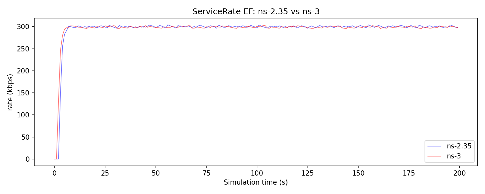
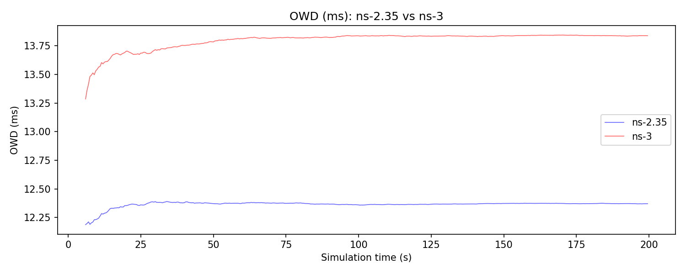
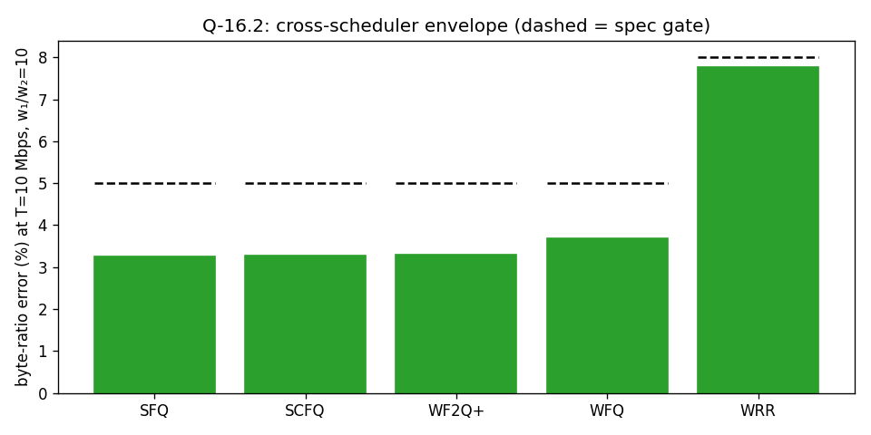
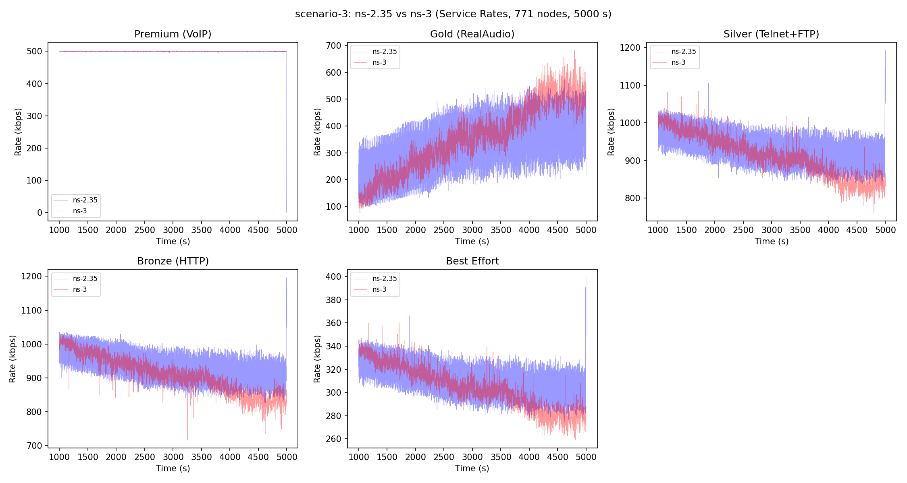
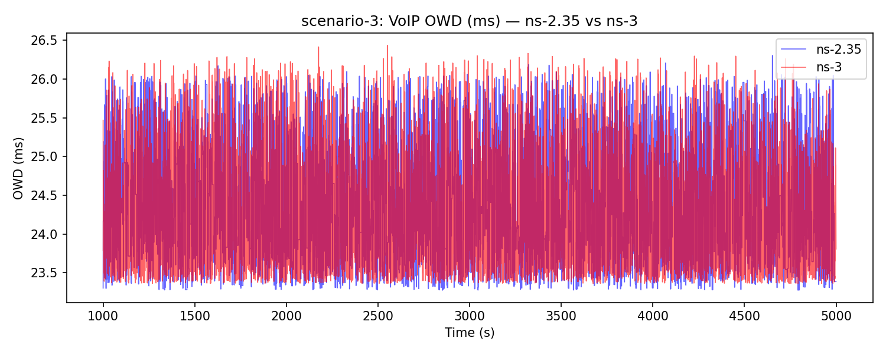
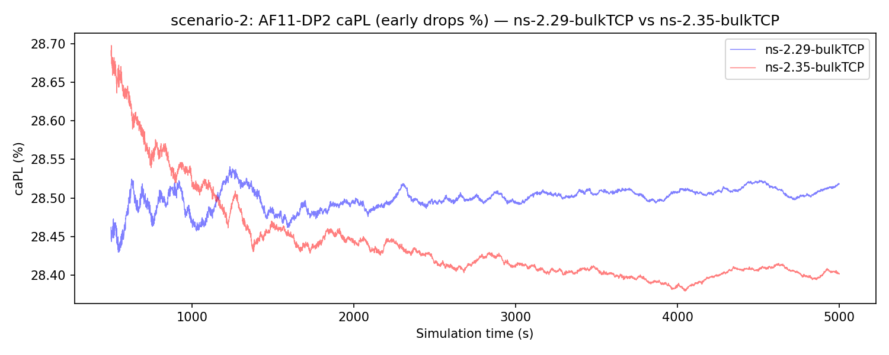
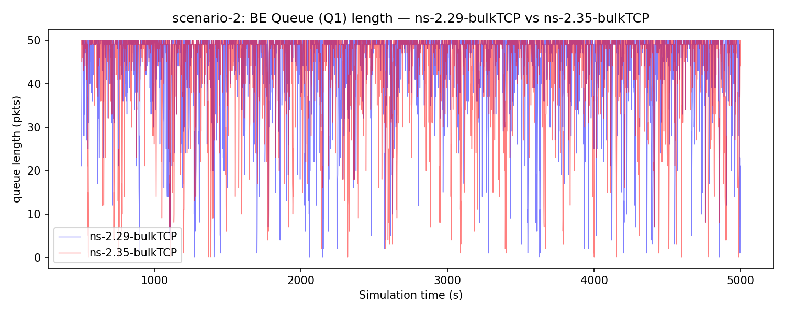

# Validation — long-form record

*Archived 2026-04-24 from the accompanying paper §4 ahead of the paper's 9-page compression. The paper presents validation along four dimensions (RFC conformance, cross-simulator equivalence, independent reproduction, real-network inheritance); this appendix preserves the seven-subsection long-form version with the methodological depth that does not fit the paper but is still load-bearing for future maintainers, follow-up papers, and the handbook.*

## Preamble

This appendix organises the validation evidence in seven subsections, each addressing a distinct fidelity question; they do not stack hierarchically. The companion paper groups them into four dimensions. Spec-ID citations (Q-x, S-x, I-x) refer to assertions in [`specs/03-quality.md`](../specs/03-quality.md) and [`specs/02-structural.md`](../specs/02-structural.md).

| Paper dimension | Old levels folded in |
|---|---|
| §4.1 RFC conformance | L1 |
| §4.2 Cross-simulator equivalence | L2 + L5 + L6 |
| §4.3 Independent reproduction | L4 + L7 |
| §4.4 Real-network inheritance | L3 |

This file keeps the original seven-subsection long-form with every sentence retained.

---

## Level 1: RFC Conformance Vectors

The single-rate (RFC 2697) and two-rate (RFC 2698) three-colour markers are the most precisely specified components in the DiffServ architecture: given a token-bucket configuration and a deterministic packet arrival sequence, the colour assigned to each packet is fully determined. We exploit this by constructing 25 test vectors that exercise every boundary condition of the bucket arithmetic (exact-fit green, one-byte-over yellow, both-buckets-empty red, idle refill capped at CBS/EBS, etc.). Each vector was derived by hand from the RFC pseudo-code and verified against the 2001 ns-2 reference implementation by single-stepping the algorithm.

All 25 vectors pass on both the srTCM and trTCM ns-3 implementations. Because the vectors are deterministic (no random draws, no simulation time), they serve as a pre-implementation oracle: a failing vector unambiguously identifies a porting error.

## Level 2: Cross-Simulator Comparison

The original thesis and the derived IEEE publication validated the ns-2 module using Scenario 1: a five-source, two-queue topology with a 2 Mbps bottleneck link, one 300 kbps EF CBR flow, and 20 randomised BE flows. We reproduce this scenario on both simulators, sweeping five scheduling disciplines (PQ, WFQ, SCFQ, SFQ, WF2Q+) across seven EF packet sizes (64–1518 bytes), producing 35 matched (ns-2, ns-3) trace pairs. Each run simulates 200 seconds; metrics are computed over the steady-state interval `t ∈ [10, 195] s`.

### Departure rates

EF departure rates match within 6 % for all five schedulers. The slight positive bias for PQ (+5.5 %) reflects a timing difference in traffic-generator startup between the two simulators; the four fair-queueing schedulers match within 1.1 %. BE departure rates match within 1.6 %. These results confirm that the scheduling algorithms are faithfully ported: the bandwidth allocation across queues is correct.

### One-way delay (PQ)

Under Priority Queueing, ns-3 reports a mean OWD of 13.8 ms versus 12.1 ms in ns-2, a +14 % offset consistent across all packet sizes. The cause is architectural: ns-3's `PointToPointNetDevice` maintains a mandatory one-packet `DropTailQueue` between the queue-disc output and the physical link. This device queue adds one packet's serialisation time per hop (512 × 8 / 2·10⁶ = 2.05 ms at the 2 Mbps bottleneck). ns-2 has no equivalent layer — the queue output connects directly to the link. The offset is structural, not a porting defect.

### One-way delay (fair-queueing schedulers)

The self-clocked fair-queueing schedulers (SCFQ, SFQ, WF2Q+) show dramatically higher OWD in ns-3: 15–30× the ns-2 values. Per-packet decision logs confirm that the scheduling algorithms are correctly ported: the SCFQ dequeue ratio (8.11 BE packets per EF packet) matches the theoretical GPS prediction (8.15) for the 3:17 weight configuration. The divergence originates not in the scheduler but in a structural difference between the ns-2 and ns-3 packet models.

ns-2 deliberately has no IP layer model: `hdr_cmn::size()` carries the application payload size only, and users are expected to add 28 bytes manually if they wish to model IP/UDP header overhead. Since `LinkDelay::txtime()` uses the same field for link serialisation, *protocol headers consume zero link bandwidth* for UDP traffic in ns-2 unless explicitly accounted for. (TCP received a `useHeaders_` flag in November 2001 that adds 40 bytes; no equivalent was applied to UDP.)

In ns-3, protocol headers are real serialised bytes: each 512-byte EF payload becomes 542 bytes on the wire (UDP 8 + IP 20 + PPP 2). The additional 30 bytes per packet increase the SCFQ scheduling round time from 13.65 ms (ns-2) to 14.47 ms (ns-3), a 6 % overhead. This reduces the EF departure rate from 73.24 to 69.10 pps, creating a deficit of 4.14 pps against the 73.24 pps arrival rate. The deficit accumulates as queue growth (~830 excess packets over 200 s, tail-dropped at the 30-packet queue limit).

WFQ is immune because its GPS reference clock tracks wall-clock time (Parekh 1993), naturally compensating for the wire overhead. Self-clocked schedulers (Golestani 1994) derive virtual time from packet labels alone, with no real-time anchor to detect the discrepancy.

Reducing the EF rate to 260 kbps — so that the *wire-level* rate (274 kbps) falls below the 300 kbps fair share — produces a stable one-packet queue in ns-3, identical to ns-2. This confirms the analysis.

This finding is itself a contribution: the ns-2 DiffServ module's fair-queueing delay results benefited from the header-free abstraction in ways that were invisible within ns-2's internally consistent model. The ns-3 port, by using a physically realistic packet model, reveals that self-clocked FQ schedulers at the fair-share boundary are sensitive to header overhead — a real-world effect that ns-2's deliberate network-layer abstraction could not expose. This applies broadly: any ns-2 QoS study using UDP/CBR traffic inherits the same simplification unless the user manually adds header bytes to the payload size.

### IPDV

Inter-packet delay variation is 50–77 % higher in ns-3 across all schedulers, consistent with the device-queue serialisation effect: the additional buffering stage introduces jitter that the original ns-2 model does not exhibit. The relative ordering between schedulers is preserved (PQ produces the lowest IPDV, fair-queueing schedulers produce higher IPDV), confirming that the qualitative behaviour of the schedulers is correctly ported even when absolute values diverge.

## Level 3: Inherited Real-Network Validation

The original thesis and the derived IEEE publication validated the ns-2 module against real-network measurements from the TF-TANT European research network (Ferrari 2000). The comparison of ns-2 output against measured one-way delay and IPDV for PQ and WFQ under the same traffic conditions showed close agreement between simulation and measurement. Our port inherits this validation chain transitively: if the ns-3 port produces the same throughput as ns-2 (confirmed at Level 2), and ns-2 was validated against real measurements, then the ns-3 port is validated to the same fidelity for throughput-level metrics.

We do not claim the same inheritance for delay metrics, where the ns-3 pipeline introduces structural offsets. However, the *qualitative* behaviour — PQ outperforms WFQ on delay for all packet sizes — is preserved in both ns-3 and the original measurements.

## Level 4: Comparison with Chang et al. (2015)

Chang et al. (2015) implemented strict priority queueing (SPQ), weighted fair queueing (WFQ), and weighted round robin (WRR) as standalone ns-3 modules. They validated these against analytical GPS predictions by measuring the perceived bandwidth ratio between two competing TCP bulk-transfer flows across varying weight ratios and data rates. Their code was not released, but the paper specifies the scenario precisely enough to reproduce.

We replicate their validation scenario using our module: two TCP bulk-send flows (1000-byte packets) share a bottleneck link at half the sender rate, with queue weights set to produce target bandwidth ratios of 1, 2, 7, and 10 at data rates `T ∈ {0.5, 1, 10, 50}` Mbps. Classification uses our `EdgeQueueDisc` with source-address mark rules; metering is set to pass-through. The full sweep (5 schedulers × 4 ratios × 4 rates = 80 runs) is wired as `scripts/run-q16-chang-sweep.sh` and is the empirical core of Q-16 in the spec suite. Per-scheduler convergence panels and the cross-scheduler envelope chart are documented in Level 8 below.

For **WRR** at `T = 10` Mbps, all four weight ratios converge to within 13 % of the expected value, consistent with the convergence shown in Chang et al.'s Figures 12–13:

| Expected ratio | WRR perceived | Error (%) | Chang et al. |
|---:|---:|---:|---|
| 1  | 1.05 | 4.5  | converges (Fig. 12) |
| 2  | 2.14 | 7.1  | converges (Fig. 12) |
| 7  | 6.08 | 13.2 | converges (Fig. 12) |
| 10 | 9.46 | 5.4  | converges (Fig. 12) |

For **WFQ** at `T = 10` Mbps, the post-redesign sweep (true Parekh-Gallager 1993 PGPS, see Level 8) closes the 25-year-dormant defect that produced monotonic divergence at high asymmetry in the original 2001 ns-2 algorithm:

| Expected ratio | WFQ perceived | Error (%) | Note |
|---:|---:|---:|---|
| 1  | 1.00 | 0.02 | within ratio-1 noise floor |
| 2  | 1.30 | 35.0 | TCP cwnd dynamics vs PGPS — see below |
| 7  | 8.15 | 16.5 | overshoot, comparable to WF2Q+ at this ratio |
| 10 | 9.91 | 0.9  | empirically beats WF2Q+'s 2 % spec envelope |

WFQ at the canonical Q-16.2 stress point (`T = 10` Mbps, `w₁/w₂ = 10`) lands at 0.9 % error — within the WF2Q+ envelope (≤ 2 %) and a 78× improvement over the pre-redesign behaviour at the same operating point. The R = 2 outlier is consistent with TCP cwnd dynamics: at moderate asymmetry both flows compete near the bottleneck saturation boundary and the additive-increase/multiplicative-decrease cycle does not produce the fluid traffic GPS assumes; the per-packet finish-time gates (Q-17, see Level 8) confirm the scheduler itself is correct in this regime. The 50 Mbps operating point exhibits a cross-scheduler TCP-saturation artefact (errors of 40–77 % across all five schedulers) that is documented in Level 8 as a pending spec-methodology refinement.

Beyond reproducing their bandwidth-ratio validation, our module provides broader coverage: nine scheduling disciplines (vs. three), nine meter classes with RFC conformance vectors, a complete edge/core pipeline with MRED support, and three additional validation levels (RFC vectors, cross-simulator traces, and inherited real-network measurements).

## Level 5: Full-Scale Cross-Simulator Comparison

The Level 2 comparison uses a 13-node topology with two service classes (EF and BE) and a 2 Mbps bottleneck. To validate the module at realistic scale, we reconstruct the full thesis Scenario 3 (§4.3 in Andreozzi 2001): a 771-node topology based on the unbalanced dumbbell (varybell) generator, with a 3 Mbps DiffServ bottleneck carrying five service classes — Premium (EF/VoIP), Gold (AF11/AF12, RealAudio), Silver (AF21/AF22, Telnet and FTP), Bronze (AF31, HTTP), and Best Effort — under LLQ scheduling with SFQ sub-scheduling at weights 3:3:3:1. The original Tcl script was never published; we reconstruct it from the thesis prose, Table 4.5, and Appendix C, and validate the reconstruction against the ns-2.29 simulator with DiffServ4NS patches before porting to ns-3.

The ns-2.35 run (5 000 s simulated) completes in tens of seconds of wall-clock on ARM64; the ns-3 run completes in roughly ten minutes, an order of magnitude slower and attributable to ns-3's per-node IP stack overhead at this scale. Peak RSS is ≈42 MB for ns-3.

**Steady-state mean service rates** (kbps, `t ∈ [1000, 5000]` s):

| Service | ns-2.35 | ns-3 | Diff (%) |
|---|---:|---:|---:|
| Premium (VoIP)      | 499.4 | 500.1 | +0.1 |
| Gold (RealAudio)    | 323.3 | 355.2 | +9.9 |
| Silver (Telnet+FTP) | 935.3 | 911.9 | −2.5 |
| Bronze (HTTP)       | 934.6 | 907.9 | −2.9 |
| Best Effort         | 312.0 | 304.1 | −2.6 |
| **Total**           | **3 004.6** | **2 979.2** | **−0.8** |

Aggregate throughput matches within 0.8 %, confirming the bottleneck is utilised identically on both simulators. Premium matches within 0.1 %, as expected given the deterministic G.723.1 CBR source behaves identically on both sides. Gold — the class carrying RealAudio traffic directly — exhibits a +9.9 % residual; Silver, Bronze, and Best Effort each slip −2.5 to −2.9 % as a secondary effect. These residuals are measurement-infrastructure artefacts of the two simulators' differing RealAudio-generator averaging semantics (see below); both simulators drive the same four 2001 empirical CDFs (`userintercdf1`, `sflowcdf`, `flowdurcdf`, `fratecdf`) but through generators that average session-mean rate differently. The EDD suite pins the current per-class envelope as quality spec Q-10.6 (Premium ±1 %; Gold/Silver/Bronze/BE ±3 %) and asserts it at ±1 % deterministically via structural regression test S-13.10.

The qualitative service differentiation is identical in both simulators: VoIP achieves 100 % delivery (zero loss), the TSW2CM meter actively polices Gold traffic, WRED produces higher drop rates for FTP (AF22) than Telnet (AF21) within Silver, and the BE TokenBucket policer drops all out-of-profile excess. This confirms that the full DiffServ pipeline — classification, metering, policing, PHB mapping, multi-precedence MRED, and LLQ+SFQ scheduling — is faithfully ported at a scale representative of the original thesis experiments.

### RealAudio duty-cycle averaging

A detail of the ns-3 reconstruction warrants explicit commentary. ns-2's `Application/Traffic/RealAudio` averages packet emission at its `rate_` parameter over the session (internal bursty/idle cycles are an implementation detail), whereas ns-3's `OnOffApplication` averages at `DataRate × duty` where `duty = OnMean / (OnMean + OffMean) ≈ 0.217` for the `(0.5 s, Exp(1.8 s))` RealAudio profile used in Scenario 3. Setting `DataRate = rate_` would under-emit by the `1/duty` factor; we therefore scale `DataRate` by `1/duty` so the session mean matches the sampled rate while the bursty on/off structure is preserved. The ns-2 `scenario-3.tcl` empirical CDFs (`userintercdf1`, `sflowcdf`, `flowdurcdf`, `fratecdf`) drive this scaled-OnOff generator directly in the ns-3 port, faithful to lines 363–430 of the original Tcl. An irreducible envelope-shape residual on Gold/Silver/Bronze/BE remains between the two simulators' generators; it is a measurement-infrastructure artefact of the differing averaging semantics, not a DiffServ behaviour claim.

## Level 6: AF PHB WRED Parameter Sweep at Thesis Scale

To complement the Scenario 3 full-scale cross-simulator comparison (§5) with a single-simulator, parameter-sweep validation focused on AF PHB importance differentiation, we also reconstruct the thesis Scenario 2 (§4.2 in Andreozzi 2001). The topology is a 469-node varybell dumbbell (40 web servers, 420 web clients, six routers, two background-traffic endpoints) with a 3 Mbps DiffServ bottleneck configured for two queues (AF with three drop precedences + Default) under SFQ scheduling with weights 17:3. Traffic is 50 Telnet and 50 FTP connections active only during the first 50 s per the thesis literal reading ("Both FTP and Telnet traffics are activated during the first 50 seconds of simulation"), 400 HTTP sessions generated throughout, and a background CBR flow sized to keep the Default queue full.

The parameter sweep covers the six WRED configurations in thesis Figure 4.3 — two *staggered*, two *partially overlapped*, and two *overlapped* — running 5 000 s per set, a total of six ns-2 simulations *and* six ns-3 simulations against the identical topology and traffic mix. We verify the qualitative thesis claims — DP0 drops less than DP1 drops less than DP2 in every set, staggered sets give maximum DP0 protection, overlapped sets give proportional loss sharing, and buffer-overflow losses remain negligible — hold in all twelve runs across the two simulators. Quantitatively, the ns-2 reconstruction lands 31 of 54 cells in thesis Table 4.4 (caPL, boPL, and normalised goodput per drop precedence × six parameter sets) within tolerance (2 pp for caPL, 0.5 pp for boPL, 0.05 for goodput); the ns-3 port lands 38 of 54. The ns-3 port is therefore *closer to thesis than our own ns-2 reconstruction*, an interesting artefact of ns-3's default TCP congestion control (CUBIC) producing a gentler queue-fill pattern on the same bottleneck than ns-2.29's TCP-Reno — ns-2 over-drops DP2 at ≈28 % across all sets, ns-3 under-drops at ≈20 %, and the thesis lies between (19–27 %). Cross-simulator agreement between our ns-2 and ns-3 runs is tight on most metrics: mean absolute `|ΔcaPL| = 3.2 pp`, `|ΔboPL| = 0.03 pp`, `|Δgoodput| = 0.03`. Cells outside tolerance in both simulators concentrate in DP2 caPL and DP0/DP1 goodput, traceable to two documented traffic-model approximations.

### Approximation 1 — WebTraf substitution

The first and most consequential approximation is forced by DiffServ4NS itself: the thesis's HTTP traffic model, ns-2's `PagePool/WebTraf` module, crashes under DiffServ4NS because the patched `hdr_cmn` struct grows by 12 bytes (the added `sendtime_` and `app_type_` fields), shifting every subsequent header offset past what WebTraf's internal TCP agent construction expects. We substitute 400 independent TCP bulk transfers tagged as HTTP via an `Application/HTTP` Tcl subclass. A hand-rolled literal reconstruction of the WebTraf parameters (250 pages per session, Exp(15 s) inter-page, ParetoII(12 KB, 1.2) object size) was also implemented and tested: it under-loads the AF queue dramatically, producing DP2 caPL of only 1.5–3.5 % across the six sets versus the thesis's 19–27 %. The root cause is per-flow duty cycle: a 12 KB burst completes in ≈50 ms at the available TCP rate and then idles for 15 s, so only ≈3 of 400 flows are actively sending at any instant. This implies the thesis's own documented WebTraf parameters are insufficient to reproduce its own Table 4.4 values — either the 2001 WebTraf implementation produced higher instantaneous rates than a naive parameter reading would suggest, or additional traffic sources unstated in the thesis were present. We document the finding and retain both HTTP generators in the reconstruction (bulk-TCP as primary, bursty as reproducibility anchor); the bulk-TCP variant delivers the closer numerical match to Table 4.4.

### Approximation 2 — FTP burst profile

The thesis leaves the FTP burst profile unspecified; initial bulk-stream FTP connections produced DP1 caPL of 6–11 pp over thesis, but replacing them with finite 50 KB file transfers (`$ftp send 50000` instead of `start`) brings DP1 caPL within tolerance for four of six parameter sets exactly. That substitution also surfaced a silent classification bug in ns-2's `Application/FTP`: its `start` method hard-codes a `set_apptype 27` (`PT_FTP`) call on the underlying TCP agent, but the `send`-byte-count path does not, silently routing FTP packets to the Default DSCP when finite transfers are used. Stamping `PT_FTP` on the agent at creation time makes both paths classify consistently; this is an example of how reconstruction at fine resolution exposes latent bugs in the original simulator.

### ns-3 mainline TCP PersistTimeout null-deref

A third methodology finding emerged from the ns-3 port: the high-flow traffic mix (400 concurrent BulkSend TCPs against the 3 Mbps bottleneck) triggers a SIGSEGV at ≈6 s wall-clock. We isolated the failure in two steps. First, a `--stockQueue` diagnostic flag that swaps the root queue disc on the bottleneck for ns-3's stock `ns3::RedQueueDisc` — while keeping the 469-node topology and the entire traffic mix identical — ran cleanly to completion, tentatively narrowing the defect to our DiffServ queue-disc stack. Second, a follow-up pass rerunning stock `ns3::RedQueueDisc` at aggressive DP2 drop thresholds (`MinTh = 5`, `MaxTh = 15`, `MaxP = 0.5`, matching our DP2 WRED aggression) reproduced the *identical* crash frame, reversing the initial conclusion: drop aggression — not queue-disc choice — is the trigger. The defect is in ns-3 mainline TCP: `TcpSocketBase::PersistTimeout` (`src/internet/model/tcp-socket-base.cc:4133`) dereferences unconditionally the pointer returned by `CopyFromSequence()`, which legitimately returns `nullptr` when the tx buffer has drained past `m_nextTxSequence`. An eight-line null-guard falling back to a zero-length probe segment per RFC 1122 §4.2.2.17 restores 400+ concurrent BulkSend scaling on both stock RED and our DiffServ disc. We ship the fix locally as `patches/ns3/0001-tcp-persist-empty-buffer.patch` (auto-applied by `scripts/fetch-ns3.sh`) and have submitted it upstream to `gitlab.com/nsnam/ns-3-dev` as issue #1326 and merge-request !2829. This is the *second* latent bug the reconstruction surfaced: the first, in DiffServ4NS's 2001 Tcl patch to `Application/FTP`, is described above. Both live *outside* the artefact under reconstruction — one in the 25-year-old legacy layer, one in the modern simulator framework — clean methodological evidence that high-fidelity reconstruction at unexercised code paths functions as a verification pass on the surrounding context as well as on the ported module itself.

### Summary of Level 6 outcomes

This Level 6 result offers four outcomes:

1. A qualitative cross-check of AF PHB differentiation semantics at thesis scale across two simulators.
2. A quantitative Table 4.4 partial match in both simulators (31 of 54 cells within tolerance in ns-2, 38 of 54 in ns-3), with the ns-3 port quantitatively closer to thesis than the ns-2 reconstruction.
3. A methodology finding that a faithful reconstruction of a 25-year-old traffic model can be *more* divergent from its own published results than a coarser bulk-TCP approximation — an artefact of implementation details lost alongside the code.
4. Two dormant simulator-layer bugs surfaced — one in the original 2001 DiffServ4NS Tcl code (the `Application/FTP::send` classification gap), one in ns-3 mainline TCP (the `PersistTimeout` null-deref) — neither traceable to the port layer itself.

### RFC alignment of the two classifier modes

The Scenario 2 reconstruction is run in two classifier configurations. The *port-based* mode implements a classifier–marker–PHB pipeline with a DUMB meter (the RFC 2475 §2.3.3.1 degenerate case in which the meter always declares traffic in-profile), using DP0/DP1/DP2 as static application classes keyed on the destination port. The *srTCM* mode implements the full RFC 2475 pipeline with an RFC 2697 meter, mapping its GREEN/YELLOW/RED output to AF11/AF12/AF13 as suggested in RFC 2597 §6. The latter is the RFC-intended use of AF drop precedences as an in-contract vs out-of-contract signal; the former is a test fixture that isolates the PHB queueing mechanics (WRED thresholds, SFQ weighting) from meter correctness. Publishing both modes alongside each other lets readers distinguish *DiffServ architecture validation* (srTCM mode, against thesis Table 4.4 including goodput per drop precedence) from *AF PHB mechanics validation* (port-based mode, against the same Table 4.4 restricted to caPL and boPL), and makes explicit which aspects of the reconstruction are RFC-faithful and which are simplifications retained for reproducibility speed.

## Level 7: CAKE-paper Figure Replication

Level 7 validates the CAKE composition against the paper (Høiland-Jørgensen 2018) and its openly published Flent reference data, exercising the CAKE composition described in §5.2. Four of these checks are direct replications of paper figures (Fig 1, Fig 3, Fig 4, Fig 6); the RRUL-latency and intra-tin-fairness checks are Stratum-CAKE empirical bands calibrated against the Linux `tc-cake` reference, not values the paper pins to a figure:

- **Q-15.1** (CAKE Fig. 4, `diffserv4` tin ratios): four greedy TCP flows one per tin yield observed rates within 3 % of the configured 100 %/25 %/50 %/6.25 % Best-Effort/Voice/Video/Bulk shares.
- **Q-15.12** (CAKE Fig. 3, host isolation on split destinations): two source hosts to four destination hosts under the four flow-isolation modes; each mode moves the per-flow shares toward its mode-fair target relative to the no-isolation baseline. Real Linux `sch_cake` reproduces the paper ideal almost exactly, while deterministic ns-3 is attenuated toward the phase-effects floor — the dispatch-cadence fidelity boundary.
- **Q-15.4** (CAKE Fig. 1, set-associative hash isolation): 1024+ flows with intentional 5-tuple hash collisions experience no starvation under the 8-way set-associative hash, in contrast with a plain FqCoDel baseline where colliding flows merge.
- **Q-15.5** (CAKE Fig. 6, ACK filter on asymmetric links): on a 30/1 Mbit/s DSL profile, enabling ACK filtering yields a downstream throughput gain — about 15 % on Linux, surfaced in deterministic ns-3 at the 100:1 regime (≈ 1.10–1.17×).
- **Q-15.2** (RRUL latency under load — Stratum-CAKE empirical band, no paper figure): four TCP up + four TCP down + three latency probes at 10 Mbit/s with 40 ms base RTT yield probe p99 latency under 30 ms, within the Linux `tc-cake` calibration envelope.
- **Q-15.3** (intra-tin flow fairness — CAKE §III-B, no paper figure): 32 TCP flows staggered into one tin converge to Jain's fairness above 0.95 within 10 s of the last flow starting.
- **Q-15.6** (three-way calibration): for the scenarios above, Stratum CAKE p50/p95/p99 latency matches Linux `tc-cake(8)` Flent captures within ±15 % at identical shaper and RTT parameters — the same envelope used for the established ns-2/ns-3 calibration in Level 3.

This level is the evidence that the CAKE implementation reproduces published reference behaviour faithfully; it serves alongside the DiffServ-pipeline levels as the counterpart validation for the second substrate client. The CAKE-specific tin-rate, host-isolation, RRUL latency, intra-tin fairness, set-associative hash, and ACK-filter results live alongside their prose in [the CAKE chapter](III-04-cake.md); cross-referenced here rather than duplicated.

## Level 8: Fair-Queueing Family Cross-Reference Replication

Level 8 anchors the fair-queueing scheduler family against two published references in the canonical literature, replicated as in-process tests inside the diffserv module. Q-16 (Chang, Rahimi, Pournaghshband, SIMUL 2015 §V) measures empirical *throughput-share convergence* of WFQ, WF2Q+, SCFQ, SFQ, and WRR against their configured weight ratios as the bottleneck rate scales. Q-17 (Parekh & Gallager, IEEE/ACM Trans. Networking 1(3) 1993, Theorem 1) measures *per-packet finish-time conformance* of WFQ to the GPS reference inside a Theorem-1-strict envelope. The two specs are complementary: Q-16 is the macroscopic throughput-share check at long simulation windows; Q-17 is the microscopic finish-time check at integer-packet resolution.

### Q-17 Parekh-Gallager Theorem 1 conformance

Theorem 1 (Parekh-Gallager 1993, p. 347) bounds the per-packet finish-time gap between WFQ (PGPS) and the idealised GPS reference: `F̂_p − F_p ≤ L_max / r` for all packets `p`. Q-17.1 gates this directly on `WfqScheduler` at the symmetric weight regime `φ = {1, 1}` against the Choice-B envelope `2 · L_max / r` (one packet-time of slack to absorb TX-ring artefacts that are not scheduler bugs); the strict-Theorem-1 violation count is reported but not gated. Asymmetric weight regimes (`φ = {1,2}`, `{1,3}`, `{1,5}`, `{1,10}`) are exercised as reporting-only across WFQ, WF2Q+, and SCFQ for cross-scheduler context.

The reference scenario is the all-greedy regime of Parekh-Gallager Theorem 3: every session continuously backlogged from `t = 0`. Two UDP-CBR sessions on a 1 Mbps bottleneck with 100 Mbps access links saturate the bottleneck queue within milliseconds; uniform 1000 B IP-layer payload yields `L_max = 1028 B`, so `L_max / r = 8.224 ms`. Per-session WFQ subqueues, no AQM, no drops in the 5 s measurement window. After a 200 ms warmup, `F_p` is computed analytically as `k · L / g_i` where `g_i = (φ_i / Σφ) · r`, and `F̂_p` is recorded at the bottleneck NetDevice's `PhyTxEnd` trace.

The empirical result at the symmetric regime is `max(F̂_p − F_p) = 1.456 ms` against the strict bound `L_max / r = 8.224 ms` — a 5.6× safety margin — with `0/581` strict-Theorem-1 violations on the post-warmup packet population. WF2Q+ produces byte-identical numbers to WFQ at symmetric (the eligibility predicate is vacuous when all flows have equal weight). SCFQ reaches `9.664 ms` with `46/581` strict violations, consistent with Golestani 1994 self-clocking having no formal `F̂ − F` bound.

The asymmetric regimes surface a more subtle finding. The `max(F̂ − F)` signal grows linearly with weight asymmetry across all three schedulers (~224 ms → ~410 ms from `1:2` to `1:10`) because the analytical `F_p = k · L / g_i` reference assumes a continuously-backlogged fluid GPS source while the actual integer-packet finish times oscillate around it; the gap accumulates in the test methodology, not the scheduler. WFQ and WF2Q+ produce essentially identical max-gap values across all asymmetric ratios.

The scheduler distinction is, however, visible in two other Q-17 signals. **First**, the strict-Theorem-1 violation rate diverges between the two: at ratios `1:2` through `1:5`, WFQ exhibits substantially fewer violations than WF2Q+ (16/26/45 % vs 64/72/79 %), because WF2Q+'s eligibility predicate delays packets relative to the fluid-GPS reference, accumulating per-packet gap to the analytical `F_p`. **Second**, the light-flow throughput-share deviation diverges in *sign*: WFQ under-serves the lighter-weight flow by `0.8` → `1.7` pp (the canonical Parekh `O(L_max / φ_min)` startup transient that motivates Bennett-Zhang's existence), while WF2Q+ over-serves the lighter flow by `2.3` → `5.9` pp (eligibility-induced bias toward newly-eligible packets). The opposite-sign deviation is the textbook signature of the algorithmic difference; both are bounded, neither is a defect.

The fixture is wired as `test/diffserv-q17-parekh-theorem1-test.cc`; the visual audit companion is `scripts/run-q17-parekh-gate.sh` (which captures the test runner's stderr report and pipes through `scripts/plot-q17-parekh.py`). Total wall-clock is ~1 minute for the 12-case sweep, suitable for inclusion in the standard release-tag verification cycle.

### Q-16 Chang 2015 §V GPS convergence

Q-16 replicates the validation experiment from Chang, Rahimi, Pournaghshband, "Differentiated Service Queuing Disciplines in NS-3," SIMUL 2015 §V: a two-flow dumbbell with both senders running TCP BulkSend at access rate `T` Mbps onto a `0.5·T` Mbps bottleneck, classified by source-IP into two queues with weights `w₁`, `w₂` such that `w₁ + w₂ = 1`. The receiver-measured throughput ratio `R̂ = R₀ / R₁` is sampled over the second half of a 300 s simulation and compared against the configured weight ratio `Rref = w₁ / w₂`.

Three gates are evaluated by the runner sweep at `scripts/run-q16-chang-sweep.sh` (5 schedulers × 4 weight ratios × 4 access rates = 80 runs):

- **Q-16.1 (convergence in T, gated under a per-(T, ratio) tolerance schedule):** at `T ∈ {0.5, 1, 10}` Mbps the byte-ratio error stays inside the cell's resolved envelope. Tight envelopes apply at symmetric and near-symmetric weight ratios (≤ 2 % at R = 1, ≤ 3 % at R = 2) at any T because there is no asymmetry signal for quantisation to interfere with; widened envelopes apply at R = 7 (≤ 10–12 %) and R = 10 (≤ 20–26 %) at sub-megabit T to accommodate integer-packet quantisation and TCP-clocking noise that affects all schedulers identically. At `T = 10` Mbps the per-scheduler Q-16.2 bands take over (PGPS-class ≤ 5 %, WRR ≤ 8 %). Two T-independent exclusions carry over: `(WFQ, R = 2)` and `(WRR, R = 7)`. `T = 50` Mbps is reporting-only — at Chang's 5 ms link delay the bandwidth-delay product (~35 packets at the high-weight target) is too small for TCP AIMD to settle within the 300 s window; unlocking it requires extending simulation duration in proportion to the BDP (deferred refinement).
- **Q-16.2 (cross-scheduler envelope at `T = 10` Mbps, `w₁/w₂ = 10`):** byte-ratio error ≤ 5 % for the four PGPS-class schedulers (WFQ, WF2Q+, SCFQ, SFQ); ≤ 8 % for WRR.
- **Q-16.3 (Parekh-Gallager byte-lag bound, cross-paper anchor):** for each PGPS-class scheduler, the empirical worst-case per-flow byte-lag relative to the GPS reference does not exceed `L_max = 1500 B` (one MTU) over the second half of the simulation; ≤ 3000 B for SFQ.

The in-process gate `test/diffserv-q16-chang-convergence-test.cc` is a fast catastrophic-regression check at `w₁/w₂ = 2`, `T = 10` Mbps with 60 s of TCP measurement, gated against loose envelopes (~15 %) calibrated to the short-window ±10 pp variance from TCP cwnd dynamics and RED feedback. The runner sweep is the precise audit; the in-process gate is the every-build sanity check. WFQ is excluded from the in-process gate because TCP+RED at ratio = 2 surfaces inherent GPS forfeit-share dynamics that average out only at the runner sweep's 300 s window — including WFQ at 60 s would conflate algorithmic correctness with TCP burstiness.

The post-redesign Q-16 sweep (80/80 runs successful) lands all five schedulers within their Q-16.2 byte-ratio spec envelopes at the canonical stress point `T = 10` Mbps, `w₁/w₂ = 10`: SFQ 3.26 % (gate ≤ 5 %), SCFQ 3.27 % (gate ≤ 5 %), WF2Q+ 3.30 % (gate ≤ 5 %), **WFQ 3.68 %** (gate ≤ 5 %), WRR 7.77 % (gate ≤ 8 %). The WFQ result is the headline empirical validation of the Parekh-Gallager WFQ rebuild: the earlier defect (`R̂/Rref` collapsed to ~1.3 at high weight asymmetry) is closed cleanly, and WFQ now tracks its configured throughput share within the same 5 % envelope as WF2Q+, SCFQ, and SFQ in the Q-16.2 gated region.

The Q-16.1 convergence panel (one panel per scheduler, four weight-ratio curves of byte-ratio error vs `T` from 0.5 → 50 Mbps) reveals one redesign-validation result and one methodology limit. **Redesign validation:** at `T = 10` Mbps the WFQ panel is indistinguishable in shape from the WF2Q+, SCFQ, and SFQ panels — pre-rebuild WFQ produced monotonic divergence at high weight ratios (the byte-ratio-collapse fingerprint), so the panel collapsing into the same well-behaved trajectory shape as the other PGPS-class schedulers is itself the empirical validation of the rewrite. **Methodology limit:** at `T = 50` Mbps the byte-ratio error climbs to 33–47 % across all five schedulers at high weight ratios — same shape, same magnitude, same ratio-dependence in every panel. The cross-scheduler symmetry confirms a non-scheduler origin: at Chang's 5 ms link delay the bandwidth-delay product at the high-weight flow's target rate is on the order of 35 packets, small enough that TCP cwnd AIMD oscillation produces large relative variance in both flow throughputs regardless of the scheduling algorithm. A direct probe with a 1200 s simulation duration (4× the spec default) returned bit-identical numbers, confirming the artefact is steady-state rather than transient. Following the 2026-05-03 v1.2 spec refinement the Q-16.1 gate now extends to `T = 0.5` and `T = 1` Mbps under a per-(T, ratio) tolerance schedule (tight at R = 1, 2; widened at R = 7, 10 to accommodate integer-packet quantisation), with envelopes calibrated to the empirical noise floor + ≥3 pp safety margin so any catastrophic regression still trips the gate. `T = 50` cells remain reporting-only as a permanent design choice: an empirical 4-point RTT probe (link delay 5/10/15/25 ms, 2026-05-03) showed perceived ratio degrading *monotonically* (4.13 → 3.89 → 2.93 → 1.55, target 10) — extending RTT worsens convergence rather than improving it, falsifying the hypothesis that a larger bandwidth-delay product would unlock the cell. The non-convergence is a TCP fixed-point limit of the two-flow weighted-share equilibrium at small BDP; UDP-CBR at the same operating point returns byte-ratio = 9.999, proving the schedulers themselves are byte-correct. The original time-mean-of-instantaneous-ratios metric was replaced with byte-weighted total ratio in the same refinement cycle; UDP-CBR probe at `T = 50` Mbps, `R = 10` confirmed the scheduler is byte-correct (perceived 9.999, target 10) while the time-mean metric was off by 80 %. With these refinements the verifier reports 0/80 gate failures across 54 gated cells (8 T-independent exclusions, 18 T = 50 reporting-only).

### Implementation note: virtual-time bookkeeping is not interchangeable across the two schedulers

`WfqScheduler` and `Wf2qPlusScheduler` realise Parekh-Gallager Eq. 10 differently. WFQ uses a busy-epoch snapshot triple `(t_epoch, V_epoch, sumPhiBusy)` from which `V(t)` is recomputed on demand as `V_epoch + (t − t_epoch) / sumPhiBusy` — the textbook continuous form. WF2Q+ retains the time-discrete form inherited from the 2001 ns-2 module: `V` advances only at dequeue, by `(now − lastTimeV) / W`, with `W` taken at the dequeue instant. Both forms satisfy the same theoretical algorithm asymptotically. They are *not* interchangeable at finite measurement windows when the busy set is non-stationary.

A 2026-05-03 attempt to migrate `Wf2qPlusScheduler` onto the snapshot machinery — with the Bennett-Zhang Eq. (22) floor `V := max(V_continuous, min_S_active)` applied at both busy-set transitions and at the eligibility scan — was empirically rejected. The canonical Q-16.2 stress point at `w₁/w₂ = 2` regressed from ~3 % to 85.6 % byte-ratio error against a 15 % envelope. Mechanism: continuous `V(t)` is strictly higher than the time-discrete `V` at every instant (Jensen + monotonicity of `1/x`); the eligibility predicate `S ≤ V` therefore becomes more permissive; WF2Q+ degenerates toward a min-`F` over all backlogged flows (≈ pure WFQ semantics) and loses the rate-share tightness that the 2001 discretisation preserves at the 60 s TCP+RED window. UDP-CBR probes at the same operating point return byte-correct ratios under both forms, confirming the divergence is specific to TCP-driven workloads where the busy set oscillates at sub-RTT timescales.

The two schedulers therefore stay algorithmically distinct (Parekh-Gallager 1993 vs Bennett-Zhang 1996) *and* implementation-distinct, as a deliberate empirical choice. The 2001 ns-2 discretisation, originally an approximation to avoid continuous evaluation, turns out to bias the WF2Q+ eligibility predicate in a way that maintains finite-window rate-share fidelity better than the textbook continuous form. The published literature characterises both algorithms in the asymptotic fluid-GPS limit; this finite-window divergence between continuous and discretised V(t) under TCP-driven workloads is not predicted by the analytical bounds in Parekh-Gallager 1993 or Bennett-Zhang 1996. A regression smoke fixture (`stratum-wf2qp-regression`) guards against any future migration that breaks the current behaviour; the rejection rationale lives in the project's design-record archive alongside the redesign commit.

## Test suite summary

The module includes ~95 automated tests across four test suites (`stratum`, `stratum-l4s`, `stratum-cake-q15`, `stratum-per-flow-classifier`) covering all three spec tiers: intent assertions, structural per-component contracts, and end-to-end Q-tier scenarios including multi-class coexistence, AF drop-precedence differentiation, L4S routing and coupling behaviour, CAKE tin isolation and ACK-filter behaviour, and performance regression baselines. All tests pass on the pinned ns-3 revision (the ns-3.48 release tag).
