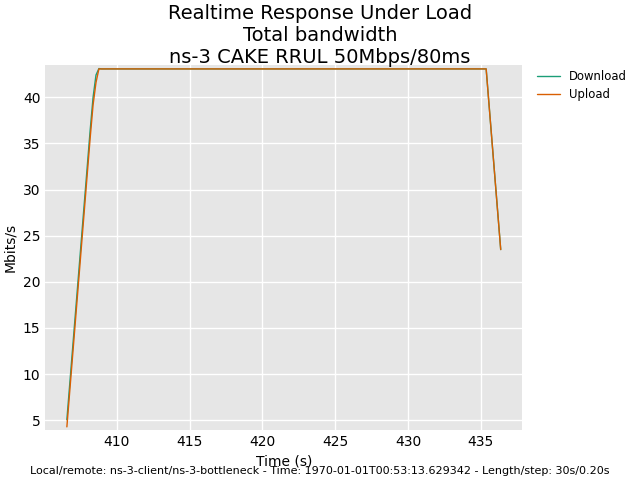
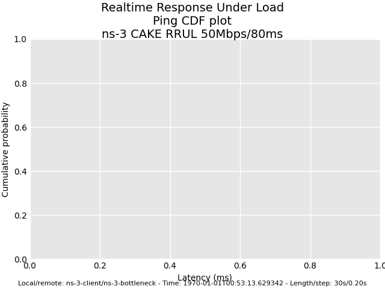

# AQM-eval interop: Flent JSON workflow

This chapter describes how to export an ns-3 simulation run from the
diffserv module as a Flent-compatible JSON archive, so that the
broader bufferbloat / AQM-evaluation community can replay our results
with the same plotting and post-processing tooling they use for
hardware-in-the-loop measurements.

## Why Flent JSON?

[Flent](https://github.com/tohojo/flent) is the de-facto lingua franca
of the AQM-evaluation research community. Its archive format
(``.flent.gz``) is the input contract for the [bufferbloat data
archives](https://github.com/dtaht/bufferbloat-data) that accompany
the CAKE journal paper, the L4S evaluation tracks, and the FQ-CoDel
field-test repositories. Public datasets that ship a Flent archive
can be cross-compared with any Linux ``tc-cake`` measurement bundle
released over the last decade.

By emitting the same archive format, the diffserv module joins that
ecosystem at the post-processing layer: a researcher who wants to
compare a hardware ``tc-cake`` capture against an ns-3 rate-based
shaper (path β) run can drop both into the same ``flent --plot``
invocation and overlay the timeseries panels on a single figure.

## Workflow

Three commands turn an ns-3 simulation into a Flent-replayable
archive:

1. Run the simulation, emitting a per-flow CSV bundle:

   ```bash
   ./ns3 run "cake-rrul --output=output/cake-rrul/ --length=60"
   ```

   The ``cake-rrul`` example installs a cake::Helper RateBased mode
   shaper at the bottleneck and runs an RRUL-style workload of four
   saturating TCP downloads, four saturating TCP uploads, four UDP
   probes, and one ICMP ping over a dumbbell. The CSV bundle layout
   is documented in ``scripts/flent-export/SCHEMA.md``.

2. Convert the CSV bundle to a Flent JSON archive:

   ```bash
   cd scripts/flent-export
   source .venv/bin/activate
   python -m ns3_csv_to_flent \
       --test rrul \
       --indir ../../output/cake-rrul/ \
       --output cake-rrul.flent.gz \
       --title "ns-3 CAKE RRUL 50Mbps/80ms"
   ```

   This emits a single ``cake-rrul.flent.gz`` file that conforms to
   Flent file-format version 4 (the version pinned by Flent 2.2.0).

3. Plot or analyse with Flent:

   ```bash
   flent --plot totals_bandwidth --output tcp-totals.png cake-rrul.flent.gz
   flent --plot ping_cdf         --output ping-cdf.png   cake-rrul.flent.gz
   flent --plot download         --output download.png   cake-rrul.flent.gz
   flent --plot upload           --output upload.png     cake-rrul.flent.gz
   ```

   Any of the [rrul-test plots](https://flent.org/) catalogued by
   ``flent rrul --list-plots`` are available, including
   ``totals_bandwidth``, ``totals``, ``ping``, ``ping_cdf``,
   ``ping_scaled``, ``download``, ``upload``, and the box-plot /
   CDF / Q-Q variants.

## Per-test schemas

The converter currently supports three Flent test types. Each
schema declares which CSV files in the bundle map to which Flent
series names; the canonical reference is
``scripts/flent-export/SCHEMA.md``.

| Test          | Series                                       | Bundle files                                           |
|---------------|----------------------------------------------|--------------------------------------------------------|
| ``rrul``      | 4 TCP down + 4 TCP up + ICMP + 4 UDP probes  | ``tcp_down_flow{0..3}.csv``, ``tcp_up_flow{0..3}.csv``, ``ping_icmp.csv``, ``udp_probe_flow{0..3}.csv`` |
| ``tcp_download`` | 1 TCP down + ICMP                         | ``tcp_down.csv``, ``ping_icmp.csv``                    |
| ``tcp_upload``   | 1 TCP up + ICMP                           | ``tcp_up.csv``, ``ping_icmp.csv``                      |

Series naming follows the upstream ``rrul.conf`` convention: the
four TCP flows in our RRUL export are positionally aliased to the
DSCP markings used by the upstream test (BE / BK / CS5 / EF) so
that ``flent --plot`` dispatches without manual relabeling. The
ns-3 ``cake-rrul`` example does not actually mark traffic; the
labels are positional aliases for ``flow0``..``flow3`` rather than
DSCP-derived. A DSCP-aware variant is on the roadmap for v1.1.

## Worked example

Running the workflow above against the rate-based shaper gives a
60-second RRUL trace. Two of the canonical Flent panels are shown
below; the originals are at ``handbook/figures/aqm-eval-interop/``.



The ``totals_bandwidth`` panel shows the four downloads and four
uploads converging on the 50 Mbit/s bottleneck after the initial
TCP slow-start ramp.



The ``ping_cdf`` panel shows the latency distribution under
saturating cross-traffic. The shaper holds the median ICMP RTT
close to the unloaded 80 ms baseline, with the long tail bounded
by the AQM target.

## Adding a new test schema

To register a new Flent test variant:

1. Define a schema dictionary under
   ``scripts/flent-export/ns3_csv_to_flent/schemas/<name>.py``,
   listing per-flow CSV files in the bundle and any totals /
   averages to compute.
2. Register it in
   ``scripts/flent-export/ns3_csv_to_flent/__main__.py`` against the
   ``--test`` argument.
3. Document the expected CSV-bundle layout in
   ``scripts/flent-export/SCHEMA.md``.
4. Add a goldenfile fixture under
   ``scripts/flent-export/tests/fixtures/<name>-golden-input/``
   and a pytest round-trip under
   ``scripts/flent-export/tests/test_<name>_roundtrip.py``.
5. Validate end-to-end with ``flent --plot`` against the test's
   plot catalogue (``flent <name> --list-plots``).

## Limitations

- The interop is **emit-only**. Flent JSON archives produced by
  hardware-in-the-loop measurements cannot be replayed as ns-3
  traffic; the converter goes ns-3 CSV → Flent JSON, not the reverse.
- The CSV bundle to Flent JSON contract supports a subset of Flent
  test types: ``rrul``, ``tcp_download``, ``tcp_upload`` are v1;
  ``voip``, ``bursts``, and ``ping`` are deferred to v1.1.
- The UDP probe primitive used by the ``cake-rrul`` example
  (``FlentUdpProbeClient`` / ``FlentUdpProbeServer``) carries an
  ``SeqTsEchoHeader``; it is structurally comparable to Flent's
  ``netperf-omni`` UDP probe but not byte-identical. RTT histograms
  are comparable; raw byte-level traces are not.
- The TCP series in our exports are positionally aliased to the
  BE / BK / CS5 / EF DSCP labels for plot-dispatch compatibility;
  the ``cake-rrul`` example does not mark traffic. A DSCP-aware
  variant that re-uses the diffserv edge-classifier is planned for
  v1.1.
- Validation of the JSON archive against the real Flent CLI is
  scoped to ``flent --plot``. Other Flent subcommands
  (``flent --batch``, ``flent --gui``, ``--cache-file``) have not
  been validated and may require additional metadata fields.
- The Python toolchain pin is Flent 2.2.0 / file-format version 4.
  When Flent advances the format version, the converter must be
  updated to track the new schema.
